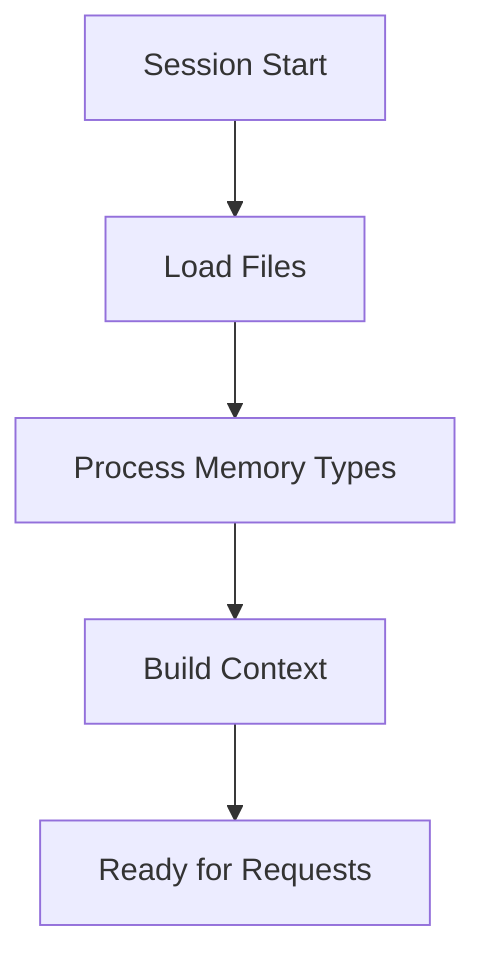
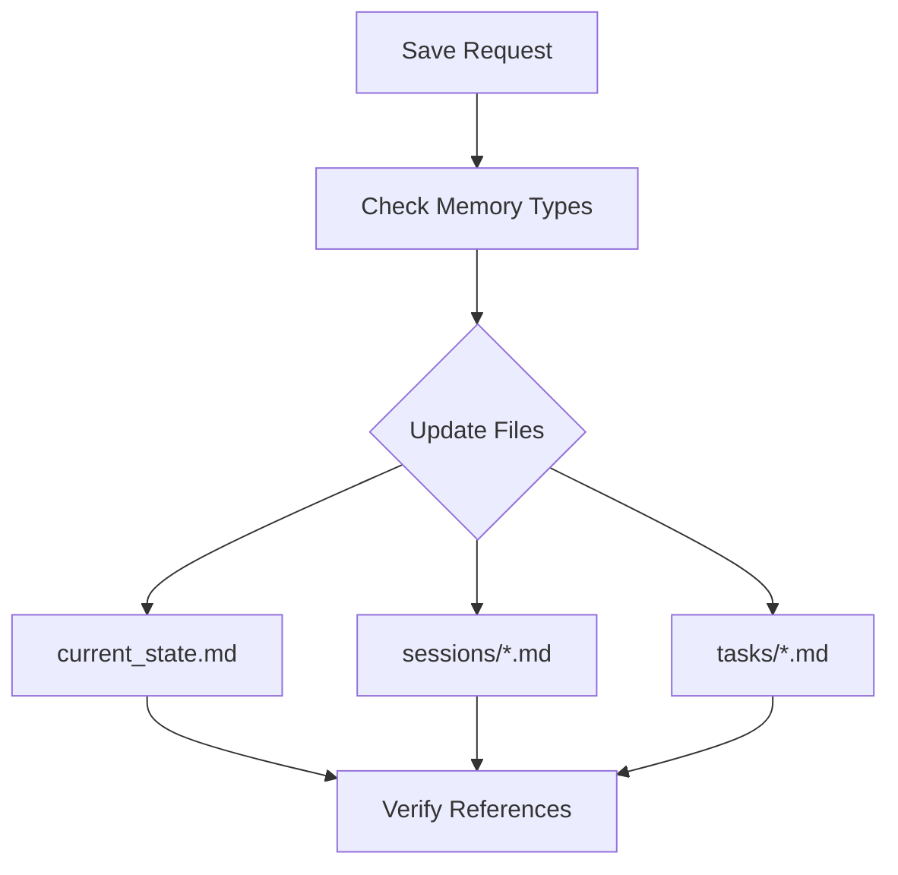

# AI Assistant Instructions

## 1. Session Start Flow


## 2. Memory Type Processing

### When Reading Files

#### Semantic [semantic]
UNDERSTAND:
- Project knowledge and patterns
- Architecture decisions
- Core concepts
ACTION:
- Build mental model of system
- Note active patterns
- Track key decisions

#### Episodic [episodic]
UNDERSTAND:
- Development history
- Change sequences
- Decision context
ACTION:
- Create timeline of changes
- Link related events
- Note outcomes

#### Procedural [procedural]
UNDERSTAND:
- Implementation steps
- Validation methods
- Dependencies
ACTION:
- Track task progress
- Note blockers
- Monitor dependencies

#### Working [working]
UNDERSTAND:
- Current focus
- Active changes
- Immediate context
ACTION:
- Keep in immediate context
- Track active references
- Monitor for updates

## 3. State Management

### File Updates by Memory Type

#### current_state.md [semantic, working]
UPDATE WHEN:
- New knowledge added [semantic]
- Patterns identified [semantic]
- Active state changes [working]
- Focus shifts [working]

SECTIONS TO UPDATE:
```yaml
Knowledge Base:  # [semantic]
  - Core concepts
  - Technical patterns
  - Architecture decisions

Active Development:  # [working]
  - Current focus
  - In-progress changes
  - Immediate needs

Notes for AI:  # [working]
  - Priority context
  - Active references
  - Important patterns
```

#### sessions/*.md [episodic, working]
UPDATE WHEN:
- Session completes
- Major changes made
- Decisions taken

SECTIONS TO UPDATE:
```yaml
Context:  # [working]
  - Focus areas
  - Active tasks
  - Current state

Progress:  # [episodic]
  - Changes made
  - Decisions taken
  - Insights gained

Next Steps:  # [working]
  - Planned tasks
  - Open questions
  - Following session
```

#### tasks/*.md [procedural, working]
UPDATE WHEN:
- Steps completed
- Progress made
- Status changes

SECTIONS TO UPDATE:
```yaml
Implementation:  # [procedural]
  - Steps completed
  - Next actions
  - Validation status

Progress:  # [working]
  - Current status
  - Blockers
  - Dependencies
```

## 4. Save Operation Flow


### Save Checklist
1. For each modified file:
   - Check memory types
   - Apply relevant updates
   - Update timestamps
   - Verify references

2. Cross-reference updates:
   - Link related changes
   - Update task references
   - Connect decisions

3. Verify consistency:
   - All referenced files exist
   - All statuses accurate
   - All links valid
