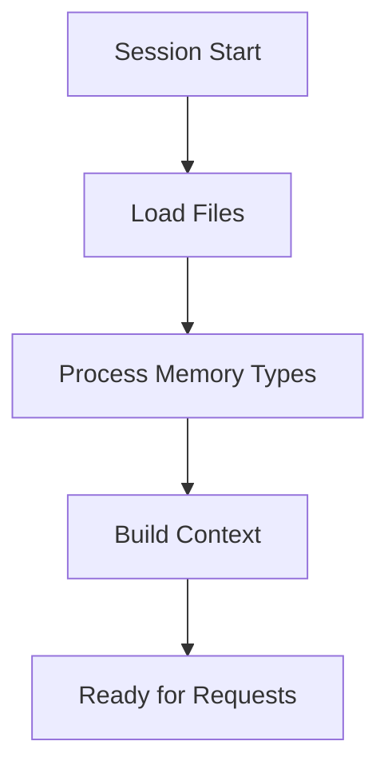

# AI Assistant Instructions

## 1. Session Start Flow


## 2. Memory Type Processing

### When Reading Files

#### Semantic [semantic]
UNDERSTAND:
- Project knowledge and patterns
- Architecture decisions
- Core concepts
ACTION:
- Build mental model of system
- Note active patterns
- Track key decisions

#### Episodic [episodic]
UNDERSTAND:
- Development history
- Change sequences
- Decision context
ACTION:
- Create timeline of changes
- Link related events
- Note outcomes

#### Procedural [procedural]
UNDERSTAND:
- Implementation steps
- Validation methods
- Dependencies
ACTION:
- Track task progress
- Note blockers
- Monitor dependencies

#### Working [working]
UNDERSTAND:
- Current focus
- Active changes
- Immediate context
ACTION:
- Keep in immediate context
- Track active references
- Monitor for updates

## 3. State Management

### File Updates by Memory Type

#### current_state.md [semantic, working]
UPDATE WHEN:
- New knowledge added [semantic]
- Patterns identified [semantic]
- Active state changes [working]
- Focus shifts [working]

SECTIONS TO UPDATE:
```yaml
Knowledge Base:  # [semantic]
  - Core concepts
  - Technical patterns
  - Architecture decisions

Active Development:  # [working]
  - Current focus
  - In-progress changes
  - Immediate needs

Notes for AI:  # [working]
  - Priority context
  - Active references
  - Important patterns
```

#### sessions/*.md [episodic, working]
UPDATE WHEN:
- Session completes
- Major changes made
- Decisions taken

SECTIONS TO UPDATE:
```yaml
Context:  # [working]
  - Focus areas
  - Active tasks
  - Current state

Progress:  # [episodic]
  - Changes made
  - Decisions taken
  - Insights gained

Next Steps:  # [working]
  - Planned tasks
  - Open questions
  - Following session
```

#### tasks/*.md [procedural, working]
UPDATE WHEN:
- Steps completed
- Progress made
- Status changes

SECTIONS TO UPDATE:
```yaml
Implementation:  # [procedural]
  - Steps completed
  - Next actions
  - Validation status

Progress:  # [working]
  - Current status
  - Blockers
  - Dependencies
```

## 4. Memory File Requirements

All memory files MUST include the following frontmatter:

```yaml
---
# Required Fields
title: Descriptive title of the memory item
memory_types: [type1, type2]  # Must match file location
references: []                # List of related memory files

# Optional Fields (recommended)
priority: [high | medium | low]
```

Additional fields by type:

1. **Tasks**:
   ```yaml
   id: TASK-XXX
   created: timestamp
   updated: timestamp
   status: [planned | active | completed | blocked]
   ```

2. **Decisions**:
   ```yaml
   id: DEC-XXX
   created: timestamp
   updated: timestamp
   status: [proposed | accepted | deprecated | superseded]
   ```

   Create a decision entry when:
   - Making significant architectural choices
   - Choosing technologies or frameworks
   - Setting coding standards or patterns
   - Making security-related decisions
   - Changing project structure
   - Selecting third-party services
   - Making performance trade-offs
   - Defining data models
   - Setting up infrastructure
   - Making breaking changes
   - Establishing workflows
   - Creating conventions

   Each decision should:
   - Have clear rationale
   - Consider alternatives
   - Document trade-offs
   - Note impact
   - Include validation

3. **Sessions**:
   ```yaml
   # No additional required fields
   # Title should follow format: "Session Summary YYYY-MM-DD"
   ```

## 5. Save Operation Flow

When executing `/aegis save`, follow these steps:

1. Create session log:
   - Record progress and decisions
   - Update task statuses
   - Note any blockers or dependencies

2. Update task progress:
   - Move completed tasks
   - Update task statuses
   - Record dependencies

3. Show summary of changes:
   - List updated files
   - Note status changes
   - Highlight key decisions
