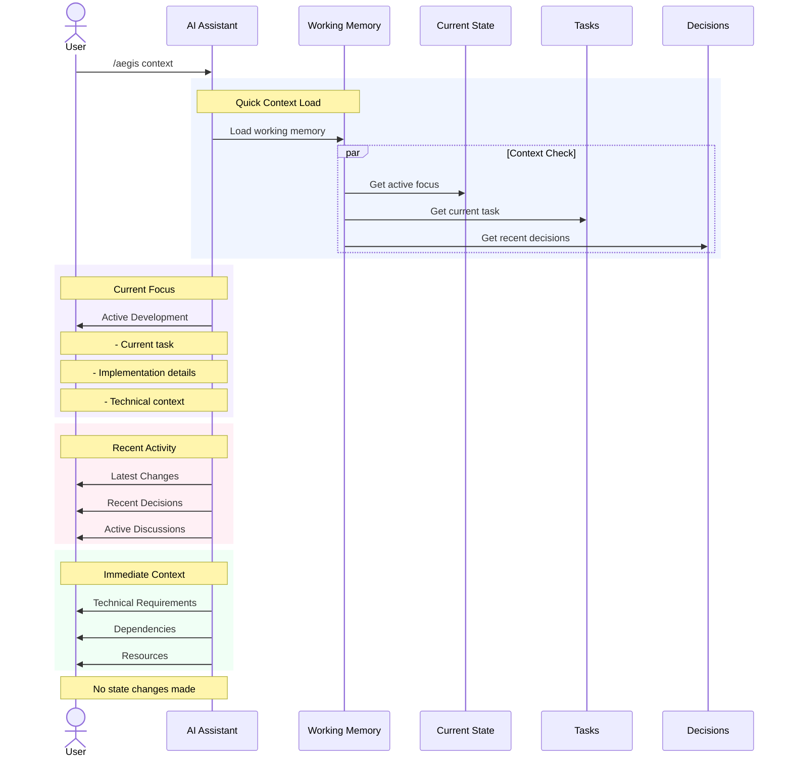

# `/aegis context` Command

The `context` command provides a quick refresh of the current working context without performing a full memory reload. It focuses on the most relevant information for the current work, helping maintain focus and productivity during development sessions.

## Usage

```bash
/aegis context
```

## Workflow



## Process Details

1. **Quick Context Load**
   - Loads working memory only
   - Parallel context checks:
     - Active development focus
     - Current task details
     - Recent decisions
     - Immediate context

2. **Current Focus**
   - Active development area
   - Current task details
   - Implementation progress
   - Technical requirements

3. **Recent Activity**
   - Latest code changes
   - Recent decisions
   - Active discussions
   - Progress updates

4. **Immediate Context**
   - Technical requirements
   - Dependencies
   - Resources
   - Constraints

## Context Components

### Working Memory
- Active development focus
- Current implementation details
- Immediate technical context
- Open questions

### Current State
- Active task progress
- Implementation status
- Technical requirements
- Resource availability

### Recent Activity
- Code changes
- Decisions made
- Discussions held
- Progress achieved

## Key Features

1. **Quick Refresh**
   - No full reload
   - Working memory focus
   - Immediate context
   - Current state

2. **Relevant Information**
   - Active focus
   - Current work
   - Recent changes
   - Immediate needs

3. **Context Maintenance**
   - Development continuity
   - Focus preservation
   - Progress tracking
   - State awareness

## Common Uses

1. **Focus Recovery**
   - After interruptions
   - Context switches
   - Session resumption
   - Task transitions

2. **Progress Check**
   - Current status
   - Recent progress
   - Next steps
   - Blockers

3. **Quick Reference**
   - Technical details
   - Implementation notes
   - Requirements
   - Dependencies

## Best Practices

1. **Regular Use**
   - After interruptions
   - Before task switches
   - During reviews
   - Session resumption

2. **Context Review**
   - Check focus
   - Verify progress
   - Note changes
   - Plan ahead

3. **Effective Recovery**
   - Quick orientation
   - State verification
   - Progress check
   - Next steps

## Tips

1. **Quick Recovery**
   - Scan recent changes
   - Check current focus
   - Review progress
   - Note blockers

2. **Context Awareness**
   - Maintain focus
   - Track progress
   - Note changes
   - Plan work

3. **Productivity**
   - Minimize interruptions
   - Quick recovery
   - Clear focus
   - Forward momentum

## Common Issues

1. **Context Loss**
   - Interrupted work
   - Lost focus
   - Missing details
   - Unclear state

2. **Information Overload**
   - Too much detail
   - Unclear priorities
   - Mixed contexts
   - Scattered focus

3. **Recovery Challenges**
   - Complex state
   - Multiple tasks
   - Unclear progress
   - Missing context

## Next Steps

1. **After Context Check**
   - Confirm understanding
   - Verify focus
   - Check progress
   - Plan work

2. **Common Actions**
   - Resume work
   - Update status
   - Address issues
   - Move forward

3. **Productivity**
   - Maintain focus
   - Track progress
   - Document changes
   - Stay organized

## Differentiation from Start

Unlike `/aegis start`, the context command:
- Performs no full reload
- Focuses on working memory
- Provides immediate context
- Maintains current focus
- Quick execution
- No state changes