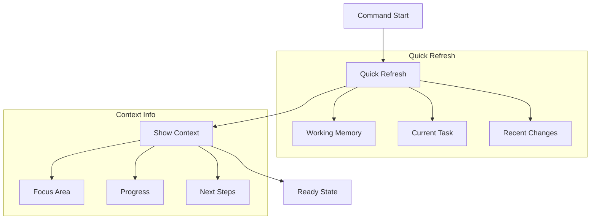

# Context Command Documentation

The `/aegis context` command performs a quick refresh of the current context, showing relevant information for current work.

> **Important**: This command should be typed in your AI assistant's chat window, not in your terminal. The command helps guide your AI assistant in understanding context.

## Usage

Type in your AI assistant's chat window:

```bash
/aegis context
```

## Workflow



## Process Steps

1. **Quick Refresh**
   * Working memory
   * Current task
   * Recent changes
   * Active focus
2. **Show Context**
   * Focus area
   * Current progress
   * Next steps
   * Blockers
3. **Ready State**
   * Maintain focus
   * Continue work
   * Track progress
   * Plan ahead

## Context Types

### Working Memory

* Active focus
* Current work
* Technical details
* Open items

### Current Task

* Progress
* Status
* Requirements
* Resources

### Recent Changes

* Code updates
* Decisions
* Progress
* Notes

## Common Issues

1. **Context Loss**
   * Interruptions
   * Lost focus
   * Missing info
   * Unclear state
2. **Information**
   * Too detailed
   * Not clear
   * Mixed focus
   * Scattered
3. **Recovery**
   * Complex work
   * Many tasks
   * Unclear path
   * Missing notes

## Best Practices

1. **Regular Use**
   * After breaks
   * Task switches
   * Reviews
   * Resuming
2. **Review**
   * Check focus
   * See progress
   * Note changes
   * Plan next
3. **Recovery**
   * Quick scan
   * State check
   * Progress view
   * Next steps

For more information, see:

* [Memory System](../memory_system.md)
* [Getting Started](../)
* [Core Files](../core_files.md)
