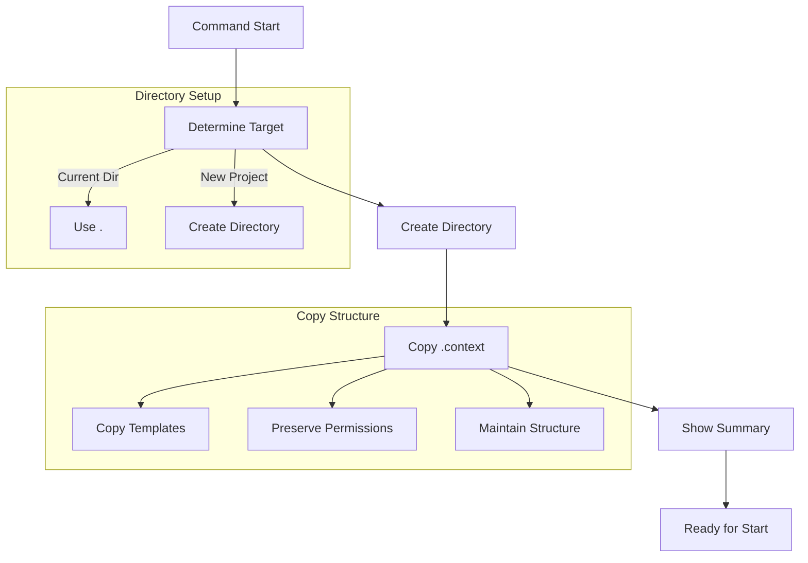

# `/aegis init` Command

The `init` command initializes the Aegis framework in your project. It sets up the necessary directory structure and files to enable AI-assisted development with structured memory management.

## Usage

```bash
/aegis init <path>
```

### Arguments

- `<path>`: The target directory for initialization
  - Use `.` to initialize in the current directory
  - Use a name (e.g., `my-project`) to create and initialize a new directory

## Workflow


## Directory Structure

The command creates the following structure:
```
.context/
├── AI_INSTRUCTIONS.md     # Framework instructions
├── plan/
│   ├── README.md           # Planning overview
│   ├── agents.mmd         # Agent system diagram
│   ├── ai_conductor.json  # Conductor configuration
│   ├── document_states.mmd # Document workflow
│   ├── feedback.mmd       # Feedback system
│   └── workflow.mmd       # Planning workflow
├── current_state.md       # Working memory
├── roadmap.md            # Project direction
├── tasks/
│   ├── TEMPLATE.md       # Task template
│   ├── active/          # Current tasks
│   ├── planned/         # Future tasks
│   ├── hold/           # Blocked tasks
│   └── completed/      # Finished tasks
├── sessions/
│   └── TEMPLATE.md      # Session log template
└── decisions/
    └── TEMPLATE.md      # Decision record template
```

## Important Rules

1. **Directory Name**
   - The directory is named ".context" with a leading dot
   - Always include the dot when copying or referencing

2. **Copy Method**
   - ALWAYS use `cp -r` to copy the entire structure
   - DO NOT use `mkdir` to create directories manually
   - DO NOT create empty directories

3. **File Handling**
   - Preserve all file permissions
   - Maintain directory structure
   - Keep template files
   - Preserve memory assignments

## Examples

1. **Initialize in Current Directory**
   ```bash
   /aegis init .
   ```

2. **Create New Project**
   ```bash
   /aegis init my-project
   ```

## Next Steps

After initialization:
```bash
/aegis start     # Begin development
```

## Common Issues

1. **Directory Already Exists**
   - Existing `.context` directory will not be overwritten
   - Use a different path or manually remove existing directory

2. **Permission Issues**
   - Ensure write permissions in target directory
   - Check file ownership if needed

3. **Path Issues**
   - Avoid special characters in path names
   - Use relative paths for best results

## Tips

1. **Project Organization**
   - Keep `.context` directory at project root
   - Use clear, descriptive names
   - Maintain clean directory structure

2. **Memory Management**
   - Review template files
   - Understand memory types
   - Plan your organization

For more information, see:
- [Memory System](../memory_system.md)
- [Getting Started](../getting_started.md)
- [Core Files](../core_files.md)