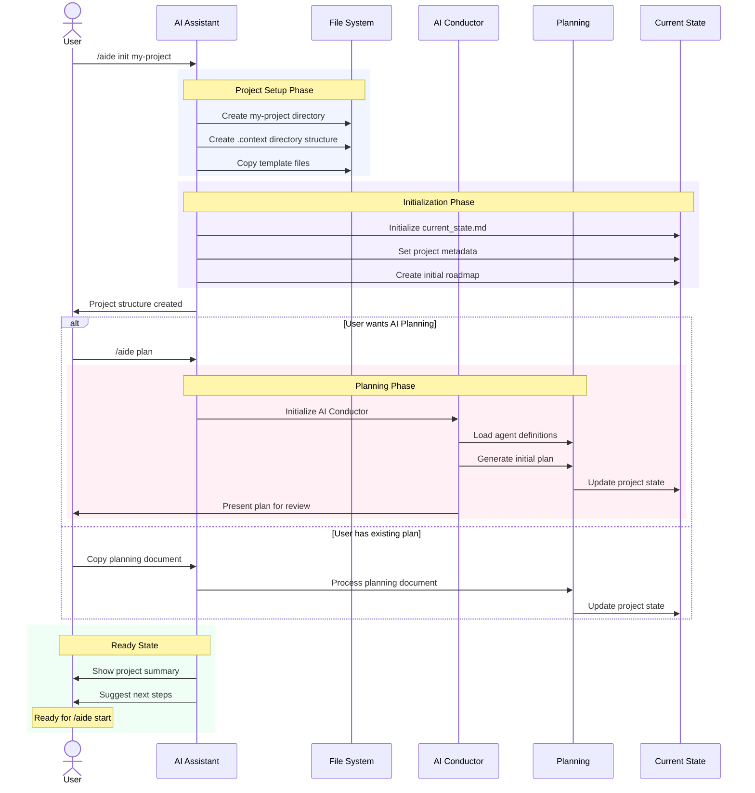

# `/aegis init` Command

The `init` command initializes the Aegis framework in your project. It sets up the necessary directory structure and files to enable AI-assisted development with structured memory management.

## Usage

```bash
/aegis init <path>
```

### Arguments

- `<path>`: The target directory for initialization
  - Use `.` to initialize in the current directory
  - Use a name (e.g., `my-project`) to create and initialize a new directory

## Workflow


1. **Directory Setup**
   - If `<path>` is `.`: Uses the current directory
   - If `<path>` is a name: Creates a new directory
   - Creates the `.context` directory structure

2. **Memory System Initialization**
   ```
   .context/
   ├── AI_INSTRUCTIONS.md    # Framework instructions
   ├── current_state.md     # Project knowledge
   ├── roadmap.md          # Project direction
   ├── plan/              # Project planning
   │   ├── README.md     # Planning overview
   │   ├── ai_conductor.json  # AI orchestration
   │   ├── agents.mmd    # Agent definitions
   │   ├── workflow.mmd  # Planning workflow
   │   ├── feedback.mmd  # Feedback handling
   │   └── document_states.mmd  # Document lifecycle
   ├── tasks/           # Task management
   │   ├── TEMPLATE.md # Task template
   │   ├── active/    # Current tasks
   │   ├── completed/ # Finished tasks
   │   ├── planned/  # Future tasks
   │   └── hold/    # Blocked tasks
   ├── sessions/   # Session records
   └── decisions/ # Architecture decisions
   ```

3. **Memory Type Setup**
   - **Semantic Memory**: Project knowledge and technical details
     - Initializes `current_state.md`
     - Creates `roadmap.md`
   
   - **Episodic Memory**: Project history
     - Sets up `sessions/` directory
     - Prepares for session logging
   
   - **Procedural Memory**: Task management
     - Creates task directory structure
     - Adds task template
   
   - **Working Memory**: Current focus
     - Initializes current state tracking
     - Sets up active development focus

4. **Planning System Setup**
   - Creates planning directory structure
   - Initializes AI Conductor configuration
   - Sets up agent definitions
   - Prepares workflow diagrams

## Next Steps

After initialization:

1. **For New Projects with AI Planning**
   ```bash
   /aegis plan      # Start AI-guided planning
   /aegis start     # Begin development
   ```

2. **For New Projects with Your Plan**
   ```bash
   # Copy your planning document
   cp your-plan.md .context/plan/initial_plan.md
   
   /aegis start     # Begin development
   ```

3. **For Existing Projects**
   ```bash
   /aegis start     # Begin development
   /aegis status    # Check project state
   ```

## Examples

1. **Initialize in Current Directory**
   ```bash
   /aegis init .
   ```

2. **Create New Project**
   ```bash
   /aegis init my-awesome-project
   ```

## Common Issues

1. **Directory Already Exists**
   - Existing `.context` directory will not be overwritten
   - Use a different path or manually remove existing directory

2. **Permission Issues**
   - Ensure write permissions in target directory
   - Check file ownership if needed

3. **Path Issues**
   - Avoid special characters in path names
   - Use relative paths for best results

## Tips

1. **Project Organization**
   - Keep `.context` directory at project root
   - Use clear, descriptive task names
   - Maintain clean directory structure

2. **Memory Management**
   - Update `current_state.md` regularly
   - Archive completed tasks
   - Document important decisions

3. **Planning Setup**
   - Review AI Conductor configuration
   - Customize agent definitions if needed
   - Adapt workflows to your needs