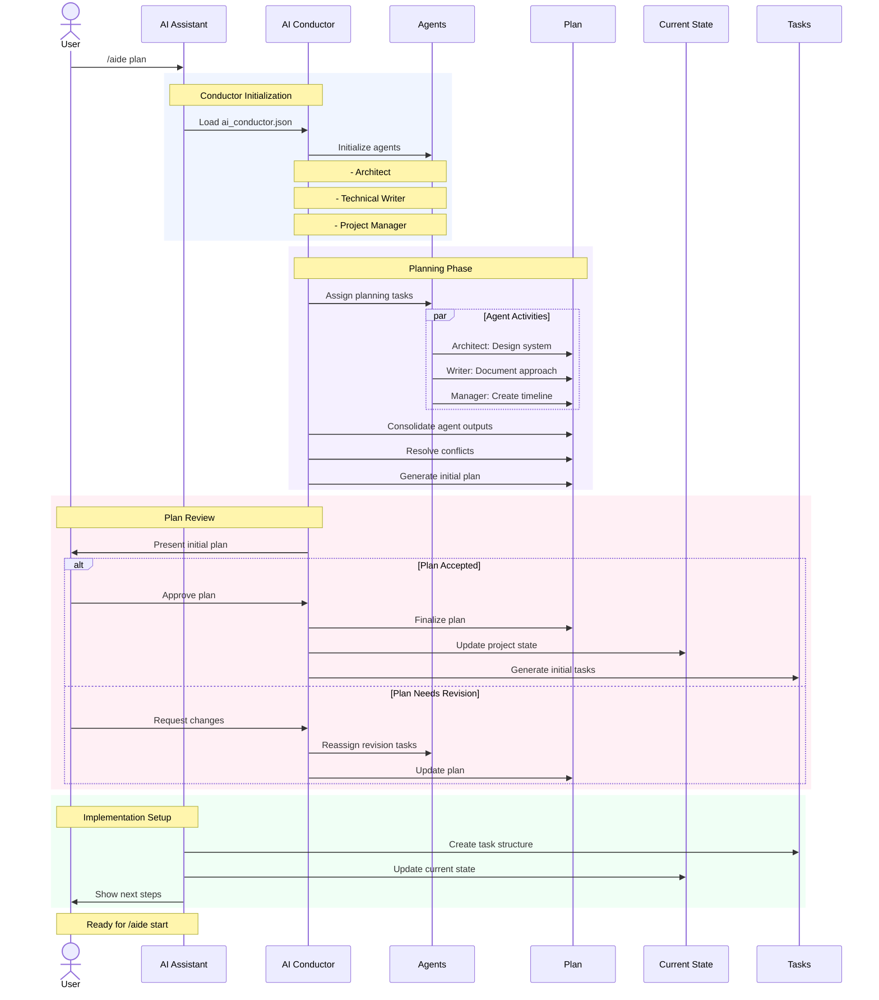

# `/aegis plan` Command

The `plan` command activates the AI Conductor to orchestrate specialized agents for project planning and execution. It generates, updates, or reviews project plans based on current goals, requirements, and constraints.

## Usage

```bash
/aegis plan
```

## Workflow



## Process Details

1. **Conductor Initialization**
   - Initialize AI Conductor
   - Load specialized agents:
     - Architect: System design
     - Planner: Task breakdown
     - Reviewer: Validation
     - Resource: Allocation

2. **Context Analysis**
   - Load current project state
   - Review existing plans
   - Check current tasks
   - Gather requirements

3. **Planning Phase**
   - Architecture definition
   - Task breakdown
   - Resource allocation
   - Timeline creation

4. **Review Phase**
   - Plan validation
   - Dependency check
   - Resource verification
   - Timeline feasibility

5. **Plan Presentation**
   - Overview
   - Task breakdown
   - Dependencies
   - Timeline

## Plan Components

### Mermaid Diagrams
The Aegis framework extensively uses Mermaid diagrams as a powerful tool for communicating context and workflows to AI assistants. These diagrams:
- Provide clear visual representation of system flows
- Help AI assistants understand complex relationships
- Document decision processes
- Illustrate system architecture
- Track state transitions
- Define agent interactions

Mermaid's declarative syntax makes it ideal for:
- Sequence diagrams (agent interactions)
- Flowcharts (decision processes)
- State diagrams (workflow states)
- Class diagrams (system architecture)
- Entity Relationship Diagrams (data relationships)

The framework stores these diagrams in markdown files, making them:
- Version controllable
- Easy to update
- Readable by both humans and AI
- Self-documenting
- Maintainable

### Architecture Plan
- System design
- Component breakdown
- Technical stack
- Integration points
- Data flow

### Task Breakdown
- Major milestones
- Task hierarchy
- Dependencies
- Priorities
- Estimates

### Resource Allocation
- Team requirements
- Technical resources
- Time allocation
- External dependencies
- Constraints

### Timeline
- Project phases
- Milestones
- Critical path
- Buffer periods
- Review points

## Specialized Agents

1. **Architect Agent**
   - System design
   - Technical decisions
   - Architecture patterns
   - Integration strategy

2. **Planner Agent**
   - Task breakdown
   - Dependencies
   - Timelines
   - Milestones

3. **Reviewer Agent**
   - Plan validation
   - Risk assessment
   - Feasibility check
   - Quality assurance

4. **Resource Agent**
   - Resource allocation
   - Capacity planning
   - Constraint analysis
   - Optimization

## Common Operations

1. **Plan Generation**
   - New project planning
   - Phase planning
   - Sprint planning
   - Release planning

2. **Plan Updates**
   - Progress incorporation
   - Scope changes
   - Resource updates
   - Timeline adjustments

3. **Plan Review**
   - Validation
   - Risk assessment
   - Progress check
   - Adjustment needs

## Best Practices

1. **Plan Creation**
   - Clear objectives
   - Realistic timelines
   - Proper dependencies
   - Resource availability

2. **Plan Updates**
   - Regular reviews
   - Progress tracking
   - Risk monitoring
   - Adjustment timing

3. **Plan Management**
   - Version control
   - Change tracking
   - Communication
   - Documentation

## Tips

1. **Effective Planning**
   - Clear goals
   - Realistic estimates
   - Buffer inclusion
   - Risk consideration

2. **Plan Maintenance**
   - Regular updates
   - Progress tracking
   - Risk monitoring
   - Communication

3. **Collaboration**
   - Team input
   - Stakeholder review
   - Clear communication
   - Feedback incorporation

## Common Issues

1. **Plan Accuracy**
   - Unrealistic estimates
   - Missing dependencies
   - Resource conflicts
   - Timeline issues

2. **Plan Management**
   - Outdated information
   - Unclear priorities
   - Resource conflicts
   - Communication gaps

3. **Plan Execution**
   - Deviation handling
   - Progress tracking
   - Risk management
   - Change control

## Next Steps

1. **After Planning**
   - Review plan
   - Get approvals
   - Create tasks
   - Begin execution

2. **During Execution**
   - Track progress
   - Monitor risks
   - Update plan
   - Communicate changes

3. **Plan Maintenance**
   - Regular reviews
   - Progress updates
   - Risk assessment
   - Adjustments