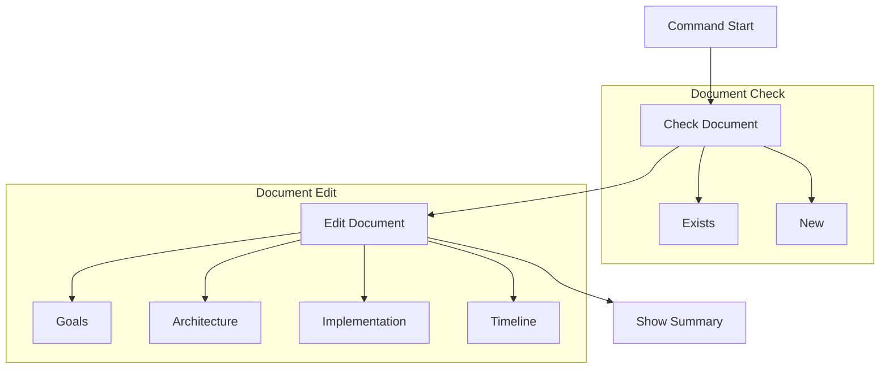

# `/aegis plan` Command

The `plan` command helps create and refine your project's planning document, focusing solely on `planning_document.md`.

> **Important**: This command should be typed in your AI assistant's chat window, not in your terminal. The command helps guide your AI assistant in project planning.

## Usage

Type in your AI assistant's chat window:
```
/aegis plan
```

Or with specific requirements:
```
/aegis plan
Requirements:
- Mobile and desktop support
- Offline capabilities
- User authentication
```

## Workflow



## Process Steps

1. **Check Planning Document**
   - Look for `planning_document.md`
   - If exists: Review and improve
   - If new: Create with template
   - Focus on root directory

2. **Guide Planning Process**
   - Project goals
   - Requirements list
   - Technical choices
   - Implementation steps
   - Success criteria

3. **Update Document**
   - Add user feedback
   - Improve sections
   - Add details
   - Clarify points

4. **Keep Document Focused**
   - Clear objectives
   - Technical decisions
   - Implementation steps
   - Success metrics

## Document Sections

### Project Goals
- Main objectives
- Requirements
- Constraints
- Success criteria

### Technical Architecture
- System design
- Technology stack
- Components
- Integration

### Implementation
- Approach
- Major steps
- Dependencies
- Resources

### Timeline
- Project phases
- Key milestones
- Dependencies
- Estimates

## Common Issues

1. **Document Focus**
   - Stay in scope
   - Clear goals
   - Specific plans
   - Actionable steps

2. **Content**
   - Complete sections
   - Clear writing
   - Good structure
   - Useful details

3. **Planning**
   - Realistic goals
   - Clear steps
   - Good timeline
   - Success metrics

## Best Practices

1. **Document Creation**
   - Clear structure
   - Complete sections
   - Good details
   - Useful examples

2. **Updates**
   - User feedback
   - Better clarity
   - More details
   - Fixed issues

3. **Organization**
   - Logical flow
   - Clear sections
   - Good format
   - Easy reading

For more information, see:
- [Memory System](../memory_system.md)
- [Getting Started](../getting_started.md)
- [Core Files](../core_files.md)