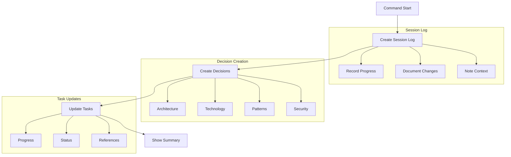

# `/aegis save` Command

The `save` command preserves the current development session progress, creating a session log and updating task status.

> **Important**: This command should be typed in your AI assistant's chat window, not in your terminal. The command helps guide your AI assistant in recording your progress.

## Usage

Type in your AI assistant's chat window:
```bash
/aegis save
```

## Workflow



## Process Steps

1. **Create Session Log**
   - Record progress made
   - Document changes
   - Note important context
   - Link related items

2. **Create Decision Records**
   - Architecture changes
   - Technology choices
   - Pattern implementations
   - Security decisions
   - Breaking changes
   - Convention creation

3. **Update Task Progress**
   - Update status
   - Move completed tasks
   - Update references
   - Note blockers

4. **Show Summary**
   - Updated files
   - Status changes
   - Key decisions
   - Next steps

## File Updates

### Session Log
- Progress made
- Changes implemented
- Decisions taken
- Context preserved

### Decision Records
- New decisions
- Status updates
- References
- Impact notes

### Task Updates
- Progress status
- Completion state
- Dependencies
- Blockers

## Common Issues

1. **File System**
   - Check permissions
   - Verify access
   - Ensure space
   - Handle locks

2. **Content**
   - Check references
   - Verify links
   - Update status
   - Maintain order

3. **State**
   - Complete updates
   - Check references
   - Verify links
   - Ensure consistency

## Best Practices

1. **Regular Saves**
   - After changes
   - Before breaks
   - Task completion
   - Session end

2. **Clean Updates**
   - Verify changes
   - Check links
   - Update status
   - Review summary

3. **Organization**
   - Link items
   - Clear references
   - Good descriptions
   - Clean structure

## Next Steps After Save

1. **Review Changes**
   - Check updated files
   - Verify task status
   - Review decisions
   - Confirm links

2. **Plan Ahead**
   - Note next tasks
   - Review dependencies
   - Check blockers
   - Plan next session

3. **Maintenance**
   - Clean up old files
   - Archive if needed
   - Update references
   - Organize tasks

For more information, see:
- [Memory System](../memory_system.md)
- [Getting Started](../getting_started.md)
- [Core Files](../core_files.md)