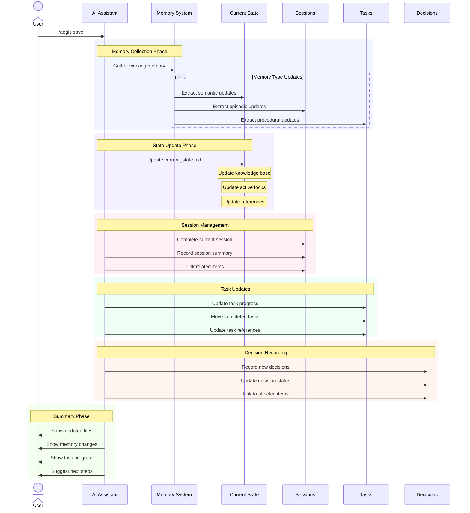

# `/aegis save` Command

The `save` command preserves the current development state and updates all relevant memory types in the Aegis framework. It ensures that project knowledge, progress, and context are properly recorded and organized.

## Usage

```bash
/aegis save
```

## Workflow



## Process Details

1. **Memory Collection Phase**
   - Gathers current working memory
   - Extracts updates by memory type:
     - Semantic: New knowledge and understanding
     - Episodic: Session activities and outcomes
     - Procedural: Task progress and changes

2. **State Update Phase**
   - Updates current project state
   - Refreshes knowledge base
   - Updates active focus areas
   - Maintains cross-references

3. **Session Management**
   - Records session outcomes
   - Creates session summary
   - Links related information
   - Preserves context

4. **Task Management**
   - Updates task progress
   - Moves completed tasks
   - Updates dependencies
   - Maintains task references

5. **Decision Recording**
   - Documents new decisions
   - Updates decision statuses
   - Links to affected components
   - Preserves decision context

6. **Summary Generation**
   - Lists updated files
   - Shows memory changes
   - Reports task progress
   - Provides next steps

## File Updates

### Semantic Memory
- `current_state.md`
  - New knowledge
  - Updated understanding
  - Technical details
  - System changes

### Episodic Memory
- `sessions/[date].md`
  - Session activities
  - Key decisions
  - Problems solved
  - Changes made

### Procedural Memory
- `tasks/`
  - Task progress
  - Status changes
  - New tasks
  - Completed tasks

### Working Memory
- Current focus updates
- Active development state
- Immediate context

## Common Issues

1. **File System Issues**
   - Permission problems
   - Lock files
   - Concurrent access
   - Storage constraints

2. **Content Conflicts**
   - Merge conflicts
   - Concurrent updates
   - Reference inconsistencies
   - Version mismatches

3. **State Synchronization**
   - Incomplete updates
   - Missing references
   - Broken links
   - Inconsistent state

## Best Practices

1. **Regular Saves**
   - Save after significant changes
   - Save before context switches
   - Save when completing tasks
   - Save before ending sessions

2. **Clean Updates**
   - Verify file changes
   - Check references
   - Validate links
   - Review summaries

3. **Context Maintenance**
   - Keep related items linked
   - Maintain clear references
   - Document relationships
   - Preserve context

## Tips

1. **Effective Saving**
   - Save at logical breakpoints
   - Include clear summaries
   - Verify critical updates
   - Check task status

2. **State Management**
   - Keep files organized
   - Maintain clean history
   - Archive completed items
   - Update references

3. **Documentation**
   - Write clear summaries
   - Document decisions
   - Explain changes
   - Note dependencies

## Next Steps After Save

1. **Review Changes**
   - Check updated files
   - Verify task status
   - Review decisions
   - Confirm links

2. **Plan Ahead**
   - Note next tasks
   - Review dependencies
   - Check blockers
   - Plan next session

3. **Maintenance**
   - Clean up old files
   - Archive if needed
   - Update references
   - Organize tasks