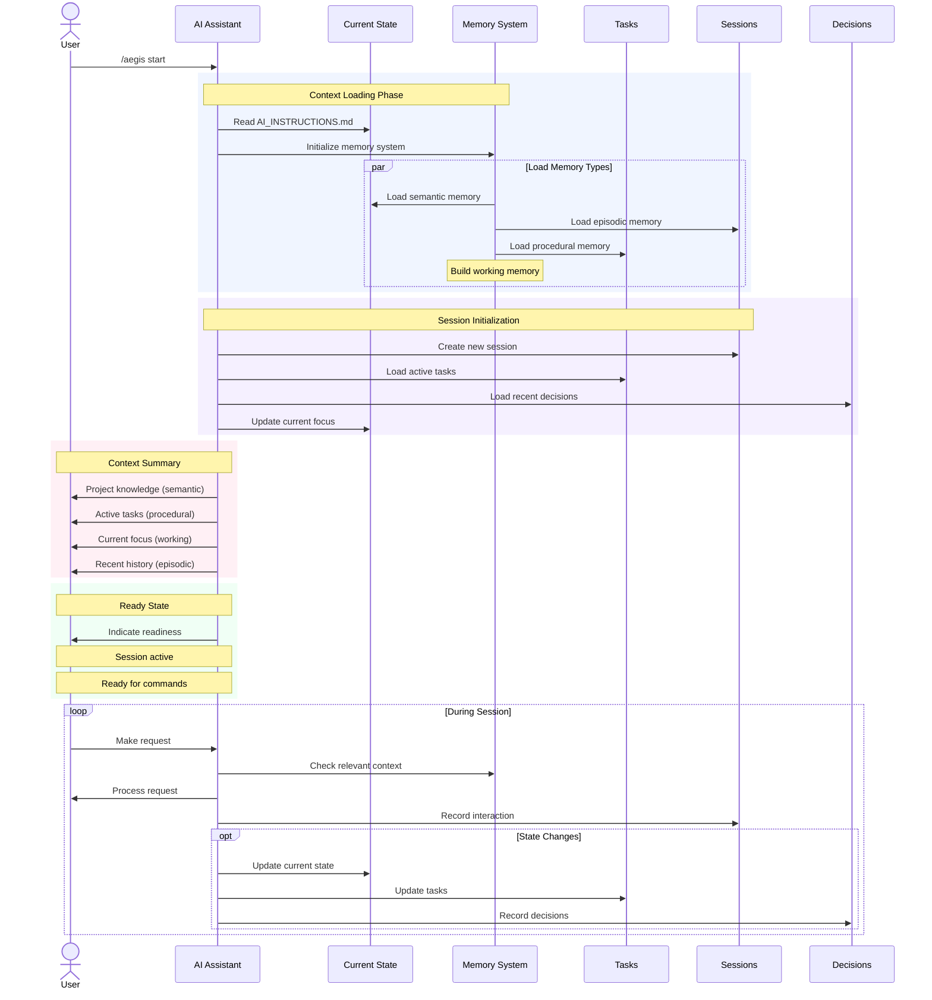

# `/aegis start` Command

The `start` command begins a new development session with the Aegis framework. It loads and processes all context from the project's memory system, providing a comprehensive overview of the project state and preparing for development tasks.

> **Related Documentation**
> - [Memory System](../memory_system.md) - Understanding memory types
> - [Core Framework Files](../core_files.md) - Essential framework files
> - [Session Management](../sessions.md) - How sessions work
> - [Task Management](../tasks.md) - Task organization
> - [Current State](../core_files.md#2-current_statemd) - Working memory details

## Usage

```bash
/aegis start
```

## Workflow



## Process Details

1. **Context Loading Phase**
   - Reads framework instructions
   - Initializes memory system
   - Loads all memory types in parallel:
     - Semantic: Project knowledge
     - Episodic: Development history
     - Procedural: Tasks and processes
     - Working: Current focus

2. **Session Initialization**
   - Creates new session record
   - Loads active task information
   - Reviews recent decisions
   - Sets current development focus

3. **Context Summary**
   - Presents organized overview of:
     - Project knowledge base
     - Active development tasks
     - Current focus areas
     - Recent project history

4. **Ready State**
   - Indicates session is active
   - Prepares for development requests
   - Maintains continuous context

## Memory Types Processed

### Semantic Memory (Project Knowledge)
- Technical documentation
- Architecture decisions
- System design
- API specifications
- Database schemas

### Episodic Memory (Project History)
- Development sessions
- Problem solutions
- Decision contexts
- Implementation history
- Debugging sessions

### Procedural Memory (Task Management)
- Active tasks
- Implementation steps
- Testing procedures
- Deployment processes
- Maintenance routines

### Working Memory (Current Focus)
- Active development
- Immediate goals
- Current challenges
- Recent changes
- Open questions

## Session Management

1. **During Session**
   - Continuous context maintenance
   - Task progress tracking
   - Decision recording
   - State updates

2. **State Changes**
   - Current state updates
   - Task status changes
   - Decision documentation
   - Progress recording

## Common Issues

1. **Context Loading Failures**
   - Verify `.context` directory structure
   - Check file permissions
   - Ensure file integrity

2. **Memory System Issues**
   - Check file format consistency
   - Verify memory type organization
   - Review file references

3. **Session Management**
   - Monitor session logging
   - Track state changes
   - Maintain clean records

## Best Practices

1. **Session Start**
   - Review context summary carefully
   - Verify active tasks
   - Check current focus
   - Note recent changes

2. **During Development**
   - Keep context updated
   - Document decisions
   - Track progress
   - Maintain clear focus

3. **Session Organization**
   - Use clear task descriptions
   - Document important decisions
   - Update state regularly
   - Maintain clean history

## Tips

1. **Effective Context Use**
   - Reference relevant history
   - Link related tasks
   - Document decisions
   - Track dependencies

2. **Memory Management**
   - Keep files organized
   - Update regularly
   - Archive completed items
   - Maintain references

3. **Session Productivity**
   - Focus on active tasks
   - Track progress clearly
   - Document changes
   - Update state regularly