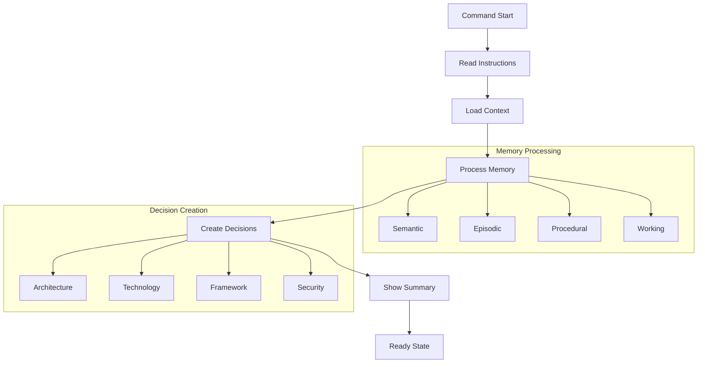

# `/aegis start` Command

The `start` command begins a new development session with the Aegis framework. It loads and processes all context from the project's memory system, providing a comprehensive overview of the project state and preparing for development tasks.

> **Related Documentation**
> - [Memory System](../memory_system.md) - Understanding memory types
> - [Core Framework Files](../core_files.md) - Essential framework files
> - [Session Management](../sessions.md) - How sessions work
> - [Task Management](../tasks.md) - Task organization
> - [Current State](../core_files.md#2-current_statemd) - Working memory details

## Usage

```bash
/aegis start
```

## Workflow



## Process Steps

1. **Read AI_INSTRUCTIONS.md**
   - Load framework instructions
   - Initialize session flow
   - Set up memory processing

2. **Load and Process Context**
   - Process all memory types:
     - Semantic: Project knowledge
     - Episodic: Development history
     - Procedural: Tasks and processes
     - Working: Current focus

3. **Create/Update Decisions**
   - Architecture decisions
   - Technology choices
   - Framework selections
   - Infrastructure setup
   - Security approaches

4. **Present Summary**
   - Project knowledge (semantic)
   - Active tasks (procedural)
   - Current focus (working)
   - Recent history (episodic)

5. **Ready State**
   - Indicate readiness
   - Prepare for requests
   - Maintain context

## Memory Types

### Semantic Memory (Project Knowledge)
- Technical documentation
- Architecture decisions
- System design
- Best practices
- Project standards

### Episodic Memory (Project History)
- Development sessions
- Problem solutions
- Decision contexts
- Learning outcomes
- Past challenges

### Procedural Memory (Task Management)
- Active tasks
- Implementation steps
- Testing procedures
- Quality checks
- Validation rules

### Working Memory (Current Focus)
- Active development
- Immediate goals
- Current challenges
- Recent changes
- Open questions

## Common Issues

1. **Context Loading**
   - Check `.context` structure
   - Verify file permissions
   - Ensure file integrity

2. **Memory Processing**
   - Check file formats
   - Verify organization
   - Review references

3. **State Management**
   - Monitor logging
   - Track changes
   - Keep clean records

## Best Practices

1. **Starting Session**
   - Review context summary
   - Check active tasks
   - Note recent changes
   - Verify decisions

2. **During Development**
   - Keep context updated
   - Document decisions
   - Track progress
   - Stay focused

3. **Organization**
   - Use clear descriptions
   - Document decisions
   - Update state
   - Maintain history

For more information, see:
- [Memory System](../memory_system.md)
- [Getting Started](../getting_started.md)
- [Core Files](../core_files.md)