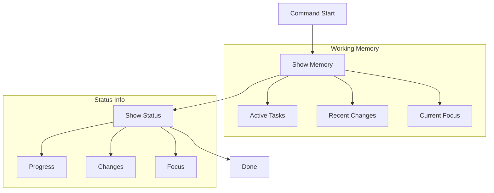

# `/aegis status` Command

The `status` command shows the current working memory, including active tasks and recent changes.

> **Important**: This command should be typed in your AI assistant's chat window, not in your terminal. The command helps guide your AI assistant in providing project status.

## Usage

Type in your AI assistant's chat window:
```bash
/aegis status
```

## Workflow



## Process Steps

1. **Show Working Memory**
   - Active tasks
   - Recent changes
   - Current focus
   - Open items

2. **Present Status**
   - Task progress
   - Recent updates
   - Focus areas
   - Next steps

3. **No File Updates**
   - Read-only operation
   - Quick snapshot
   - Current state
   - Safe to run

## Status Components

### Active Tasks
- Current work
- Progress
- Blockers
- Dependencies

### Recent Changes
- Code updates
- Documentation
- Configuration
- Features

### Current Focus
- Priorities
- Problems
- Goals
- Questions

## Common Issues

1. **State Check**
   - Current info
   - Clear view
   - Quick read
   - No changes

2. **Information**
   - Key points
   - Progress
   - Changes
   - Focus

3. **Usage**
   - Regular checks
   - Quick views
   - Team updates
   - Planning

## Best Practices

1. **Regular Use**
   - Session start
   - After changes
   - Before meetings
   - Day end

2. **Review**
   - Note blocks
   - Check deps
   - See progress
   - Plan next

3. **Action**
   - Fix blocks
   - Update work
   - Adjust focus
   - Move forward

For more information, see:
- [Memory System](../memory_system.md)
- [Getting Started](../getting_started.md)
- [Core Files](../core_files.md)