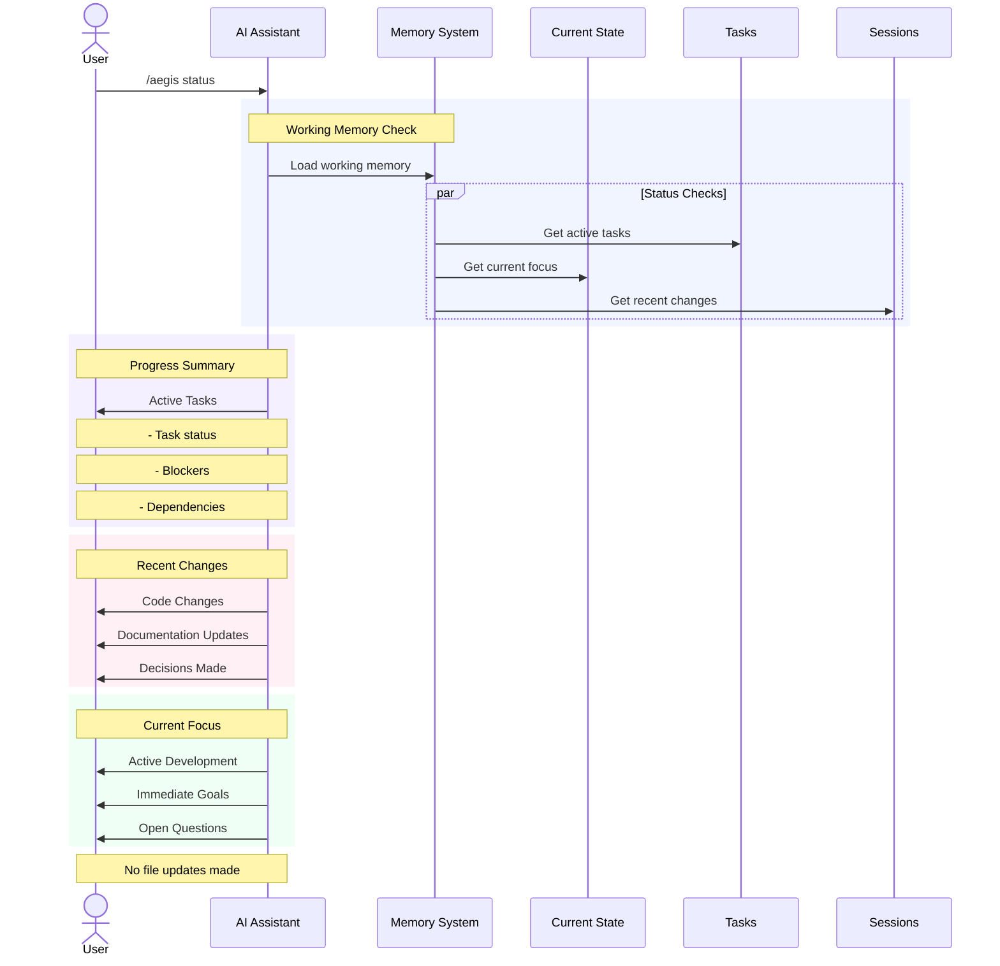

# `/aegis status` Command

The `status` command provides a quick overview of your project's current state. It's a read-only operation that shows active tasks, recent changes, and current focus areas without modifying any files.

## Usage

```bash
/aegis status
```

## Workflow



## Process Details

1. **Working Memory Check**
   - Quick load of working memory
   - Parallel status checks:
     - Active tasks and progress
     - Current development focus
     - Recent project changes

2. **Progress Summary**
   - Active task overview
   - Blocker identification
   - Dependency status
   - Implementation progress

3. **Recent Changes**
   - Code modifications
   - Documentation updates
   - New decisions
   - Recent milestones

4. **Current Focus**
   - Active development areas
   - Immediate objectives
   - Outstanding questions
   - Work in progress

## Status Components

### Active Tasks
- Current implementation tasks
- Task priorities
- Completion status
- Blocking issues
- Dependencies

### Recent Changes
- Code updates
- Documentation changes
- Configuration modifications
- New features
- Bug fixes

### Current Focus
- Development priorities
- Active problems
- Immediate goals
- Open questions

## Key Features

1. **Read-Only Operation**
   - No file modifications
   - Safe to run anytime
   - Quick execution
   - Current snapshot

2. **Comprehensive Overview**
   - Task progress
   - Recent activity
   - Current priorities
   - Project health

3. **Quick Context**
   - Immediate state
   - Active work
   - Recent history
   - Next steps

## Common Uses

1. **Progress Tracking**
   - Check task status
   - Review changes
   - Monitor blockers
   - Track dependencies

2. **Context Switching**
   - Quick project overview
   - Current state check
   - Active work review
   - Priority verification

3. **Team Updates**
   - Share progress
   - Report status
   - Highlight blockers
   - Show priorities

## Best Practices

1. **Regular Checks**
   - Start of session
   - After major changes
   - Before meetings
   - End of day

2. **Effective Review**
   - Note blockers
   - Check dependencies
   - Verify progress
   - Plan next steps

3. **Status Interpretation**
   - Identify patterns
   - Spot bottlenecks
   - Track progress
   - Plan actions

## Tips

1. **Quick Overview**
   - Focus on changes
   - Note blockers
   - Check priorities
   - Review progress

2. **Context Awareness**
   - Understand current state
   - Track dependencies
   - Monitor progress
   - Plan ahead

3. **Decision Support**
   - Identify issues
   - Plan work
   - Set priorities
   - Make adjustments

## Next Steps

1. **After Status Check**
   - Address blockers
   - Update priorities
   - Plan work
   - Take action

2. **Common Actions**
   - Update tasks
   - Remove blockers
   - Adjust focus
   - Plan sprints

3. **Follow-up**
   - Document issues
   - Update plans
   - Communicate status
   - Track progress