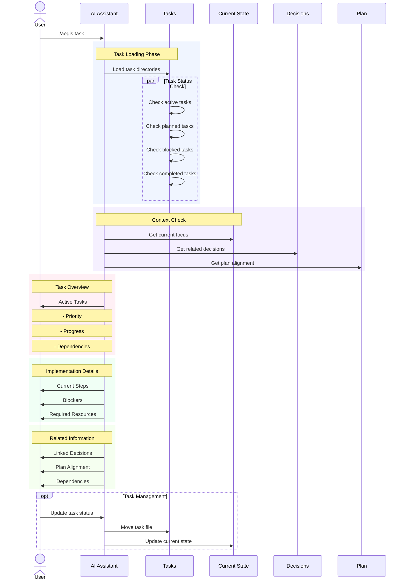

# `/aegis task` Command

The `task` command focuses on procedural memory, providing detailed information about active tasks, their implementation progress, and any blockers or dependencies. It helps manage and track the actual development work being done.

## Usage

```bash
/aegis task
```

## Workflow



## Process Details

1. **Task Loading Phase**
   - Loads all task directories
   - Parallel status checks:
     - Active tasks in progress
     - Planned future tasks
     - Tasks on hold/blocked
     - Recently completed tasks

2. **Context Check**
   - Current development focus
   - Related architectural decisions
   - Alignment with project plan
   - Dependencies and requirements

3. **Task Overview**
   - Priority levels
   - Progress indicators
   - Dependency chains
   - Resource requirements

4. **Implementation Details**
   - Current implementation steps
   - Technical requirements
   - Blocking issues
   - Resource allocation

5. **Related Information**
   - Linked decisions
   - Plan alignment status
   - External dependencies
   - Required resources

## Task Organization

### Directory Structure
```
tasks/
├── TEMPLATE.md     # Task template
├── active/        # Current tasks
├── completed/    # Finished tasks
├── planned/     # Future tasks
└── hold/       # Blocked tasks
```

### Task States
1. **Active**
   - Currently in development
   - Being implemented
   - Under review
   - In testing

2. **Planned**
   - Ready for development
   - Dependencies resolved
   - Resources available
   - Prioritized

3. **Hold**
   - Blocked by dependencies
   - Awaiting resources
   - Technical limitations
   - Strategic delays

4. **Completed**
   - Implementation done
   - Tests passed
   - Documentation updated
   - Reviewed and merged

## Task Components

### Required Fields
- Title
- Description
- Priority
- Status
- Dependencies
- Resources

### Optional Fields
- Technical details
- Implementation steps
- Testing requirements
- Documentation needs
- Review criteria

## Common Operations

1. **Task Review**
   - Check progress
   - Verify dependencies
   - Review blockers
   - Update status

2. **Task Management**
   - Create new tasks
   - Update status
   - Move between states
   - Archive completed

3. **Task Planning**
   - Set priorities
   - Allocate resources
   - Schedule work
   - Plan dependencies

## Best Practices

1. **Task Creation**
   - Use clear titles
   - Detailed descriptions
   - Specific requirements
   - Clear acceptance criteria

2. **Task Updates**
   - Regular progress updates
   - Clear blocker documentation
   - Dependency tracking
   - Status changes

3. **Task Organization**
   - Logical grouping
   - Clear priorities
   - Maintained dependencies
   - Updated status

## Tips

1. **Effective Management**
   - Regular reviews
   - Clear communication
   - Dependency tracking
   - Progress monitoring

2. **Status Updates**
   - Frequent updates
   - Clear progress markers
   - Blocker documentation
   - Dependency status

3. **Task Flow**
   - Smooth transitions
   - Clear handoffs
   - Progress tracking
   - Status clarity

## Common Issues

1. **Task Clarity**
   - Unclear requirements
   - Missing details
   - Ambiguous goals
   - Undefined scope

2. **Dependency Management**
   - Circular dependencies
   - Missing requirements
   - Blocked progress
   - Resource conflicts

3. **Status Tracking**
   - Outdated status
   - Missing updates
   - Unclear progress
   - Lost context

## Next Steps

1. **After Task Review**
   - Update progress
   - Address blockers
   - Check dependencies
   - Plan next actions

2. **Task Updates**
   - Document changes
   - Update status
   - Move between states
   - Update dependencies

3. **Planning**
   - Review priorities
   - Allocate resources
   - Schedule work
   - Set milestones