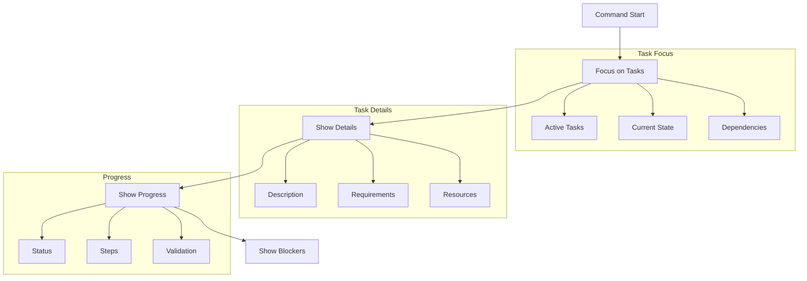

# `/aegis task` Command

The `task` command focuses on procedural memory, providing detailed information about active tasks, their implementation progress, and any blockers or dependencies. It helps manage and track the actual development work being done.

## Usage

```bash
/aegis task
```

## Workflow



## Process Steps

1. **Focus on Tasks**
   - Load active tasks
   - Check current state
   - Review dependencies
   - Gather resources

2. **Show Task Details**
   - Task description
   - Requirements
   - Resources needed
   - Dependencies

3. **Present Progress**
   - Implementation status
   - Completed steps
   - Validation state
   - Quality checks

4. **List Blockers**
   - Dependencies
   - Resources
   - Technical issues
   - External factors

## Task Organization

### Directory Structure
```
tasks/
├── TEMPLATE.md     # Task template
├── active/        # Current tasks
├── completed/    # Finished tasks
├── planned/     # Future tasks
└── hold/       # Blocked tasks
```

### Task States
1. **Active**
   - In development
   - Under review
   - Testing
   - Validation

2. **Planned**
   - Ready
   - Dependencies met
   - Resources ready
   - Prioritized

3. **Hold**
   - Blocked
   - Waiting
   - Limited
   - Delayed

4. **Completed**
   - Done
   - Tested
   - Documented
   - Reviewed

## Common Issues

1. **Task Details**
   - Clear requirements
   - Complete info
   - Defined goals
   - Set scope

2. **Dependencies**
   - Track chains
   - Note requirements
   - Watch progress
   - Handle conflicts

3. **Status**
   - Keep current
   - Show progress
   - Note changes
   - Maintain context

## Best Practices

1. **Task Management**
   - Clear titles
   - Good descriptions
   - Track progress
   - Note blockers

2. **Updates**
   - Regular status
   - Document blocks
   - Track deps
   - Show changes

3. **Organization**
   - Group logically
   - Set priority
   - Track deps
   - Update status

For more information, see:
- [Memory System](../memory_system.md)
- [Getting Started](../getting_started.md)
- [Core Files](../core_files.md)