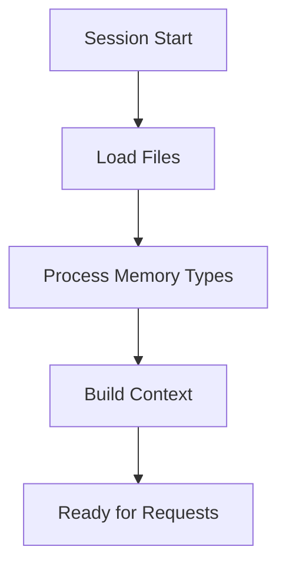
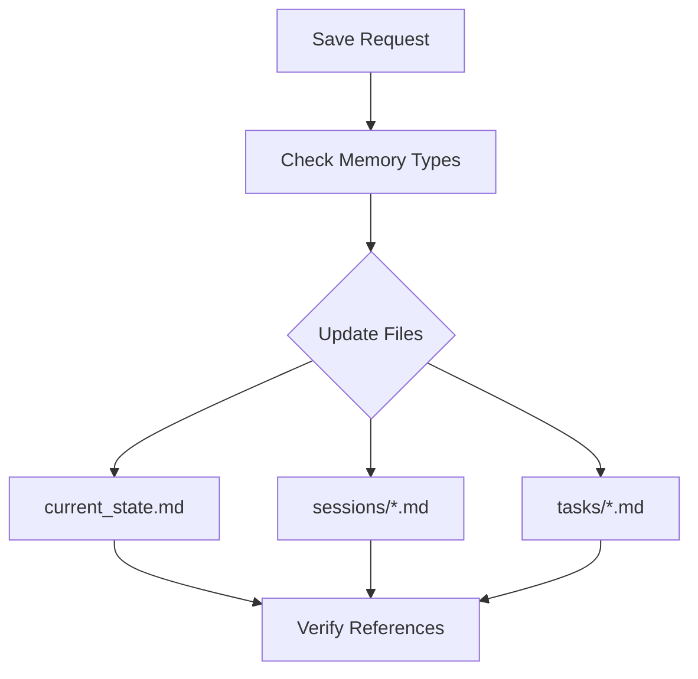

# Core Framework Files

Aegis uses a set of core files to maintain system state and guide project development. These files are central to the framework's operation and require special attention.

> **Related Documentation**
> - [Memory System](./memory_system.md) - Understanding how memory types work
> - [Cross-Referencing](./cross_referencing.md) - How core files are linked together
> - [Task Management](./tasks.md) - Working with tasks
> - [Session Management](./sessions.md) - Managing development sessions
> - [Templates](./templates.md) - Standard templates for core files

## Overview

```mermaid
graph TD
    A[Core Files] --> B[AI_INSTRUCTIONS.md]
    A --> C[current_state.md]
    A --> D[roadmap.md]
    A --> P[planning_document.md]
    A --> T[Templates]
    
    B --> B1[Session Flow]
    B --> B2[Memory Types]
    B --> B3[State Management]
    B --> B4[Save Operations]
    
    C --> C1[Knowledge Base]
    C --> C2[Active Development]
    C --> C3[Technical State]
    C --> C4[Current Focus]
    
    D --> D1[Current Focus]
    D --> D2[Future Direction]
    D --> D3[Achievement Log]
    
    P --> P1[Goals]
    P --> P2[Architecture]
    P --> P3[Implementation]
    P --> P4[Timeline]
    
    T --> T1[tasks/TEMPLATE.md]
    T --> T2[sessions/TEMPLATE.md]
    T --> T3[decisions/TEMPLATE.md]
```



## 1. AI_INSTRUCTIONS.md

This file provides operational instructions for the framework.

### Purpose
- Guides behavior
- Defines processing flows
- Establishes memory management
- Sets operational standards

### Key Components

#### Session Start Flow


#### Memory Type Processing
- **Semantic**: Project knowledge and patterns
- **Episodic**: Development history
- **Procedural**: Implementation steps
- **Working**: Current focus

#### State Management
- File update rules
- Section management
- Memory type handling
- Reference maintenance

#### Save Operation Flow


### Usage
- Framework maintains consistency
- Operations stay standardized
- Context remains organized

## 2. current_state.md

This file maintains the current state of the project.

### Purpose
- Tracks project state
- Maintains active context
- Records technical state
- Guides development

### Structure

```yaml
---
last_updated: ${timestamp}
memory_types: [semantic, working]
current_phase: ${phase}
sprint_status: ${status}
priority: high
references: []
---
```

### Key Sections

#### Knowledge Base [semantic]
- Core concepts
- Technical stack
- Key terminology
- Version requirements

#### Active Development [working]
- Completed features
- In-progress work
- Upcoming features
- References to tasks

#### Technical State [semantic]
- Core dependencies
- Environment details
- Configuration state
- System requirements

#### Current Focus [working]
- Active priorities
- Immediate needs
- Recent changes
- Task references

### Usage
- Updated each session
- Referenced by commands
- Guides development
- Maintains context

## 3. roadmap.md

This file tracks the project's direction and achievements.

### Purpose
- Sets direction
- Tracks progress
- Plans features
- Records achievements

### Structure

```yaml
---
last_updated: ${timestamp}
---
```

### Key Sections

#### Current Focus
- Priority goals
- Active initiatives
- Technical debt
- Immediate needs

#### Future Direction
- Immediate horizon
- Next steps
- Future vision
- Strategic goals

#### Achievement Log
- Completed milestones
- Major improvements
- Architectural changes
- Impact notes

### Usage
- Guides planning
- Tracks progress
- Sets priorities

## 4. planning_document.md

This file contains the project's planning details.

### Purpose
- Documents goals
- Defines architecture
- Plans implementation
- Sets timeline

### Structure

```yaml
---
last_updated: ${timestamp}
memory_types: [semantic]
priority: high
references: []
---
```

### Key Sections

#### Project Goals
- Main objectives
- Requirements
- Constraints
- Success criteria

#### Technical Architecture
- System design
- Technology stack
- Components
- Integration

#### Implementation Plan
- Major steps
- Dependencies
- Resources
- Testing

#### Timeline
- Project phases
- Key milestones
- Dependencies
- Estimates

### Usage
- Created by `/aegis plan`
- Guides development
- Sets direction
- Tracks progress

## File Templates

### 1. Task Template
- Location: `.context/tasks/TEMPLATE.md`
- Used for: Creating new tasks
- Sections:
  - Task details
  - Implementation steps
  - Dependencies
  - Progress tracking

### 2. Session Template
- Location: `.context/sessions/TEMPLATE.md`
- Used for: Recording sessions
- Sections:
  - Context
  - Progress
  - Decisions
  - Next steps

### 3. Decision Template
- Location: `.context/decisions/TEMPLATE.md`
- Used for: Recording decisions
- Sections:
  - Context
  - Options
  - Decision
  - Impact

## Best Practices

1. **File Management**
   - Regular updates
   - Clear structure
   - Proper references
   - Version control

2. **Content Quality**
   - Clear writing
   - Complete info
   - Good format
   - Useful details

3. **Organization**
   - Logical structure
   - Easy navigation
   - Good references
   - Clean layout

For more information, see:
- [Memory System](memory_system.md)
- [Cross-Referencing](cross_referencing.md)
- [Templates Guide](templates.md)
