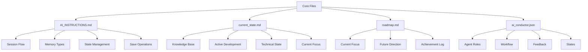
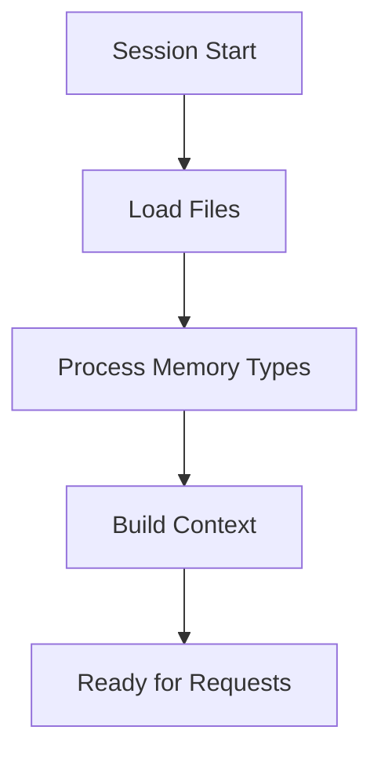
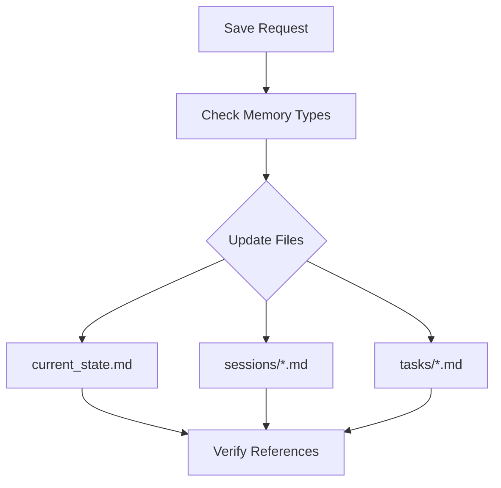
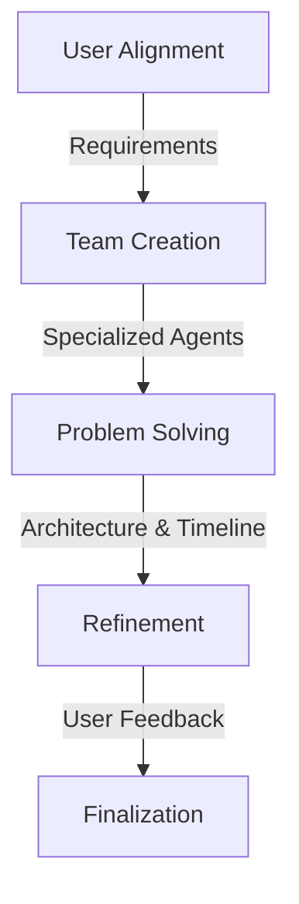
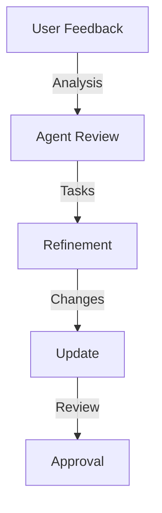
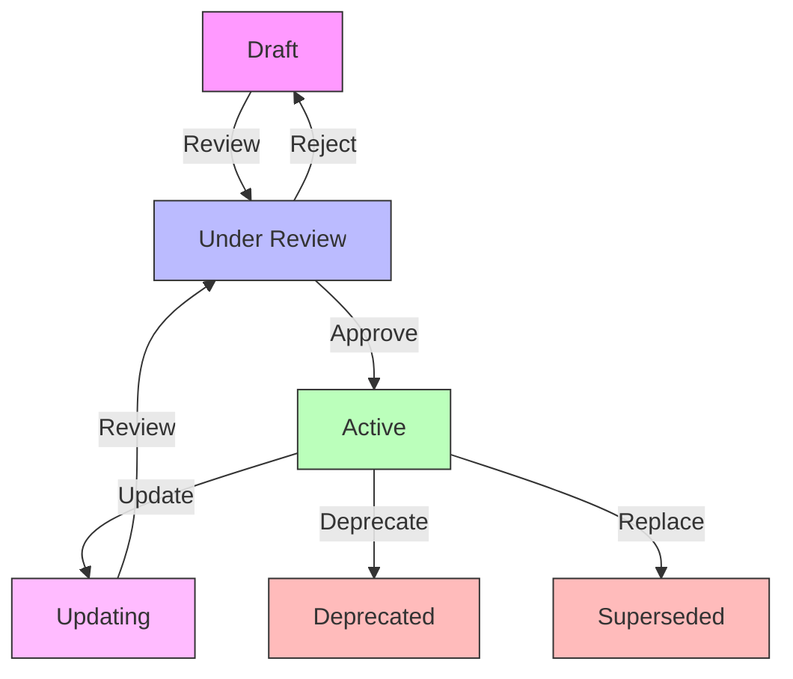

# Core Framework Files

Aegis uses a set of core files to maintain system state, guide AI behavior, and orchestrate multi-agent development. These files are central to the framework's operation and require special attention.

> **Related Documentation**
> - [Memory System](./memory_system.md) - Understanding how memory types work
> - [Cross-Referencing](./cross_referencing.md) - How core files are linked together
> - [Task Management](./tasks.md) - Working with tasks
> - [Session Management](./sessions.md) - Managing development sessions
> - [Templates](./templates.md) - Standard templates for core files
> - [Agent Integration](./planning/agents.md) - Working with specialized agents

## Overview



## 1. AI_INSTRUCTIONS.md

This file provides operational instructions for AI assistants using the framework.

### Purpose
- Guides AI behavior
- Defines processing flows
- Establishes memory management
- Sets operational standards

### Key Components

#### Session Start Flow


#### Memory Type Processing
- **Semantic**: Project knowledge and patterns
- **Episodic**: Development history
- **Procedural**: Implementation steps
- **Working**: Current focus

#### State Management
- File update rules
- Section management
- Memory type handling
- Reference maintenance

#### Save Operation Flow


### Usage
- AI assistants follow these instructions
- Framework maintains consistency
- Operations stay standardized
- Context remains organized

## 2. current_state.md

This file maintains the current state of the project and active agent contexts.

### Purpose
- Tracks project state
- Maintains active context
- Records technical state
- Manages agent states
- Guides development

### Structure

```yaml
---
last_updated: ${timestamp}
memory_types: [semantic, working]
current_phase: ${phase}
sprint_status: ${status}
active_agents: []
priority: high
references: []
---
```

### Key Sections

#### Knowledge Base [semantic]
- Core concepts
- Technical stack
- Key terminology
- Version requirements
- Agent knowledge

#### Active Development [working]
- Completed features
- In-progress work
- Upcoming features
- References to tasks
- Agent assignments

#### Technical State [semantic]
- Core dependencies
- Environment details
- Configuration state
- System requirements
- Agent configurations

#### Current Focus [working]
- Active priorities
- Immediate needs
- Recent changes
- Task references
- Agent states

### Usage
- Updated each session
- Referenced by AI
- Guides development
- Maintains context

## 3. roadmap.md

This file tracks the project's direction and achievements.

### Purpose
- Sets direction
- Tracks progress
- Plans features
- Records achievements

### Structure

```yaml
---
last_updated: ${timestamp}
---
```

### Key Sections

#### Current Focus
- Priority goals
- Active initiatives
- Technical debt
- Immediate needs

#### Future Direction
- Immediate horizon
- Next steps
- Future vision
- Strategic goals

#### Achievement Log
- Completed milestones
- Major improvements
- Architectural changes
- Impact notes

### Usage
- Guides planning
- Tracks progress
- Sets priorities
- Records history

## 4. ai_conductor.json

This file configures the AI Conductor and specialized agent roles.

### Purpose
- Defines agent roles
- Configures workflows
- Manages feedback
- Tracks states
- Orchestrates development

### Structure
```json
{
  "role": "AI Conductor",
  "objective": "Orchestrate AI agents",
  "workflow_diagram": "workflow.mmd",
  "agent_interactions": "agents.mmd",
  "decision_flow": "feedback.mmd",
  "document_states": "document_states.mmd"
}
```

### Key Components

#### Agent Roles
- Product Manager
- Tech Lead
- UX Designer
- QA Specialist
- DevOps Engineer

#### Workflow Management


#### Feedback System


#### State Machine


### Usage
- Orchestrates development
- Manages agent roles
- Handles feedback
- Tracks states
- Guides workflow

## Best Practices

### 1. File Updates
- Regular maintenance
- Consistent format
- Complete information
- Valid references
- Agent state tracking

### 2. Memory Types
- Proper assignment
- Clear boundaries
- Regular validation
- Context maintenance
- Agent memory integration

### 3. State Management
- Current information
- Active references
- Clear status
- Updated timestamps
- Agent state synchronization

### 4. Documentation
- Clear purpose
- Complete context
- Accurate links
- Regular updates

## Integration Points

### 1. Commands
- `/aegis start`: Initializes all components
- `/aegis save`: Updates state and memory
- `/aegis status`: Reads current state
- `/aegis task`: Manages tasks and agents
- `/aegis plan`: Engages AI Conductor

### 2. Memory System
- Guides processing
- Maintains context
- Tracks state
- Records history
- Manages agent memory

### 3. Agent System
- Role definitions
- State management
- Memory access
- Task coordination
- Feedback handling

## Tips for Success

1. **Consistency**
   - Regular updates
   - Standard format
   - Clear structure
   - Valid references

2. **Completeness**
   - Full context
   - All sections
   - Clear status
   - Updated references

3. **Clarity**
   - Clear purpose
   - Complete information
   - Accurate state
   - Valid links

4. **Maintenance**
   - Regular reviews
   - Timely updates
   - Valid references
   - Clean structure

## Memory Integration

### 1. File System
- Organized structure
- Clear hierarchy
- Version control
- Access control

### 2. Memory Types
- Semantic: Long-term knowledge
- Episodic: Project history
- Procedural: Task management
- Working: Current focus

### 3. Agent System
- Role definitions
- State management
- Memory access
- Task coordination
- Feedback handling

### Agent Configuration
```json
{
  "agents": {
    "AGENT-PM": {
      "role": "Product Manager",
      "memory_access": ["semantic", "working"],
      "responsibilities": [
        "Requirements gathering",
        "Feature prioritization",
        "Project planning"
      ],
      "state_transitions": {
        "active": ["standby", "completed"],
        "standby": ["active", "blocked"],
        "blocked": ["active", "standby"],
        "completed": ["standby"]
      }
    },
    "AGENT-TL": {
      "role": "Tech Lead",
      "memory_access": ["semantic", "procedural"],
      "responsibilities": [
        "Technical architecture",
        "Implementation guidance",
        "Code review"
      ],
      "state_transitions": {
        "active": ["standby", "completed"],
        "standby": ["active", "blocked"],
        "blocked": ["active", "standby"],
        "completed": ["standby"]
      }
    }
  },
  "workflow": {
    "planning": {
      "lead": "AGENT-PM",
      "participants": ["AGENT-TL"],
      "memory_types": ["semantic", "working"]
    },
    "implementation": {
      "lead": "AGENT-TL",
      "participants": ["AGENT-QA", "AGENT-DEVOPS"],
      "memory_types": ["procedural", "working"]
    },
    "review": {
      "lead": "AGENT-QA",
      "participants": ["AGENT-TL", "AGENT-PM"],
      "memory_types": ["semantic", "procedural"]
    }
  }
}
```
