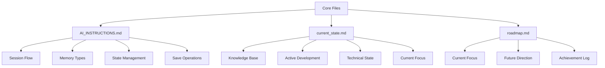
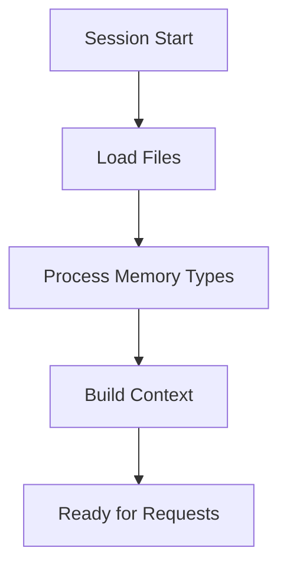
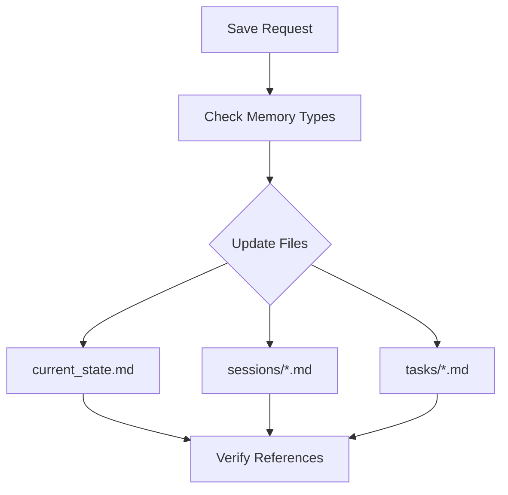

# Core Framework Files

Aegis uses three special files to maintain system state, guide AI behavior, and track project direction. These files are central to the framework's operation and require special attention.

> **Related Documentation**
> - [Memory System](./memory_system.md) - Understanding how memory types work
> - [Cross-Referencing](./cross_referencing.md) - How core files are linked together
> - [Task Management](./tasks.md) - Working with tasks
> - [Session Management](./sessions.md) - Managing development sessions
> - [Templates](./templates.md) - Standard templates for core files

## Overview



## 1. AI_INSTRUCTIONS.md

This file provides operational instructions for AI assistants using the framework.

### Purpose
- Guides AI behavior
- Defines processing flows
- Establishes memory management
- Sets operational standards

### Key Components

#### Session Start Flow


#### Memory Type Processing
- **Semantic**: Project knowledge and patterns
- **Episodic**: Development history
- **Procedural**: Implementation steps
- **Working**: Current focus

#### State Management
- File update rules
- Section management
- Memory type handling
- Reference maintenance

#### Save Operation Flow


### Usage
- AI assistants follow these instructions
- Framework maintains consistency
- Operations stay standardized
- Context remains organized

## 2. current_state.md

This file maintains the current state of the project across all memory types.

### Purpose
- Tracks project state
- Maintains active context
- Records technical state
- Guides development

### Structure

```yaml
---
last_updated: ${timestamp}
memory_types: [semantic, working]
current_phase: ${phase}
sprint_status: ${status}
priority: high
references: []
---
```

### Key Sections

#### Knowledge Base [semantic]
- Core concepts
- Technical stack
- Key terminology
- Version requirements

#### Active Development [working]
- Completed features
- In-progress work
- Upcoming features
- References to tasks

#### Technical State [semantic]
- Core dependencies
- Environment details
- Configuration state
- System requirements

#### Current Focus [working]
- Active priorities
- Immediate needs
- Recent changes
- Task references

### Usage
- Updated each session
- Referenced by AI
- Guides development
- Maintains context

## 3. roadmap.md

This file tracks the project's direction and achievements.

### Purpose
- Sets direction
- Tracks progress
- Plans features
- Records achievements

### Structure

```yaml
---
last_updated: ${timestamp}
---
```

### Key Sections

#### Current Focus
- Priority goals
- Active initiatives
- Technical debt
- Immediate needs

#### Future Direction
- Immediate horizon
- Next steps
- Future vision
- Strategic goals

#### Achievement Log
- Completed milestones
- Major improvements
- Architectural changes
- Impact notes

### Usage
- Guides planning
- Tracks progress
- Sets priorities
- Records history

## Best Practices

### 1. File Updates
- Regular maintenance
- Consistent format
- Complete information
- Valid references

### 2. Memory Types
- Proper assignment
- Clear boundaries
- Regular validation
- Context maintenance

### 3. State Management
- Current information
- Active references
- Clear status
- Updated timestamps

### 4. Documentation
- Clear purpose
- Complete context
- Accurate links
- Regular updates

## Integration Points

### 1. Commands
- `/aide start`: Uses all three
- `/aide save`: Updates state
- `/aide status`: Reads state
- `/aide task`: References state

### 2. Memory System
- Guides processing
- Maintains context
- Tracks state
- Records history

### 3. Templates
- Follow structure
- Maintain consistency
- Reference correctly
- Update properly

## Tips for Success

1. **Consistency**
   - Regular updates
   - Standard format
   - Clear structure
   - Valid references

2. **Completeness**
   - Full context
   - All sections
   - Clear status
   - Updated references

3. **Clarity**
   - Clear purpose
   - Complete information
   - Accurate state
   - Valid links

4. **Maintenance**
   - Regular reviews
   - Timely updates
   - Valid references
   - Clean structure
