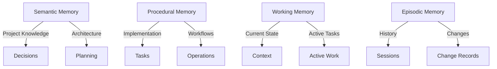

# Cross-Referencing System

The Aegis framework uses a robust cross-referencing system to maintain relationships between different types of memory and project information. This document explains how references are managed, validated, and integrated with the framework's operation patterns.

## Overview

The cross-referencing system connects different parts of your project in a meaningful way:

1. **Memory Types and Their Documents**
   - Semantic Memory stores long-term project knowledge in decisions and planning documents
   - Procedural Memory tracks implementation details in tasks and operation patterns
   - Working Memory maintains current context in the current state and active tasks
   - Episodic Memory records history through session logs and change records

2. **How References Work**
   - Each document has a unique ID (like `DECISION-001` or `240205_1430_task`)
   - Documents can reference other documents using these IDs
   - References are validated to ensure they point to real documents
   - The system prevents circular references

3. **Common Reference Patterns**
   - Decisions implement tasks and are recorded in sessions
   - Tasks are tracked in sessions and based on decisions
   - Sessions create decisions and update tasks
   - Current state references everything to maintain context

4. **System Integration**
   - Validation checks all references for correctness
   - State management tracks changes across documents
   - Operation patterns ensure everything works together
   - Memory types maintain their specific relationships

This system helps you:
- Track relationships between different parts of your project
- Maintain consistent project state
- Find related information quickly
- Prevent broken references
- Keep project history organized

## Reference Types

### 1. Document IDs
- **Decisions**: `DECISION-XXX`
  - Sequential numbering
  - Example: `DECISION-001`
  - Used for architectural and technical decisions

- **Sessions**: `YYYYMMDD_HHMM_session`
  - Timestamp-based format
  - Example: `20250120_1430_session`
  - Used for development sessions

- **Tasks**: `XX_descriptive_name`
  - Timestamp-based format with description
  - Example: `240205_1430_implement_feature`
  - Used for implementation tasks

### 2. Memory Type References



The cross-referencing system connects different parts of your project in a meaningful way:

1. **Semantic Memory**
   - Semantic Memory stores long-term project knowledge in decisions and planning documents
   - Semantic Memory references decisions and is recorded in sessions
   - Semantic Memory updates current state

2. **Procedural Memory**
   - Procedural Memory tracks implementation details in tasks and operation patterns
   - Procedural Memory implements tasks and is recorded in sessions
   - Procedural Memory updates current state

3. **Working Memory**
   - Working Memory maintains current context in the current state and active tasks
   - Working Memory references current state and is recorded in sessions
   - Working Memory updates current state

4. **Episodic Memory**
   - Episodic Memory records history through session logs and change records
   - Episodic Memory references decisions and is recorded in sessions
   - Episodic Memory updates current state

### 3. Reference Validation

```yaml
# Reference Validation Rules
validation:
  format:
    decisions: "DECISION-\\d{3}"
    sessions: "\\d{8}_\\d{4}_session"
    tasks: "\\d{6}_\\d{4}_[a-z_]+"
  
  content:
    required: [id, title, references]
    optional: [tags, aliases]
    validate: [format, existence]
  
  references:
    circular: false
    missing: false
    validate: true
```

### 4. Error Handling

```yaml
# Reference Error Handling
errors:
  invalid_format:
    msg: "Invalid reference format"
    action: show_format
    help: "Check reference format rules"
  
  missing_target:
    msg: "Referenced item not found"
    action: show_missing
    help: "Verify reference exists"
  
  circular_ref:
    msg: "Circular reference detected"
    action: show_circle
    help: "Break reference cycle"
```

## Integration with Operation Patterns

### 1. Framework Check Pattern
```yaml
reference_check:
  steps:
    - validate_format: {all: true}
    - check_existence: {required: true}
    - detect_circles: {prevent: true}
```

### 2. Memory Processing Pattern
```yaml
memory_refs:
  validate:
    - cross_memory: {allowed: true}
    - type_match: {required: true}
    - state_valid: {check: true}
```

### 3. State Management Pattern
```yaml
state_refs:
  track:
    - changes: {record: true}
    - updates: {validate: true}
    - history: {maintain: true}
```

## Command Integration

### 1. Plan Command
```yaml
plan_refs:
  validate:
    - decisions: {type: architecture}
    - requirements: {type: technical}
    - milestones: {type: timeline}
```

### 2. Start Command
```yaml
start_refs:
  load:
    - current: {state: true}
    - active: {tasks: true}
    - recent: {sessions: true}
```

### 3. Save Command
```yaml
save_refs:
  update:
    - session: {create: true}
    - tasks: {progress: true}
    - decisions: {if: made}
```

### 4. Task Command
```yaml
task_refs:
  manage:
    - status: {update: true}
    - dependencies: {check: true}
    - blockers: {track: true}
```

## Reference Patterns

### 1. Cross-Memory References
```yaml
cross_memory:
  semantic_working:
    - decisions: {to: current_state}
    - patterns: {to: active_tasks}
  
  procedural_working:
    - tasks: {to: current_state}
    - workflows: {to: active_tasks}
  
  episodic_semantic:
    - sessions: {to: decisions}
    - changes: {to: patterns}
```

### 2. State References
```yaml
state_refs:
  current_state:
    - active_task: {type: task}
    - recent_changes: {type: change}
    - decisions: {type: decision}
  
  task_state:
    - dependencies: {type: task}
    - blockers: {type: issue}
    - decisions: {type: decision}
```

### 3. Validation References
```yaml
validation_refs:
  rules:
    - format: {check: true}
    - content: {complete: true}
    - state: {valid: true}
  
  actions:
    - invalid: {fix: suggest}
    - missing: {fix: create}
    - circular: {fix: break}
```

## Best Practices

### 1. Reference Creation
- Use correct ID formats
- Validate before saving
- Check target existence
- Prevent circular refs

### 2. Reference Management
- Regular validation
- Clean stale refs
- Update bidirectional
- Track changes

### 3. Error Prevention
- Check formats early
- Validate targets
- Handle missing refs
- Break cycles

### 4. Documentation
- Clear purpose
- Complete context
- Valid examples
- Error solutions

## Troubleshooting

### 1. Invalid References
```yaml
invalid_ref:
  symptoms:
    - wrong format
    - missing target
    - wrong type
  solutions:
    - check format rules
    - verify target exists
    - validate type match
```

### 2. Circular References
```yaml
circular_ref:
  detection:
    - scan chains
    - find cycles
    - trace paths
  resolution:
    - break cycles
    - redirect refs
    - document changes
```

### 3. Missing References
```yaml
missing_ref:
  checks:
    - target exists
    - path valid
    - type correct
  fixes:
    - create target
    - update path
    - correct type
```

## Related Documentation

- [Memory Types](operations/memory_types.md)
- [Operation Patterns](operations/patterns.md)
- [Validation Rules](operations/validation.md)
- [Error Handling](operations/error_handling.md)
- [State Management](operations/state_management.md)

# Cross-Referencing and Memory Types

The Aegis framework uses a robust system of memory types and cross-references to maintain relationships between different types of project information. This document explains how memory types are validated, how references are managed, and how they integrate with the framework's operation patterns.

## Memory Types

### Core Memory Types

1. **Semantic Memory**
   - **Purpose**: Long-term project knowledge and architecture
   - **Front Matter Required**:
     ```yaml
     memory_types: [semantic]  # Can be combined with others
     references: []           # Related architectural decisions
     ```
   - **Valid Combinations**:
     - `[semantic]`
     - `[semantic, procedural]`
     - `[semantic, working]`
     - `[semantic, episodic]`
   - **Common Uses**:
     - Architectural decisions
     - Technical requirements
     - Design patterns
     - Project structure

2. **Procedural Memory**
   - **Purpose**: Implementation details and workflows
   - **Front Matter Required**:
     ```yaml
     memory_types: [procedural]  # Required for tasks
     status: string             # Current state
     priority: string           # Task priority
     ```
   - **Valid Combinations**:
     - `[procedural]`
     - `[procedural, semantic]`
     - `[procedural, working]`
   - **Common Uses**:
     - Tasks
     - Implementation steps
     - Operation patterns
     - Workflows

3. **Working Memory**
   - **Purpose**: Current context and active state
   - **Front Matter Required**:
     ```yaml
     memory_types: [working]    # Required for current state
     focus: string             # Active focus area
     active_task: string       # Current task reference
     ```
   - **Valid Combinations**:
     - `[working]`
     - `[working, semantic]`
     - `[working, procedural]`
     - `[working, episodic]`
   - **Common Uses**:
     - Current state
     - Active tasks
     - Session context
     - Temporary notes

4. **Episodic Memory**
   - **Purpose**: Historical records and sessions
   - **Front Matter Required**:
     ```yaml
     memory_types: [episodic]   # Required for sessions
     participants: []          # Session participants
     objectives: []            # Session goals
     ```
   - **Valid Combinations**:
     - `[episodic]`
     - `[episodic, semantic]`
     - `[episodic, working]`
   - **Common Uses**:
     - Session logs
     - Change records
     - Progress updates
     - Decision history

### Front Matter Validation

#### Common Requirements
```yaml
---
id: string                    # Unique identifier
title: string                 # Clear description
created: ISO8601              # Creation timestamp
updated: ISO8601              # Last update timestamp
memory_types: []              # At least one type
references: []                # Related files
---
```

#### Validation Rules
```yaml
validation:
  front_matter:
    required_fields:
      - id
      - title
      - created
      - updated
      - memory_types
    
    memory_types:
      max_types: 3
      combinations:
        semantic: [procedural, working, episodic]
        procedural: [semantic, working]
        working: [semantic, procedural, episodic]
        episodic: [semantic, working]
    
    timestamps:
      format: ISO8601
      created_before_updated: true
    
    references:
      format_valid: true
      targets_exist: true
      no_circles: true
```

#### Error Handling
```yaml
errors:
  critical:  # Block Operation
    - missing_front_matter
    - invalid_yaml_format
    - missing_required_fields
    - invalid_memory_types
    - invalid_timestamps
  
  warnings:  # Allow with Notice
    - invalid_references
    - missing_optional_fields
    - suboptimal_combinations
```
