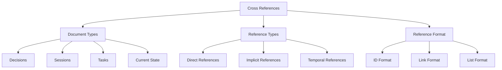
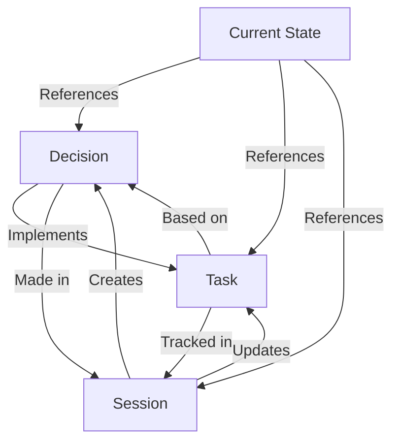

# Cross-Referencing System

Aegis uses a robust cross-referencing system to maintain relationships between different types of project information. This system helps both developers and AI assistants understand connections and dependencies across the project.

## Overview



## Reference Types

### 1. Document IDs
- **Decisions**: `DEC-XXX`
  - Sequential numbering
  - Example: `DEC-001`
  - Used for architectural decisions

- **Sessions**: `SESSION-YYYYMMDD`
  - Date-based format
  - Example: `SESSION-20250120`
  - Used for development sessions

- **Tasks**: `TASK-XXX`
  - Sequential numbering
  - Example: `TASK-001`
  - Used for implementation tasks

### 2. Reference Locations

#### YAML Frontmatter
```yaml
---
references: [DEC-001, TASK-002, SESSION-20250120]
---
```
- Used for direct document relationships
- Supports multiple references
- Part of document metadata

#### Section References
```markdown
## Progress
- Related tasks: [TASK-001, TASK-002]
- Previous session: SESSION-20250119
- Implementation: See DEC-003
```
- Used within document sections
- Provides context for specific content
- Links related information

#### List References
```markdown
### Changes Made
- Code changes:
  - References: [TASK-001]
- Decisions made:
  - References: [DEC-002]
```
- Used in lists and subsections
- Groups related references
- Provides detailed context

## Reference Relationships



## Usage Patterns

### 1. Decision References
```markdown
# Technical Stack Decision

---
id: DEC-001
references: [DEC-002, TASK-003]
---

## Context
Related to previous decision [DEC-002] about architecture...

## Implementation
Will be executed in [TASK-003]...
```

### 2. Session References
```markdown
# Session Summary 2025-01-20

---
references: [DEC-001, TASK-002, SESSION-20250119]
---

## Context
Following up on previous session [SESSION-20250119]...

## Progress
Implementing decision [DEC-001] through [TASK-002]...
```

### 3. Task References
```markdown
# API Implementation

---
id: TASK-001
references: [DEC-003, SESSION-20250120]
---

## Description
Based on architecture decision [DEC-003]...

## Progress
Updated in session [SESSION-20250120]...
```

### 4. Current State References
```markdown
# Current Project State

---
references: [DEC-001, TASK-002]
---

## Active Development
### In Progress
- API Implementation [TASK-002]
- Based on [DEC-001]
```

## Best Practices

### 1. Reference Creation
- Use correct ID format
- Include relevant references
- Maintain bidirectional links
- Document relationships

### 2. Reference Management
- Keep references current
- Update when needed
- Remove stale references
- Validate links

### 3. Reference Usage
- Be specific
- Provide context
- Group related references
- Explain relationships

### 4. Reference Documentation
- Clear purpose
- Complete context
- Accurate links
- Updated status

## Integration Points

### 1. Commands
- `/aide start`: Loads references
- `/aide save`: Updates references
- `/aide status`: Shows references
- `/aide task`: Uses references

### 2. Memory System
- Links memory types
- Maintains context
- Tracks relationships
- Guides processing

### 3. Templates
- Standard formats
- Consistent locations
- Clear structure
- Easy updates

## Tips for Success

1. **Consistency**
   - Use standard formats
   - Follow patterns
   - Maintain structure
   - Regular updates

2. **Clarity**
   - Clear purpose
   - Complete context
   - Accurate links
   - Explained relationships

3. **Maintenance**
   - Regular validation
   - Remove stale links
   - Update references
   - Check bidirectional links

4. **Organization**
   - Logical grouping
   - Clear hierarchy
   - Easy navigation
   - Quick reference
