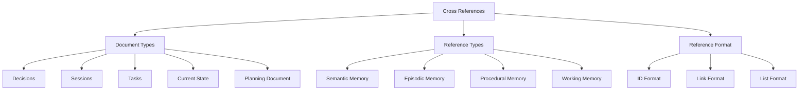
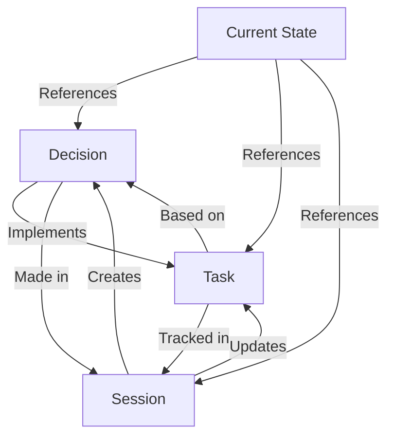

# Cross-Referencing System

Aegis uses a robust cross-referencing system to maintain relationships between different types of project information. This system helps both developers and AI assistants understand connections and dependencies across the project.

## Overview



## Reference Types

### 1. Document IDs
- **Decisions**: `DEC-XXX`
  - Sequential numbering
  - Example: `DEC-001`
  - Used for architectural decisions

- **Sessions**: `SESSION-YYYYMMDD`
  - Date-based format
  - Example: `SESSION-20250120`
  - Used for development sessions

- **Tasks**: `TASK-XXX`
  - Sequential numbering
  - Example: `TASK-001`
  - Used for implementation tasks

### 2. Reference Locations

#### YAML Frontmatter
```yaml
---
id: [ID format based on type]
title: [Document title]
created: ${timestamp}
updated: ${timestamp}
memory_types: [type1, type2]
status: [status based on type]
priority: [high|medium|low]
references: [DEC-001, TASK-002, SESSION-20250120]
---
```

### 3. Memory Types
- **semantic**: Project knowledge and patterns
- **episodic**: Development history
- **procedural**: Implementation steps
- **working**: Current focus

### 4. Status Values
- **Tasks**: planned | active | completed | blocked
- **Decisions**: proposed | accepted | deprecated | superseded

## Reference Relationships



## Usage Patterns

### 1. Decision References
```markdown
# Technical Stack Decision

---
id: DEC-001
title: Technical Stack Selection
created: ${timestamp}
updated: ${timestamp}
memory_types: [semantic, episodic]
status: proposed
priority: high
references: [DEC-002, TASK-003]
---

## Context
Related to previous decision [DEC-002] about architecture...

## Implementation
Will be executed in [TASK-003]...
```

### 2. Session References
```markdown
# Session Summary 2025-01-20

---
title: Session Summary 2025-01-20
memory_types: [episodic, working]
references: [DEC-001, TASK-002, SESSION-20250119]
priority: medium
---

## Context
Following up on previous session [SESSION-20250119]...

## Progress
Implementing decision [DEC-001] through [TASK-002]...
```

### 3. Task References
```markdown
# API Implementation

---
id: TASK-001
title: API Implementation
created: ${timestamp}
updated: ${timestamp}
memory_types: [procedural, working]
status: active
priority: high
references: [DEC-003, SESSION-20250120]
---

## Description
Based on architecture decision [DEC-003]...

## Progress
Updated in session [SESSION-20250120]...
```

### 4. Current State References
```markdown
# Current Project State

---
title: Current Project State
memory_types: [semantic, working]
references: [DEC-001, TASK-002]
priority: high
---

## Active Development
### In Progress
- API Implementation [TASK-002]
- Based on [DEC-001]
```

## Best Practices

### 1. Reference Creation
- Use correct ID format
- Include relevant references
- Maintain bidirectional links
- Document relationships

### 2. Reference Management
- Keep references current
- Update when needed
- Remove stale references
- Validate links

### 3. Reference Usage
- Be specific
- Provide context
- Group related references
- Explain relationships

### 4. Reference Documentation
- Clear purpose
- Complete context
- Accurate links
- Updated status

## Integration Points

### 1. Commands
- `/aegis init`: Creates initial directory structure with templates
- `/aegis start`: Loads all references and processes memory types
- `/aegis save`: Updates session logs and task progress
- `/aegis status`: Shows current working memory without file updates
- `/aegis task`: Shows active task details and implementation progress
- `/aegis context`: Quick refresh of current context
- `/aegis plan`: Creates/updates planning document only

### 2. Memory System
- **Semantic**: Project knowledge and patterns
- **Episodic**: Development history
- **Procedural**: Implementation steps
- **Working**: Current focus

### 3. Directory Structure
```
.context/
├── AI_INSTRUCTIONS.md     # Framework instructions
├── plan/
│   ├── README.md           # Planning overview
│   ├── agents.mmd         # Agent system diagram
│   ├── ai_conductor.json  # Conductor configuration
│   ├── document_states.mmd # Document workflow
│   ├── feedback.mmd       # Feedback system
│   └── workflow.mmd       # Planning workflow
├── current_state.md       # Working memory
├── roadmap.md            # Project direction
├── tasks/
│   ├── TEMPLATE.md       # Task template
│   ├── active/          # Current tasks
│   ├── planned/         # Future tasks
│   ├── hold/           # Blocked tasks
│   └── completed/      # Finished tasks
├── sessions/
│   └── TEMPLATE.md      # Session log template
└── decisions/
    └── TEMPLATE.md      # Decision record template
```

## Tips for Success

1. **Consistency**
   - Use standard formats
   - Follow patterns
   - Maintain structure
   - Regular updates

2. **Clarity**
   - Clear purpose
   - Complete context
   - Accurate links
   - Explained relationships

3. **Maintenance**
   - Regular validation
   - Remove stale links
   - Update references
   - Check bidirectional links

4. **Organization**
   - Logical grouping
   - Clear hierarchy
   - Easy navigation
   - Quick reference

## Agent Reference Patterns

### 1. Role Assignment
```yaml
agent_roles:
  AGENT-PM:
    memory_access: [semantic, working]
    task_types: [planning, requirements]
  AGENT-TL:
    memory_access: [semantic, procedural]
    task_types: [technical, architecture]
```

### 2. State Management
```yaml
agent_states:
  AGENT-PM:
    status: active
    current_task: TASK-002
    memory_context: [DEC-001, SESSION-20250120]
  AGENT-TL:
    status: standby
    last_task: TASK-001
    pending_review: [DEC-002]
```

### 3. Memory Access
```yaml
memory_permissions:
  semantic:
    read: [AGENT-PM, AGENT-TL, AGENT-UX]
    write: [AGENT-PM, AGENT-TL]
  working:
    read: [all]
    write: [AGENT-PM]
  procedural:
    read: [AGENT-TL, AGENT-QA]
    write: [AGENT-TL]
```
