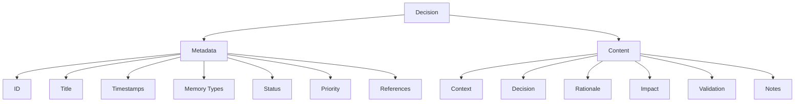

# Architectural Decision Records (ADR)

The Aegis framework uses a structured decision-recording system to maintain a clear history of architectural and technical decisions. This system helps maintain project knowledge and understand the context, rationale, and implications of important decisions.

## Overview



## Decision Record Structure

### Metadata Section
```yaml
---
id: DEC-XXX
title: [Decision Title]
created: ${timestamp}
updated: ${timestamp}
memory_types: [semantic, episodic]
status: [proposed | accepted | deprecated | superseded]
priority: [high | medium | low]
references: []
---
```

#### Fields Explained
- **id**: Unique identifier (format: DEC-XXX)
- **title**: Clear, descriptive title
- **created**: Initial creation timestamp
- **updated**: Last modification timestamp
- **memory_types**: How this decision should be processed (semantic and episodic)
- **status**: Current state of the decision
- **priority**: Importance level
- **references**: Links to related decisions, tasks, or sessions

### Content Sections

1. **Context**
   - Background information
   - Current situation
   - Problem statement
   - Motivating factors
   - Requirements
   - Constraints
   - Dependencies

2. **Decision**
   - Clear statement of the decision
   - Specific changes proposed
   - Implementation approach
   - Technical details
   - Design patterns
   - Architecture impacts

3. **Rationale**
   - Key factors considered
   - Alternatives evaluated
   - Trade-offs made
   - Reasoning process
   - Technical insights
   - Performance impacts
   - Security considerations

4. **Impact**
   - Benefits gained
   - Challenges introduced
   - Areas affected
   - Risk assessment
   - Migration needs
   - Timeline impacts
   - Resource requirements

5. **Validation**
   - Success criteria
   - Metrics to track
   - Review timeline
   - Testing approach
   - Performance benchmarks
   - Security validation
   - Quality checks

6. **Notes**
   - Implementation details
   - Technical patterns
   - Future considerations
   - Known limitations
   - Open questions
   - Related research
   - Reference materials

## Decision States

1. **Proposed**
   - Initial state
   - Under discussion
   - Pending review
   - Open for feedback
   - Gathering input
   - Collecting data
   - Initial assessment

2. **Accepted**
   - Approved for implementation
   - Active decision
   - Current approach
   - In effect
   - Ready for use
   - Fully documented
   - Implementation started

3. **Deprecated**
   - No longer recommended
   - Being phased out
   - Historical reference
   - Should be avoided
   - Migration needed
   - Alternatives listed
   - Timeline for removal

4. **Superseded**
   - Replaced by newer decision
   - Historical reference
   - Points to replacement
   - Archived state
   - Migration path
   - Transition plan
   - Legacy support

## Memory Integration

### Semantic Memory
- Long-term architectural knowledge
- System design patterns
- Technical constraints
- Implementation guidelines
- Best practices
- Project standards
- Design decisions

### Episodic Memory
- Decision-making context
- Historical progression
- Problem-solving approaches
- Evolution of solutions
- Learning outcomes
- Past challenges
- Success stories

## Best Practices

### 1. Creating Decisions
- Use clear, descriptive titles
- Provide comprehensive context
- Explain rationale thoroughly
- Consider all impacts
- Document thoroughly
- Link related items
- Include examples

### 2. Updating Decisions
- Maintain accurate status
- Update timestamps
- Add new references
- Document changes
- Preserve history
- Track dependencies
- Note impacts

### 3. Referencing Decisions
- Link related decisions
- Maintain hierarchy
- Show relationships
- Track dependencies
- Update references
- Cross-reference tasks
- Connect sessions

### 4. Documentation
- Clear descriptions
- Complete context
- Technical details
- Implementation notes
- Migration paths
- Testing plans
- Review process

## Example Decision

```markdown
# Use PostgreSQL for Primary Database

---
id: DEC-001
title: PostgreSQL as Primary Database
created: 2025-01-20T19:48:53-05:00
updated: 2025-01-20T19:48:53-05:00
memory_types: [semantic, episodic]
status: accepted
priority: high
references: [DEC-002, TASK-001, SESSION-20250120]
---

## Context
- Need a robust, scalable database solution
- Must support complex queries and transactions
- High reliability and data integrity required
- Active community and support important
- Cost considerations for scaling

## Decision
We will use PostgreSQL as our primary database system:
- Version: PostgreSQL 16.x
- Deployment: AWS RDS
- Replication: Multi-AZ
- Backup: Daily snapshots
- Monitoring: AWS CloudWatch

## Rationale
1. Technical Benefits:
   - ACID compliance
   - Advanced features (JSON, Full-text search)
   - Excellent performance
   - Strong security

2. Alternatives Considered:
   - MySQL: Less feature-rich
   - MongoDB: ACID limitations
   - DynamoDB: Cost concerns

3. Key Factors:
   - Performance benchmarks
   - Feature comparison
   - Community support
   - Cost analysis

## Impact
1. Benefits:
   - Robust data integrity
   - Advanced querying
   - Easy maintenance
   - Good scalability

2. Challenges:
   - Team training needed
   - Migration planning
   - Performance tuning
   - Resource sizing

## Validation
1. Success Criteria:
   - Query performance
   - Data integrity
   - Backup/restore
   - High availability

2. Testing Plan:
   - Performance testing
   - Failover testing
   - Backup validation
   - Load testing

## Notes
- Consider connection pooling
- Monitor query performance
- Regular maintenance
- Backup verification
- Security updates
```

## Integration with Commands

### 1. `/aegis start`
- Loads decision records
- Processes semantic memory
- Updates project context
- Tracks decision states

### 2. `/aegis save`
- Records new decisions
- Updates decision status
- Maintains references
- Archives old decisions

### 3. `/aegis status`
- Shows active decisions
- Lists recent changes
- Displays impacts
- Reports progress

### 4. `/aegis context`
- Refreshes decision context
- Shows relevant decisions
- Lists dependencies
- Updates status

For more information, see:
- [Memory System](./memory_system.md)
- [Cross-Referencing](./cross_referencing.md)
- [Task Management](./tasks.md)
- [Session Management](./sessions.md)
