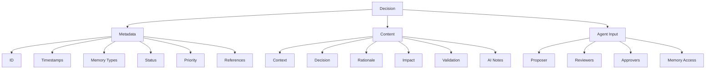

# Architectural Decision Records (ADR)

The Aegis framework uses a structured decision-recording system to maintain a clear history of architectural and technical decisions. This system helps both human developers and AI assistants understand the context, rationale, and implications of important project decisions.

## Overview



## Decision Record Structure

### Metadata Section
```yaml
---
id: DEC-XXX
created: ${timestamp}
updated: ${timestamp}
memory_types: [semantic, episodic]
status: [proposed | accepted | deprecated | superseded]
priority: [high | medium | low]
references: []
proposing_agent: AGENT-TL
reviewing_agents: [AGENT-PM, AGENT-QA]
approving_agent: AGENT-PM
memory_access: [semantic]
---
```

#### Fields Explained
- **id**: Unique identifier (format: DEC-XXX)
- **created**: Initial creation timestamp
- **updated**: Last modification timestamp
- **memory_types**: How this decision should be processed in memory
- **status**: Current state of the decision
- **priority**: Importance level
- **references**: Links to related decisions or resources
- **proposing_agent**: Agent who proposed the decision
- **reviewing_agents**: Agents who reviewed the decision
- **approving_agent**: Agent who approved the decision
- **memory_access**: Memory types needed for this decision

### Content Sections

1. **Context**
   - Background information
   - Current situation
   - Problem statement
   - Motivating factors
   - Agent perspectives
   - Role considerations
   - Memory context

2. **Decision**
   - Clear statement of the decision
   - Specific changes proposed
   - Implementation approach
   - Agent rationale
   - Role impacts
   - Memory implications

3. **Rationale**
   - Key factors considered
   - Alternatives evaluated
   - Trade-offs made
   - Reasoning process
   - Agent insights
   - Role-specific factors
   - Memory requirements

4. **Impact**
   - Benefits gained
   - Challenges introduced
   - Areas affected
   - Risk assessment
   - Agent responsibilities
   - Role changes
   - Memory updates

5. **Validation**
   - Success criteria
   - Metrics to track
   - Review timeline
   - Validation process
   - Agent verification
   - Role validation
   - Memory consistency

6. **Notes for AI**
   - Pattern implications
   - Implementation guidance
   - Future considerations
   - AI-specific context
   - Agent guidance
   - Role boundaries
   - Memory access

## Decision States

1. **Proposed**
   - Initial state
   - Under discussion
   - Pending review
   - Open for feedback
   - Proposing agent active
   - Reviewers assigned
   - Memory access set

2. **Under Review**
   - Reviewers active
   - Feedback collection
   - Memory validation

3. **Accepted**
   - Approved for implementation
   - Active decision
   - Current approach
   - In effect
   - Approver signed off
   - Roles updated
   - Memory committed

4. **Deprecated**
   - No longer recommended
   - Being phased out
   - Historical reference
   - Should be avoided
   - Agent notifications
   - Role adjustments
   - Memory archival

5. **Superseded**
   - Replaced by newer decision
   - Historical reference
   - Points to replacement
   - Archived state
   - Agent transitions
   - Role updates
   - Memory migration

## Memory Integration

### Semantic Memory
- Long-term architectural knowledge
- System design patterns
- Technical constraints
- Implementation guidelines

### Episodic Memory
- Decision-making context
- Historical progression
- Problem-solving approaches
- Evolution of solutions

## Best Practices

### 1. Creating Decisions
- Use clear, descriptive titles
- Provide comprehensive context
- Explain rationale thoroughly
- Consider all stakeholders
- Document AI implications

### 2. Updating Decisions
- Maintain accurate status
- Update timestamps
- Add new references
- Document changes
- Preserve history

### 3. Referencing Decisions
- Link related decisions
- Maintain hierarchy
- Show relationships
- Track dependencies
- Update references

### 4. Agent Coordination
- Clear role definition
- Proper review process
- Documented approvals
- Memory access control

## Example Decision

```markdown
# Implement Multi-Agent Architecture

---
id: DEC-001
created: 2025-01-20T14:30:00-05:00
updated: 2025-01-20T16:45:00-05:00
memory_types: [semantic, episodic]
status: accepted
priority: high
references: [DEC-002, TASK-001]
proposing_agent: AGENT-TL
reviewing_agents: [AGENT-PM, AGENT-QA]
approving_agent: AGENT-PM
memory_access: [semantic]
---

## Context
Project needs a structured approach to handle multiple specialized AI agents working together effectively.

### Agent Perspectives
- **Tech Lead**: Need for clear technical boundaries and interfaces
- **Product Manager**: User story and workflow considerations
- **QA**: Testing and validation requirements

## Decision
Implement a multi-agent architecture with specialized roles and memory access patterns.

### Agent Considerations
- **Tech Lead**: Technical design and implementation approach
- **Product Manager**: User experience and workflow impact
- **QA**: Quality assurance and testing strategy

## Rationale
### Technical Factors
- Clear separation of concerns
- Efficient memory management
- Scalable architecture

### Agent Insights
- TL: Technical feasibility and implementation path
- PM: User workflow and interaction patterns
- QA: Testing strategy and quality metrics

## Impact
### System Changes
- New agent management system
- Memory access controls
- State management

### Role Responsibilities
- TL: Implementation and technical documentation
- PM: Workflow documentation and user guides
- QA: Test plan and validation procedures

## Validation
### Success Criteria
- All agent roles implemented
- Memory access controls working
- State management verified

### Role Verification
- TL: Technical implementation review
- PM: Workflow validation
- QA: System-wide testing

## Notes for AI
- Follow agent role boundaries
- Respect memory access patterns
- Maintain state consistency
- Document role interactions
```

## Integration with Commands

Different commands interact with decisions in specific ways:

1. **`/aegis start`**
   - Loads agent context
   - Sets role access
   - Initializes state

2. **`/aegis save`**
   - Updates agent states
   - Records decisions
   - Manages access

3. **`/aegis status`**
   - Shows agent roles
   - Lists decisions
   - Reports access

4. **`/aegis plan`**
   - Coordinates agents
   - Manages decisions
   - Controls access
   - Tracks workflow
