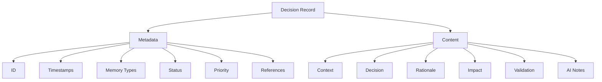

# Architectural Decision Records (ADR)

The Aegis framework uses a structured decision-recording system to maintain a clear history of architectural and technical decisions. This system helps both human developers and AI assistants understand the context, rationale, and implications of important project decisions.

## Overview



## Decision Record Structure

### Metadata Section
```yaml
---
id: DEC-XXX
created: [timestamp]
updated: [timestamp]
memory_types: [semantic, episodic]
status: [proposed | accepted | deprecated | superseded]
priority: [high | medium | low]
references: []
---
```

#### Fields Explained
- **id**: Unique identifier (format: DEC-XXX)
- **created**: Initial creation timestamp
- **updated**: Last modification timestamp
- **memory_types**: How this decision should be processed in memory
- **status**: Current state of the decision
- **priority**: Importance level
- **references**: Links to related decisions or resources

### Content Sections

1. **Context**
   - Background information
   - Current situation
   - Problem statement
   - Motivating factors

2. **Decision**
   - Clear statement of the decision
   - Specific changes proposed
   - Implementation approach

3. **Rationale**
   - Key factors considered
   - Alternatives evaluated
   - Trade-offs made
   - Reasoning process

4. **Impact**
   - Benefits gained
   - Challenges introduced
   - Areas affected
   - Risk assessment

5. **Validation**
   - Success criteria
   - Metrics to track
   - Review timeline
   - Validation process

6. **Notes for AI**
   - Pattern implications
   - Implementation guidance
   - Future considerations
   - AI-specific context

## Decision States

1. **Proposed**
   - Initial state
   - Under discussion
   - Pending review
   - Open for feedback

2. **Accepted**
   - Approved for implementation
   - Active decision
   - Current approach
   - In effect

3. **Deprecated**
   - No longer recommended
   - Being phased out
   - Historical reference
   - Should be avoided

4. **Superseded**
   - Replaced by newer decision
   - Historical reference
   - Points to replacement
   - Archived state

## Memory Integration

### Semantic Memory
- Long-term architectural knowledge
- System design patterns
- Technical constraints
- Implementation guidelines

### Episodic Memory
- Decision-making context
- Historical progression
- Problem-solving approaches
- Evolution of solutions

## Best Practices

### 1. Creating Decisions
- Use clear, descriptive titles
- Provide comprehensive context
- Explain rationale thoroughly
- Consider all stakeholders
- Document AI implications

### 2. Updating Decisions
- Maintain accurate status
- Update timestamps
- Add new references
- Document changes
- Preserve history

### 3. Referencing Decisions
- Link related decisions
- Maintain hierarchy
- Show relationships
- Track dependencies
- Update references

## Example Decision

```markdown
# Implement Memory-Type Tagging

---
id: DEC-001
created: 2025-01-20T19:42:27-05:00
updated: 2025-01-20T19:42:27-05:00
memory_types: [semantic, episodic]
status: accepted
priority: high
references: []
---

## Context
Need to help AI assistants process and categorize different types of project information effectively.

## Decision
Implement a memory-type tagging system that categorizes information into semantic, episodic, procedural, and working memory.

## Rationale
- Helps AI understand information context
- Improves information retrieval
- Enables better decision-making
- Matches cognitive models

## Impact
- Better AI understanding
- Improved context handling
- More accurate responses
- Enhanced documentation

## Validation
- AI response accuracy
- Context retention
- Information retrieval speed
- User feedback

## Notes for AI
- Use tags to determine processing
- Consider memory type in responses
- Maintain appropriate context
- Update related information
```

## Integration with Commands

Different commands interact with decisions in specific ways:

1. **`/aide start`**
   - Loads relevant decisions
   - Establishes context
   - Sets active patterns

2. **`/aide save`**
   - Records new decisions
   - Updates decision status
   - Maintains references

3. **`/aide status`**
   - Shows active decisions
   - Highlights changes
   - Reports impacts

4. **`/aide context`**
   - References relevant decisions
   - Shows decision context
   - Maintains patterns
