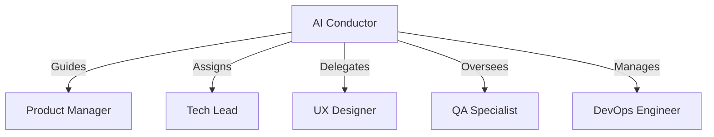

# Getting Started with Aegis

Welcome to Aegis! This guide will help you get started with the zero-dependency framework for AI-assisted development. Aegis is designed to work seamlessly with any AI code assistant while providing structured memory management and multi-agent planning capabilities.

## Prerequisites

- **An AI-powered code assistant** (e.g., GitHub Copilot, Codeium, Cursor, Amazon CodeWhisperer)  
- **Git** (optional - for version control)  
- **That's it!** Aegis has no other dependencies.

## Quick Start

### Step 1: Initialize Aegis in Your Project

To begin, copy the `.context` directory structure to your project:

> **Note**: The directory is named ".context" with a leading dot. Make sure to include the dot when copying or referencing the directory.

```bash
/aegis init .
```

This command creates the following directory structure in your project:

```
.context/
├── planning/            # Project planning
├── current_state.md     # Working Memory
├── decisions/           # Semantic Memory
├── roadmap.md           # Project Direction
├── sessions/            # Episodic Memory
└── tasks/               # Procedural Memory
    ├── active/
    ├── completed/
    ├── hold/
    └── planned/
```

### Step 2: Configure AI Conductor

Aegis uses an AI Conductor to orchestrate specialized AI agents for enhanced project planning and development:



The conductor configuration is stored in `.context/plan/ai_conductor.json`. Key features:
- Specialized agent roles for different aspects of development
- Structured workflow for project planning
- Integrated feedback system
- Document lifecycle management

### Step 3: Set Up Global Rules for Your AI Assistant

Aegis uses text-based commands to guide your AI assistant. To ensure seamless integration, you'll need to configure global rules for your specific AI tool. Here's how:

#### **Cursor**
1. Copy the contents of [COMMANDS.md](COMMANDS.md) to Cursor's **Rules for AI**.  
   Instructions are available [here](https://docs.cursor.com/context/rules-for-ai).  
2. Start Aegis with:  
   ```bash
   /aegis init .
   /aegis start
   ```

#### **Codeium**
1. Copy the contents of [COMMANDS.md](COMMANDS.md) to Windsurf's **Global AI Rules**.  
   Instructions are available [here](https://docs.codeium.com/windsurf/memories#global-rules).  
2. Start Aegis with:  
   ```bash
   /aegis init .
   /aegis start
   ```

#### **Cline**
1. Rename [COMMANDS.md](COMMANDS.md) to `.clinerules`.  
2. Start Aegis with:  
   ```bash
   /aegis init .
   /aegis start
   ```

#### **Aider**
1. Save the commands in `aegis_commands.md` in your project root.  
2. Configure Aider to load the commands automatically by editing `.aider.conf.yml`:  
   ```yaml
   # alone
   read: aegis_commands.md
   ```
3. Start Aegis with:  
   ```bash
   /aegis init .
   /aegis start
   ```

> For other AI tools, simply copy the commands to your assistant's rule configuration, ensuring it recognizes `/aegis` commands.

### Step 4: Start Your First Session

Once set up, you can start a new session:

```bash
/aegis start
```

This command:  
- Loads your project's context.  
- Initializes the memory systems.  
- Prepares for development.  
- Displays the current project state.

## Memory System Overview

Aegis uses a cognitive-inspired memory system integrated with the AI Conductor:

1. **Semantic Memory** (Long-term Knowledge)  
   - Architecture decisions
   - Technical documentation
   - Implementation standards
   - Agent knowledge base

2. **Episodic Memory** (Project History)  
   - Development sessions
   - Decision contexts
   - Implementation history
   - Agent interactions

3. **Procedural Memory** (Task Management)  
   - Tasks and workflows
   - Implementation steps
   - Agent processes
   - Validation procedures

4. **Working Memory** (Current Focus)  
   - Immediate goals
   - Current challenges
   - Recent changes
   - Active agent states

## Essential Commands

Here are the key commands you'll use with Aegis:

| Command | Description |
|---------|-------------|
| `/aegis init <path>` | Initialize Aegis in your project |
| `/aegis start` | Start a new development session |
| `/aegis save` | Save the current project state |
| `/aegis status` | Check project progress and status |
| `/aegis task` | Focus on specific tasks or workflows |
| `/aegis context` | Refresh the current project context |
| `/aegis plan` | Collaborate with AI for project planning |

For a full list of commands and their descriptions, check the [Command Reference](./commands/).

## Agent System Overview

Aegis uses specialized AI agents coordinated by the AI Conductor:

1. **Product Manager (AGENT-PM)**
   - Requirements gathering
   - User story development
   - Feature prioritization
   - Project planning
   - Memory Access: [semantic, working]

2. **Tech Lead (AGENT-TL)**
   - Technical architecture
   - Implementation guidance
   - Code review
   - Technical documentation
   - Memory Access: [semantic, procedural]

3. **UX Designer (AGENT-UX)**
   - User experience design
   - Interface mockups
   - Interaction flows
   - Usability testing
   - Memory Access: [semantic, working]

4. **QA Specialist (AGENT-QA)**
   - Test planning
   - Quality assurance
   - Validation procedures
   - Bug tracking
   - Memory Access: [procedural]

5. **DevOps Engineer (AGENT-DEVOPS)**
   - Deployment planning
   - Infrastructure setup
   - CI/CD pipelines
   - Monitoring
   - Memory Access: [procedural]

### Agent States
- **active**: Currently working on tasks
- **standby**: Ready but not engaged
- **blocked**: Waiting for dependencies
- **completed**: Finished current tasks

### Memory Integration
Each agent has specific memory access patterns:
```yaml
memory_permissions:
  semantic:
    read: [AGENT-PM, AGENT-TL, AGENT-UX]
    write: [AGENT-PM, AGENT-TL]
  working:
    read: [all]
    write: [AGENT-PM]
  procedural:
    read: [AGENT-TL, AGENT-QA, AGENT-DEVOPS]
    write: [AGENT-TL]
  episodic:
    read: [all]
    write: [AGENT-PM, AGENT-TL]
```

## Best Practices

1. **Set Up Rules for Your AI Assistant**  
   Ensure your assistant recognizes `/aegis` commands for seamless interaction.

2. **Use the AI Conductor**  
   - Let it guide specialized agents
   - Follow the structured planning process
   - Engage with feedback loops
   - Track document lifecycles

3. **Save Progress Frequently**  
   Use `/aegis save` to maintain memory state and agent context.

4. **Document Decisions**  
   Keep the semantic memory updated with architecture and design choices.

5. **Update Context**  
   Refresh working memory and agent states with `/aegis context`.

## Common Issues and Solutions

### 1. Framework Can't Find Context
**Cause**: `.context` directory is missing or misconfigured.  
**Solution**: Verify the `.context` directory structure.

### 2. AI Assistant Doesn't Recognize Commands
**Cause**: Global rules not configured.  
**Solution**: Check the instructions for your specific AI tool in [Step 3](#step-3-set-up-global-rules-for-your-ai-assistant).

### 3. Losing Track of Tasks
**Cause**: Task updates not saved.  
**Solution**: Use `/aegis save` after updates and `/aegis status` to review progress.

### 4. Agent Communication Issues
**Cause**: Misconfigured AI Conductor or agent roles.  
**Solution**: Check `.context/plan/ai_conductor.json` and agent configurations.

### 5. Memory Integration Problems
**Cause**: Memory types not properly linked to agent states.  
**Solution**: Review memory system integration in AI Conductor configuration.

## Getting Help

- Review the [Memory System](./memory_system.md) documentation
- Check the [Command Reference](./commands/) for detailed usage
- Explore the [Planning System](./planning/overview.md) for AI-guided planning
- Read about [Agent Integration](./planning/agents.md) for AI Conductor details
