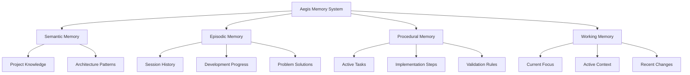
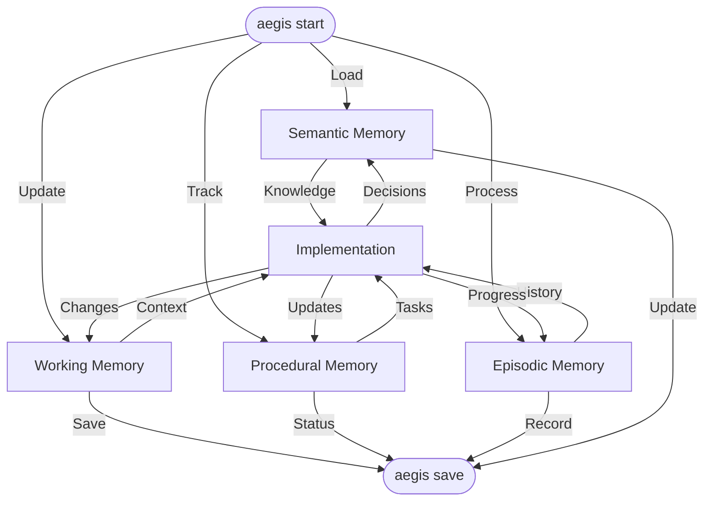

# Aegis Memory System

The Aegis framework implements a cognitive-inspired memory system that helps maintain context and make informed decisions throughout your project's lifecycle. This document explains how the memory system works and how to effectively use it.

> **Related Documentation**
> - [Core Framework Files](./core_files.md) - Learn about the essential framework files
> - [Cross-Referencing System](./cross_referencing.md) - Understanding how memory types are linked
> - [Task Management](./tasks.md) - Working with procedural memory
> - [Session Management](./sessions.md) - Managing episodic memory
> - [Decision Records](./decisions.md) - Working with semantic memory

## Overview

The Aegis memory system is designed like human memory - it has different types of memory for different purposes, each optimized for specific kinds of information and timeframes.



## Memory Types

### 1. Semantic Memory (Project Knowledge)
- **Purpose**: Long-term storage of project knowledge and patterns
- **Location**: `.context/decisions/`
- **Contains**:
  - Architecture decisions
  - Technical decisions
  - Design patterns
  - System constraints
  - Implementation choices
  - Best practices
  - Project standards
- **When Used**: 
  - Making architectural decisions
  - Technical planning
  - System design
  - Implementation guidance
  - Pattern recognition
  - Standard enforcement

### 2. Episodic Memory (Development History)
- **Purpose**: Record of project events, decisions, and their contexts
- **Location**: `.context/sessions/`
- **Contains**:
  - Development sessions
  - Problem solutions
  - Decision contexts
  - Implementation history
  - Debugging sessions
  - Learning outcomes
  - Progress tracking
- **When Used**:
  - Learning from past decisions
  - Understanding problem contexts
  - Tracking project evolution
  - Debugging similar issues
  - Improving processes
  - Refining workflows

### 3. Procedural Memory (Implementation Steps)
- **Purpose**: Managing active development and processes
- **Location**: `.context/tasks/`
- **Contains**:
  - Active tasks
  - Implementation steps
  - Testing procedures
  - Deployment processes
  - Maintenance routines
  - Validation rules
  - Quality checks
- **When Used**:
  - Task execution
  - Process following
  - Implementation guidance
  - Testing procedures
  - Quality assurance
  - Progress tracking

### 4. Working Memory (Current Focus)
- **Purpose**: Maintaining immediate context and focus
- **Location**: `.context/current_state.md`
- **Contains**:
  - Active development
  - Immediate goals
  - Current challenges
  - Recent changes
  - Open questions
  - Current status
  - Next steps
- **When Used**:
  - Current development
  - Active problem-solving
  - Immediate decisions
  - Context switching
  - Progress updates
  - Status tracking

## Directory Structure

```
.context/
├── plan/
│   ├── README.md           # Planning overview
│   ├── document_states.mmd # Document workflow
│   └── workflow.mmd       # Planning workflow
├── current_state.md       # Working memory
├── roadmap.md            # Project direction
├── tasks/
│   ├── TEMPLATE.md       # Task template
│   ├── active/          # Current tasks
│   ├── planned/         # Future tasks
│   ├── hold/           # Blocked tasks
│   └── completed/      # Finished tasks
├── sessions/
│   └── TEMPLATE.md      # Session log template
└── decisions/
    └── TEMPLATE.md      # Decision record template
```

## Memory Integration

### Memory Flow


## Command Integration

Different commands interact with specific memory types:

### 1. `/aegis start`
- Loads all memory types
- Processes project context
- Sets up working memory
- Initializes current state

### 2. `/aegis save`
- Updates working memory
- Records session progress
- Updates task status
- Stores decisions

### 3. `/aegis status`
- Shows working memory
- Displays current focus
- Lists recent changes
- Reports progress

### 4. `/aegis task`
- Focuses on procedural memory
- Shows task details
- Lists implementation steps
- Tracks progress

### 5. `/aegis context`
- Quick working memory refresh
- Shows current focus
- Lists active tasks
- Displays status

### 6. `/aegis plan`
- Creates/updates planning_document.md
- Documents project goals
- Records technical decisions
- Defines implementation steps

## Best Practices

1. **Regular Updates**
   - Save progress frequently
   - Document decisions
   - Update task status
   - Record sessions

2. **Clear Context**
   - Keep current state focused
   - Document decisions clearly
   - Link related information
   - Track dependencies

3. **Effective Planning**
   - Document goals clearly
   - Define clear steps
   - Track progress
   - Update regularly

4. **Memory Management**
   - Organize by type
   - Cross-reference related items
   - Clean up completed tasks
   - Archive old sessions

For more information, see:
- [Core Files Guide](core_files.md)
- [Cross-Referencing](cross_referencing.md)
- [Templates Guide](templates.md)
