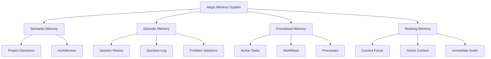
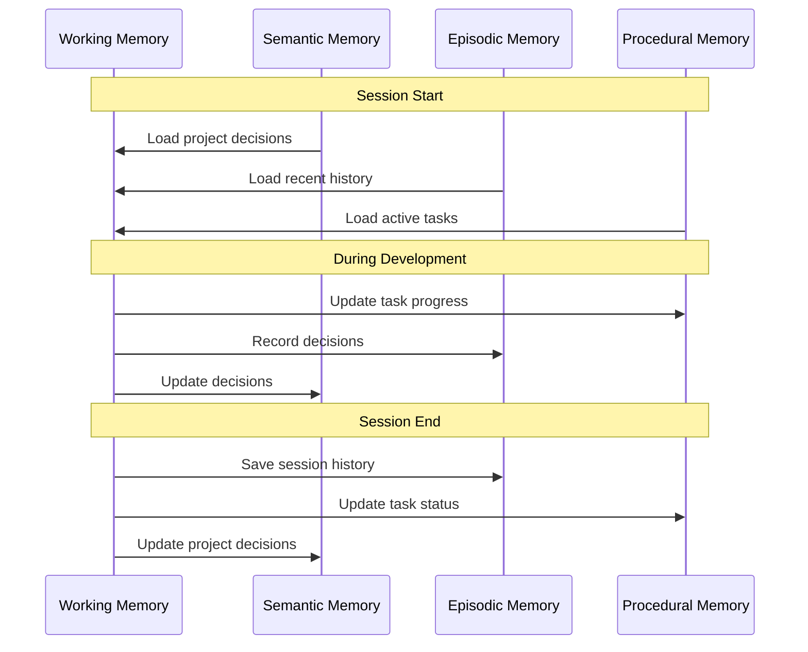
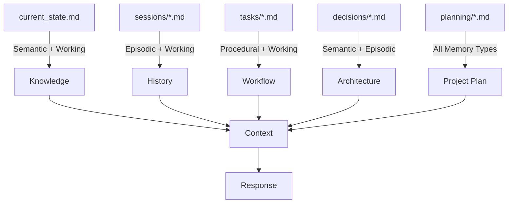

# Aegis Memory System

The Aegis framework implements a cognitive-inspired memory system that helps AI assistants maintain context and make informed decisions throughout your project's lifecycle. This document explains how the memory system works and how to effectively use it.

> **Related Documentation**
> - [Core Framework Files](./core_files.md) - Learn about the essential framework files
> - [Cross-Referencing System](./cross_referencing.md) - Understanding how memory types are linked
> - [Task Management](./tasks.md) - Working with procedural memory
> - [Session Management](./sessions.md) - Managing episodic memory
> - [Decision Records](./decisions.md) - Working with semantic memory

## Overview

Think of the Aegis memory system as similar to human memory - it has different types of memory for different purposes, each optimized for specific kinds of information and timeframes.



## Memory Types

### 1. Semantic Memory (Decisions & Architecture)
- **Purpose**: Long-term storage of project decisions and architecture
- **Location**: `.context/decisions/`
- **Contains**:
  - Architecture decisions
  - Technical decisions
  - Design patterns
  - System constraints
  - Implementation choices
- **When Used**: 
  - Making architectural decisions
  - Technical planning
  - System design
  - Implementation guidance

### 2. Episodic Memory (Project History)
- **Purpose**: Record of project events, decisions, and their contexts
- **Location**: `.context/sessions/`
- **Contains**:
  - Development sessions
  - Problem solutions
  - Decision contexts
  - Implementation history
  - Debugging sessions
- **When Used**:
  - Learning from past decisions
  - Understanding problem contexts
  - Tracking project evolution
  - Debugging similar issues

### 3. Procedural Memory (Task Management)
- **Purpose**: Managing active development and processes
- **Location**: `.context/tasks/`
- **Contains**:
  - Active tasks
  - Implementation steps
  - Testing procedures
  - Deployment processes
  - Maintenance routines
- **When Used**:
  - Task execution
  - Process following
  - Implementation guidance
  - Testing procedures

### 4. Working Memory (Current Focus)
- **Purpose**: Maintaining immediate context and focus
- **Location**: `.context/current_state.md`
- **Contains**:
  - Active development
  - Immediate goals
  - Current challenges
  - Recent changes
  - Open questions
- **When Used**:
  - Current development
  - Active problem-solving
  - Immediate decisions
  - Context switching

## Directory Structure

```
.context/
├── AI_INSTRUCTIONS.md    # Framework instructions
├── current_state.md     # Working Memory
├── decisions/          # Semantic Memory (Architecture & Technical Decisions)
├── plan/              # Project Planning
├── roadmap.md         # Project Direction
├── sessions/          # Episodic Memory
└── tasks/             # Procedural Memory
    ├── active/
    └── completed/
    ├── hold/
    └── planned/
```

## Memory Interaction

### Command Integration
Different commands interact with specific memory types:
- `/aide start`: Loads and processes all memory types
- `/aide save`: Updates all relevant memory types
- `/aide status`: Focuses on working memory
- `/aide task`: Focuses on procedural memory
- `/aide context`: Quick working memory refresh

### Memory Flow


### Memory Type Usage


## Best Practices

### 1. Memory Organization
- Keep related information together
- Use consistent naming conventions
- Maintain clear hierarchies
- Regular cleanup of outdated information

### 2. Memory Updates
- Save significant changes
- Document important decisions
- Update task progress regularly
- Maintain clear contexts

### 3. Memory Usage
- Reference relevant history
- Build on existing knowledge
- Follow established processes
- Maintain focus

## Common Issues and Solutions

### 1. Context Loss
- **Problem**: Losing track of current context
- **Solution**: Use `/aide context` for quick refresh

### 2. Information Overload
- **Problem**: Too much information to process
- **Solution**: Focus on relevant memory types

### 3. State Inconsistency
- **Problem**: Memory types out of sync
- **Solution**: Regular use of `/aide save`

## Tips for Effective Use

1. **Regular Updates**
   - Save after significant changes
   - Document decisions immediately
   - Update task status regularly
   - Maintain clear contexts

2. **Organized Structure**
   - Follow directory structure
   - Use templates
   - Maintain hierarchies
   - Clean up regularly

3. **Effective Retrieval**
   - Use specific commands
   - Reference relevant contexts
   - Build on existing knowledge
   - Maintain clear links

## Advanced Usage

### 1. Memory Templates
The framework provides templates for:
- Task documentation
- Session records
- Decision logs
- Context updates

### 2. Memory Integration
- Integration with version control
- CI/CD pipeline integration
- Documentation generation
- Analytics and insights

### 3. Memory Optimization
- Regular cleanup
- Archive old sessions
- Update references
- Maintain relationships
