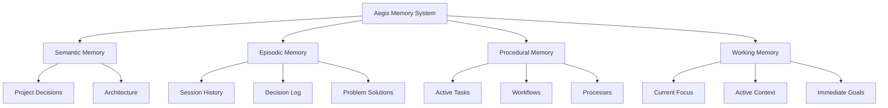
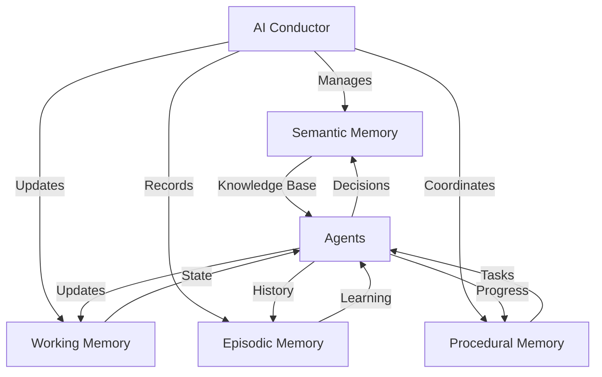
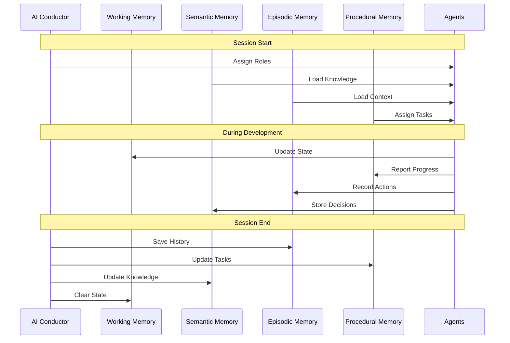
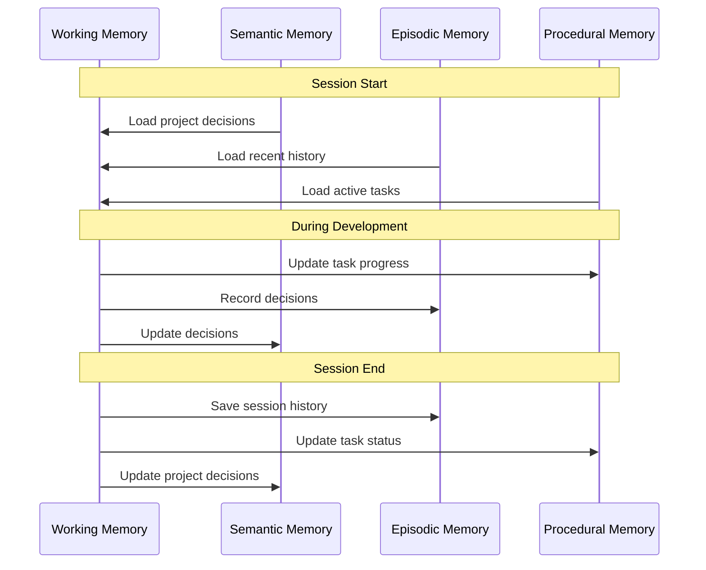
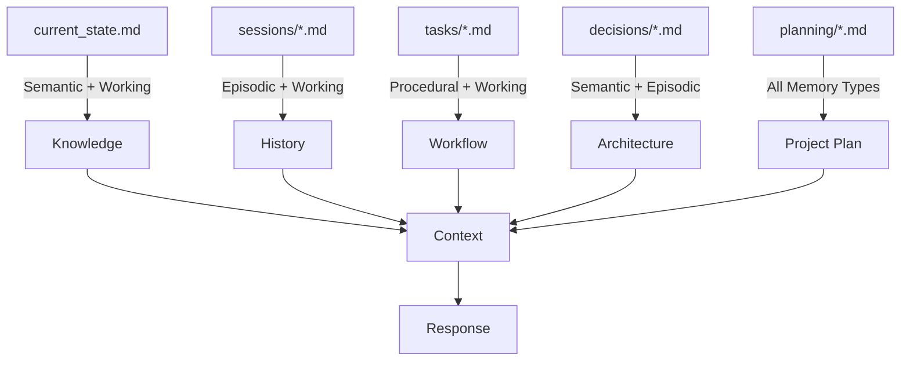

# Aegis Memory System

The Aegis framework implements a cognitive-inspired memory system that helps AI assistants maintain context and make informed decisions throughout your project's lifecycle. This document explains how the memory system works and how to effectively use it.

> **Related Documentation**
> - [Core Framework Files](./core_files.md) - Learn about the essential framework files
> - [Cross-Referencing System](./cross_referencing.md) - Understanding how memory types are linked
> - [Task Management](./tasks.md) - Working with procedural memory
> - [Session Management](./sessions.md) - Managing episodic memory
> - [Decision Records](./decisions.md) - Working with semantic memory

## Overview

Think of the Aegis memory system as similar to human memory - it has different types of memory for different purposes, each optimized for specific kinds of information and timeframes.



## Memory Types

### 1. Semantic Memory (Decisions & Architecture)
- **Purpose**: Long-term storage of project decisions and architecture
- **Location**: `.context/decisions/`
- **Contains**:
  - Architecture decisions
  - Technical decisions
  - Design patterns
  - System constraints
  - Implementation choices
  - Agent knowledge base
  - Conductor configurations
- **When Used**: 
  - Making architectural decisions
  - Technical planning
  - System design
  - Implementation guidance
  - Agent role definition
  - Conductor orchestration

### 2. Episodic Memory (Project History)
- **Purpose**: Record of project events, decisions, and their contexts
- **Location**: `.context/sessions/`
- **Contains**:
  - Development sessions
  - Problem solutions
  - Decision contexts
  - Implementation history
  - Debugging sessions
  - Agent interactions
  - Feedback cycles
- **When Used**:
  - Learning from past decisions
  - Understanding problem contexts
  - Tracking project evolution
  - Debugging similar issues
  - Improving agent performance
  - Refining workflows

### 3. Procedural Memory (Task Management)
- **Purpose**: Managing active development and processes
- **Location**: `.context/tasks/`
- **Contains**:
  - Active tasks
  - Implementation steps
  - Testing procedures
  - Deployment processes
  - Maintenance routines
  - Agent workflows
  - Validation rules
- **When Used**:
  - Task execution
  - Process following
  - Implementation guidance
  - Testing procedures
  - Agent task assignment
  - Workflow orchestration

### 4. Working Memory (Current Focus)
- **Purpose**: Maintaining immediate context and focus
- **Location**: `.context/current_state.md`
- **Contains**:
  - Active development
  - Immediate goals
  - Current challenges
  - Recent changes
  - Open questions
  - Active agent states
  - Current feedback
- **When Used**:
  - Current development
  - Active problem-solving
  - Immediate decisions
  - Context switching
  - Agent coordination
  - State management

## Directory Structure

```
.context/
├── AI_INSTRUCTIONS.md     # Framework instructions
├── current_state.md      # Working Memory
├── decisions/           # Semantic Memory
├── plan/               # Project Planning
│   ├── README.md       # Planning overview
│   ├── ai_conductor.json # Conductor config
│   ├── agents.mmd      # Agent definitions
│   ├── workflow.mmd    # Process flow
│   ├── feedback.mmd    # Refinement system
│   └── document_states.mmd # State machine
├── roadmap.md          # Project Direction
├── sessions/           # Episodic Memory
└── tasks/              # Procedural Memory
    ├── active/
    ├── completed/
    ├── hold/
    └── planned/
```

## Memory Integration with AI Conductor

### Agent Memory Management


### Memory Flow with Agents


## Memory Interaction

### Command Integration
Different commands interact with specific memory types:
- `/aegis start`: Loads and processes all memory types
- `/aegis save`: Updates all relevant memory types
- `/aegis status`: Focuses on working memory
- `/aegis task`: Focuses on procedural memory
- `/aegis context`: Quick working memory refresh

### Memory Flow


### Memory Type Usage


## Best Practices

### 1. Memory Organization
- Keep related information together
- Use consistent naming conventions
- Maintain clear hierarchies
- Regular cleanup of outdated information

### 2. Memory Updates
- Save significant changes
- Document important decisions
- Update task progress regularly
- Maintain clear contexts

### 3. Memory Usage
- Reference relevant history
- Build on existing knowledge
- Follow established processes
- Maintain focus

## Common Issues and Solutions

### 1. Context Loss
- **Problem**: Losing track of current context
- **Solution**: Use `/aegis context` for quick refresh

### 2. Information Overload
- **Problem**: Too much information to process
- **Solution**: Focus on relevant memory types

### 3. State Inconsistency
- **Problem**: Memory types out of sync
- **Solution**: Regular use of `/aegis save`

## Tips for Effective Use

1. **Regular Updates**
   - Save after significant changes
   - Document decisions immediately
   - Update task status regularly
   - Maintain clear contexts

2. **Organized Structure**
   - Follow directory structure
   - Use templates
   - Maintain hierarchies
   - Clean up regularly

3. **Effective Retrieval**
   - Use specific commands
   - Reference relevant contexts
   - Build on existing knowledge
   - Maintain clear links

## Advanced Usage

### 1. Memory Templates
The framework provides templates for:
- Task documentation
- Session records
- Decision logs
- Context updates

### 2. Memory Integration
- Integration with version control
- CI/CD pipeline integration
- Documentation generation
- Analytics and insights

### 3. Memory Optimization
- Regular cleanup
- Archive old sessions
- Update references
- Maintain relationships

### 4. Agent Memory Integration
- **Role-based Access**:
  - Each agent type has specific memory access patterns
  - Memory permissions based on agent role
  - State persistence per agent

- **State Management**:
  - Agent state tracking in working memory
  - Knowledge sharing between agents
  - Context preservation across sessions

- **Memory Optimization**:
  - Agent-specific caching
  - Selective memory loading
  - State cleanup on role change

### 5. Memory Performance
- **Caching Strategies**
  ```yaml
  cache_config:
    semantic:
      ttl: 24h
      max_size: 100MB
      priority: high
    episodic:
      ttl: 12h
      max_size: 50MB
      priority: medium
    procedural:
      ttl: 6h
      max_size: 25MB
      priority: high
    working:
      ttl: 1h
      max_size: 10MB
      priority: critical
  ```

- **Access Patterns**
  ```yaml
  access_patterns:
    semantic:
      read_ratio: 0.8
      write_ratio: 0.2
      batch_size: 100
    episodic:
      read_ratio: 0.6
      write_ratio: 0.4
      batch_size: 50
    procedural:
      read_ratio: 0.7
      write_ratio: 0.3
      batch_size: 25
    working:
      read_ratio: 0.9
      write_ratio: 0.1
      batch_size: 10
  ```

- **Cleanup Rules**
  ```yaml
  cleanup_rules:
    semantic:
      archive_after: 90d
      delete_after: never
      compress_after: 30d
    episodic:
      archive_after: 30d
      delete_after: 365d
      compress_after: 7d
    procedural:
      archive_after: 14d
      delete_after: 90d
      compress_after: 3d
    working:
      archive_after: 1d
      delete_after: 7d
      compress_after: 6h
  ```

### 6. Memory Monitoring
- **Metrics**
  - Access patterns
  - Cache hit rates
  - Memory usage
  - Agent interactions
  - State transitions

- **Alerts**
  - Memory pressure
  - Cache invalidation
  - Access violations
  - State conflicts
  - Reference errors

- **Optimization**
  - Automatic cleanup
  - Cache warming
  - Access pattern tuning
  - State compaction
  - Reference pruning

## Tips for Success

1. **Regular Updates**
   - Save after significant changes
   - Document decisions immediately
   - Update task status regularly
   - Maintain clear contexts

2. **Organized Structure**
   - Follow directory structure
   - Use templates
   - Maintain hierarchies
   - Clean up regularly

3. **Effective Retrieval**
   - Use specific commands
   - Reference relevant contexts
   - Build on existing knowledge
   - Maintain clear links
