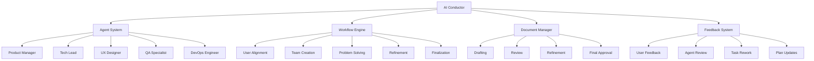

# Planning System

The Aegis framework implements a sophisticated planning system that integrates with different types of memory to create, validate, and maintain project plans. This document explains how the planning system works and how it integrates with the framework's operation patterns.

## Overview

The planning system consists of several integrated components:

1. **Core Components**
   - AI Conductor orchestrates the planning process
   - Specialized agents provide domain expertise
   - Workflow engine manages state transitions
   - Feedback system enables iterative refinement

2. **Memory Integration**
   - Semantic Memory stores architectural decisions and patterns
   - Procedural Memory tracks planning steps and workflows
   - Working Memory maintains current planning focus
   - Episodic Memory records planning sessions and feedback

3. **Document Management**
   - Planning documents capture project structure
   - Decision records track architectural choices
   - Workflow documents guide implementation
   - Feedback records track improvements

4. **Validation System**
   - Format rules ensure consistent structure
   - Content rules verify completeness
   - Reference rules maintain connections
   - State rules manage transitions

## System Architecture



## Component Documentation

### 1. AI Conductor
```yaml
conductor:
  role: orchestration
  responsibilities:
    - Process management
    - Agent coordination
    - State tracking
    - Quality control
  
  integration:
    memory: [semantic, working]
    agents: [all]
    workflow: [full_control]
```

### 2. Agent System
```yaml
agent_system:
  roles:
    product_manager:
      focus: requirements
      memory: [semantic, working]
    
    tech_lead:
      focus: architecture
      memory: [semantic, procedural]
    
    ux_designer:
      focus: user_experience
      memory: [semantic, working]
    
    qa_specialist:
      focus: quality
      memory: [procedural, working]
    
    devops_engineer:
      focus: infrastructure
      memory: [procedural, working]
```

For detailed documentation on each component:

1. [AI Conductor](conductor.md)
   - Orchestration patterns
   - Process management
   - State coordination
   - Agent supervision

2. [Specialized Agents](agents.md)
   - Role definitions
   - Memory access
   - Task types
   - Interaction patterns

3. [Workflow Engine](workflow.md)
   - State management
   - Transition rules
   - Validation steps
   - Process tracking

4. [Feedback System](feedback.md)
   - Collection patterns
   - Processing rules
   - Integration points
   - Improvement cycles

## Planning Process

### 1. Initialization
```yaml
planning_init:
  steps:
    - validate_framework: {check: true}
    - load_context: {if_exists: true}
    - initialize_agents: {required: true}
    - set_focus: {from: context}
```

### 2. Document Creation
```yaml
document_creation:
  required:
    - project_overview: {complete: true}
    - goals: {defined: true}
    - architecture: {validated: true}
    - timeline: {realistic: true}
  
  validation:
    - format: {check: true}
    - content: {complete: true}
    - references: {resolve: true}
```

### 3. State Management
```yaml
planning_states:
  transitions:
    init:
      to: [active]
      validate: [context, agents]
    
    active:
      to: [review, hold]
      validate: [progress, blockers]
    
    review:
      to: [active, complete]
      validate: [feedback, changes]
    
    complete:
      final: true
      validate: [deliverables]
```

### 4. Document Management
```yaml
document_states:
  drafting:
    status: initial
    next: [review]
  
  review:
    status: in_progress
    next: [refinement, drafting]
  
  refinement:
    status: updating
    next: [review, approval]
  
  approval:
    status: final
    next: []
```

### 5. Feedback Flow
```yaml
feedback_flow:
  sources:
    - user_input: {priority: high}
    - agent_review: {priority: medium}
    - system_checks: {priority: low}
  
  processing:
    - collect: {all: true}
    - analyze: {impact: true}
    - prioritize: {by: importance}
    - integrate: {into: plan}
```

### 6. Error Handling
```yaml
planning_errors:
  invalid_state:
    msg: "Invalid planning state"
    action: show_valid_states
    help: "Check state transition rules"
  
  incomplete_plan:
    msg: "Planning document incomplete"
    action: show_missing
    help: "Complete required sections"
  
  validation_failed:
    msg: "Plan validation failed"
    action: show_issues
    help: "Address validation errors"
```

## Usage Examples

1. **Basic Planning**
   ```bash
   /aegis plan
   ```
   Starts interactive planning process

2. **Context-Based Planning**
   ```bash
   /aegis plan "Build a web-based task system"
   ```
   Plans with initial context

3. **File-Based Planning**
   ```bash
   /aegis plan @requirements.md
   ```
   Plans using file content

4. **Structured Planning**
   ```bash
   /aegis plan
   Requirements:
   - Mobile support
   - Offline mode
   - User auth
   - Encryption
   ```
   Plans with specific requirements

## Integration Points

1. **Operation Patterns**
   - Framework validation
   - Memory processing
   - State management
   - Error handling

2. **Memory Types**
   - Semantic: Architecture and patterns
   - Procedural: Planning steps
   - Working: Current focus
   - Episodic: Planning history

3. **Validation Rules**
   - Document structure
   - Content completeness
   - Reference integrity
   - State transitions

## Related Documentation

- [Memory Types](../operations/memory_types.md)
- [Operation Patterns](../operations/patterns.md)
- [Validation Rules](../operations/validation.md)
- [Error Handling](../operations/error_handling.md)
- [State Management](../operations/state_management.md)
