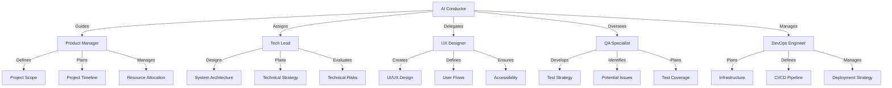
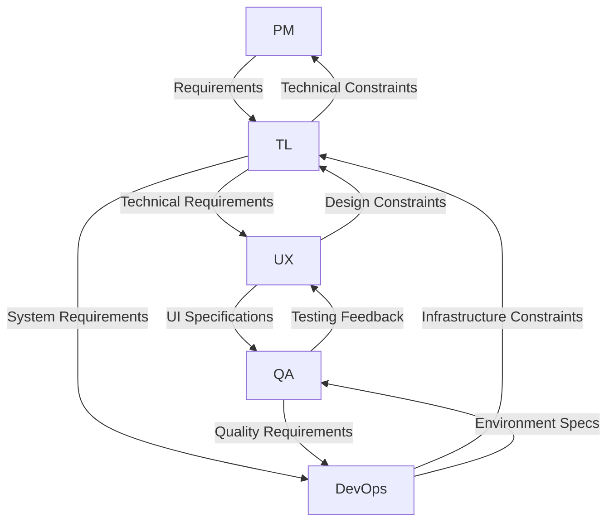

# Specialized Planning Agents

The Aegis planning system employs specialized AI agents, each with unique expertise and responsibilities. These agents work together under the AI Conductor's orchestration to create comprehensive project plans.

## Agent Structure

## Agent Roles

### 1. Product Manager
- **Expertise**: Project planning and scope management
- **Responsibilities**:
  - Define project scope
  - Plan timelines
  - Allocate resources
  - Manage priorities
- **Deliverables**:
  - Project roadmap
  - Resource plan
  - Timeline estimates
  - Risk assessment

### 2. Tech Lead
- **Expertise**: Technical architecture and system design
- **Responsibilities**:
  - Design architecture
  - Plan technical strategy
  - Evaluate risks
  - Guide implementation
- **Deliverables**:
  - System architecture
  - Technical specs
  - Implementation plan
  - Risk mitigation

### 3. UX Designer
- **Expertise**: User experience and interface design
- **Responsibilities**:
  - Design interfaces
  - Create user flows
  - Ensure accessibility
  - Plan interactions
- **Deliverables**:
  - UI/UX designs
  - User flows
  - Interaction models
  - Design system

### 4. QA Specialist
- **Expertise**: Quality assurance and testing
- **Responsibilities**:
  - Plan testing strategy
  - Identify issues
  - Define coverage
  - Ensure quality
- **Deliverables**:
  - Test plan
  - Coverage map
  - Quality metrics
  - Risk assessment

### 5. DevOps Engineer
- **Expertise**: Infrastructure and deployment
- **Responsibilities**:
  - Plan infrastructure
  - Design pipelines
  - Manage deployments
  - Ensure reliability
- **Deliverables**:
  - Infrastructure plan
  - CI/CD pipeline
  - Deployment strategy
  - Monitoring plan

## Agent Interactions

### 1. Collaboration Patterns

### 2. Communication Flow
- Regular sync meetings
- Cross-functional reviews
- Dependency management
- Issue resolution

### 3. Deliverable Integration
- Coordinated planning
- Shared documentation
- Unified delivery
- Quality assurance

## Best Practices

### 1. Agent Selection
- Match project needs
- Consider dependencies
- Balance expertise
- Ensure coverage

### 2. Collaboration
- Clear communication
- Regular updates
- Shared context
- Unified goals

### 3. Deliverables
- Consistent format
- Clear ownership
- Regular reviews
- Quality standards

### 4. Knowledge Sharing
- Document decisions
- Share insights
- Track progress
- Maintain history

## Integration Points

### 1. Planning Process
- Initial setup
- Regular updates
- Progress tracking
- Final delivery

### 2. Documentation
- Shared templates
- Standard formats
- Version control
- Change tracking

### 3. Memory System
- Context sharing
- Decision history
- Progress tracking
- Knowledge base

## Tips for Success

1. **Clear Roles**
   - Define responsibilities
   - Set expectations
   - Track deliverables
   - Manage dependencies

2. **Effective Communication**
   - Regular updates
   - Clear channels
   - Shared context
   - Quick feedback

3. **Quality Focus**
   - Standard processes
   - Regular reviews
   - Clear metrics
   - Continuous improvement

4. **Knowledge Management**
   - Document decisions
   - Share insights
   - Track progress
   - Maintain history
