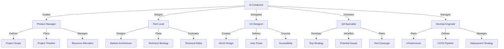
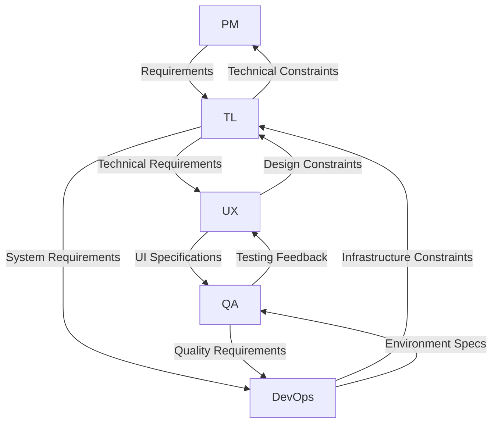
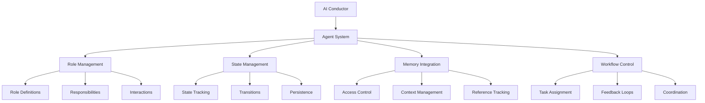
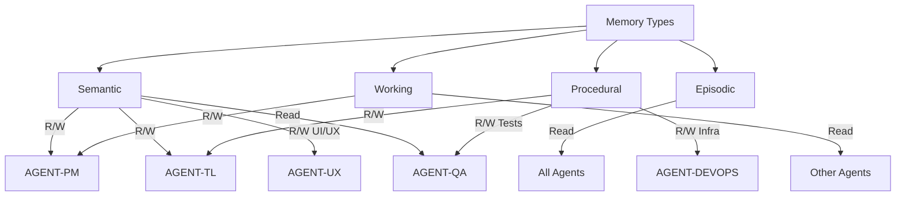
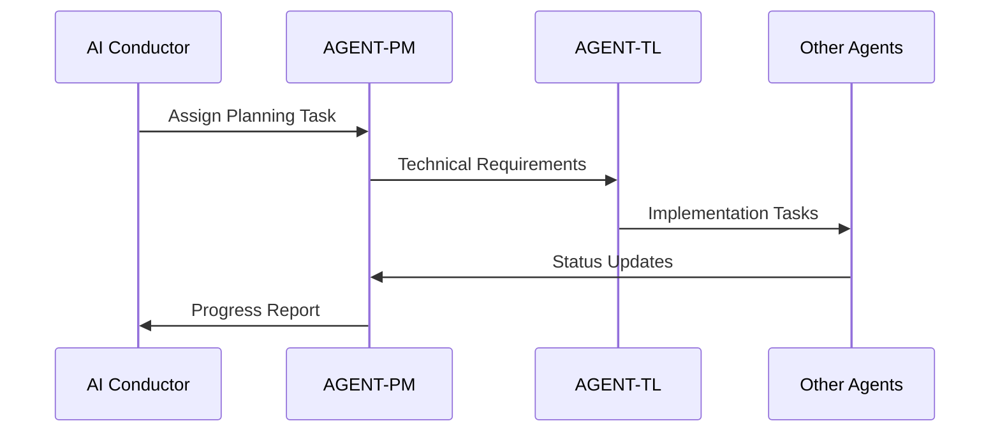
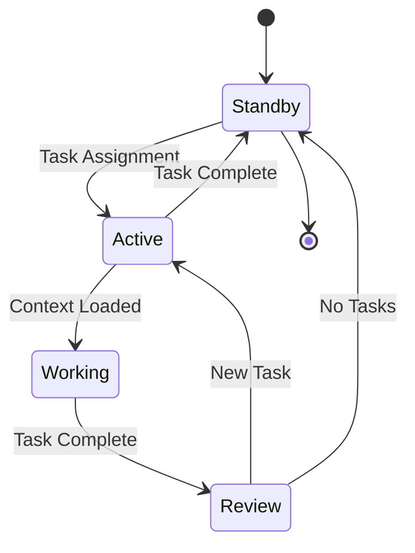

# Specialized Planning Agents

The Aegis planning system employs specialized AI agents, each with unique expertise and responsibilities. These agents work together under the AI Conductor's orchestration to create comprehensive project plans.

## Agent Structure



## Agent Roles

### 1. Product Manager
- **Expertise**: Project planning and scope management
- **Responsibilities**:
  - Define project scope
  - Plan timelines
  - Allocate resources
  - Manage priorities
- **Deliverables**:
  - Project roadmap
  - Resource plan
  - Timeline estimates
  - Risk assessment

### 2. Tech Lead
- **Expertise**: Technical architecture and system design
- **Responsibilities**:
  - Design architecture
  - Plan technical strategy
  - Evaluate risks
  - Guide implementation
- **Deliverables**:
  - System architecture
  - Technical specs
  - Implementation plan
  - Risk mitigation

### 3. UX Designer
- **Expertise**: User experience and interface design
- **Responsibilities**:
  - Design interfaces
  - Create user flows
  - Ensure accessibility
  - Plan interactions
- **Deliverables**:
  - UI/UX designs
  - User flows
  - Interaction models
  - Design system

### 4. QA Specialist
- **Expertise**: Quality assurance and testing
- **Responsibilities**:
  - Plan testing strategy
  - Identify issues
  - Define coverage
  - Ensure quality
- **Deliverables**:
  - Test plan
  - Coverage map
  - Quality metrics
  - Risk assessment

### 5. DevOps Engineer
- **Expertise**: Infrastructure and deployment
- **Responsibilities**:
  - Plan infrastructure
  - Design pipelines
  - Manage deployments
  - Ensure reliability
- **Deliverables**:
  - Infrastructure plan
  - CI/CD pipeline
  - Deployment strategy
  - Monitoring plan

## Agent Interactions

### 1. Collaboration Patterns


### 2. Communication Flow
- Regular sync meetings
- Cross-functional reviews
- Dependency management
- Issue resolution

### 3. Deliverable Integration
- Coordinated planning
- Shared documentation
- Unified delivery
- Quality assurance

## Best Practices

### 1. Agent Selection
- Match project needs
- Consider dependencies
- Balance expertise
- Ensure coverage

### 2. Collaboration
- Clear communication
- Regular updates
- Shared context
- Unified goals

### 3. Deliverables
- Consistent format
- Clear ownership
- Regular reviews
- Quality standards

### 4. Knowledge Sharing
- Document decisions
- Share insights
- Track progress
- Maintain history

## Integration Points

### 1. Planning Process
- Initial setup
- Regular updates
- Progress tracking
- Final delivery

### 2. Documentation
- Shared templates
- Standard formats
- Version control
- Change tracking

### 3. Memory System
- Context sharing
- Decision history
- Progress tracking
- Knowledge base

## Tips for Success

1. **Clear Roles**
   - Define responsibilities
   - Set expectations
   - Track deliverables
   - Manage dependencies

2. **Effective Communication**
   - Regular updates
   - Clear channels
   - Shared context
   - Quick feedback

3. **Quality Focus**
   - Standard processes
   - Regular reviews
   - Clear metrics
   - Continuous improvement

4. **Knowledge Management**
   - Document decisions
   - Share insights
   - Track progress
   - Maintain history

# Agent Integration System

The Aegis framework uses a sophisticated multi-agent system orchestrated by an AI Conductor to enhance project planning and development. This document explains how agents integrate with the memory system and work together effectively.

## Overview



## Core Agents

### Product Manager (AGENT-PM)
- **Purpose**: Guide product direction and requirements
- **Memory Access**:
  - Full read/write: semantic, working
  - Read-only: episodic
- **Primary Tasks**:
  - Requirements definition
  - Feature prioritization
  - Planning coordination
  - Stakeholder alignment

### Tech Lead (AGENT-TL)
- **Purpose**: Technical architecture and implementation
- **Memory Access**:
  - Full read/write: semantic, procedural
  - Read-only: episodic, working
- **Primary Tasks**:
  - Architecture decisions
  - Technical planning
  - Code review
  - Implementation guidance

### UX Designer (AGENT-UX)
- **Purpose**: User experience and interface design
- **Memory Access**:
  - Full read/write: semantic (UI/UX)
  - Read-only: working, episodic
- **Primary Tasks**:
  - Interface design
  - User flows
  - Interaction patterns
  - Usability feedback

### QA Specialist (AGENT-QA)
- **Purpose**: Quality assurance and testing
- **Memory Access**:
  - Full read/write: procedural (tests)
  - Read-only: semantic, working
- **Primary Tasks**:
  - Test planning
  - Quality validation
  - Bug tracking
  - Process improvement

### DevOps Engineer (AGENT-DEVOPS)
- **Purpose**: Infrastructure and deployment
- **Memory Access**:
  - Full read/write: procedural (infrastructure)
  - Read-only: semantic, working
- **Primary Tasks**:
  - Infrastructure planning
  - Deployment automation
  - Performance monitoring
  - Security implementation

## Memory Integration

### Access Patterns


### Context Management
1. **Loading Context**
   ```yaml
   memory_context:
     semantic: [DEC-001, DEC-002]
     episodic: [SESSION-20250120]
     procedural: [TASK-001]
     working: current_state.md
   ```

2. **State Persistence**
   ```yaml
   agent_state:
     status: active
     context: [DEC-001, TASK-002]
     memory_access: [semantic, working]
   ```

3. **Reference Tracking**
   ```yaml
   references:
     decisions: [DEC-001]
     tasks: [TASK-002]
     sessions: [SESSION-20250120]
   ```

## Workflow Integration

### Task Assignment Flow


### State Transitions


## Best Practices

### 1. Role Management
- Define clear responsibilities
- Maintain role boundaries
- Document interactions
- Update capabilities

### 2. State Management
- Track state changes
- Maintain context
- Clean up resources
- Handle transitions

### 3. Memory Access
- Follow access patterns
- Validate permissions
- Update references
- Maintain context

### 4. Workflow Control
- Coordinate tasks
- Handle feedback
- Manage transitions
- Track progress

## Integration Examples

### 1. Planning Session
```markdown
# Planning Session

---
agent_roles: [AGENT-PM, AGENT-TL]
memory_access: [semantic, working]
---

## Workflow
1. PM defines requirements
2. TL reviews technical approach
3. PM updates planning document
4. TL creates implementation tasks
```

### 2. Implementation
```markdown
# Implementation Task

---
assigned_agents: [AGENT-TL, AGENT-QA]
memory_access: [procedural, working]
---

## Process
1. TL designs solution
2. QA creates test plan
3. TL implements feature
4. QA validates implementation
```

### 3. Review Process
```markdown
# Code Review

---
agent_roles: [AGENT-TL, AGENT-QA]
memory_access: [semantic, procedural]
---

## Steps
1. TL reviews code changes
2. QA validates test coverage
3. TL approves implementation
4. QA confirms quality
```

## Command Integration

### Agent Management
- `/aegis plan`: Engage AI Conductor
- `/aegis task`: Manage agent tasks
- `/aegis status`: Check agent states
- `/aegis save`: Update agent context

### Memory Operations
- Load agent context
- Update state records
- Track references
- Maintain permissions

### Workflow Control
- Assign tasks
- Track progress
- Handle transitions
- Manage feedback

## Tips for Success

1. **Clear Communication**
   - Define roles clearly
   - Document interactions
   - Maintain boundaries
   - Track decisions

2. **State Management**
   - Track transitions
   - Maintain context
   - Clean up properly
   - Handle errors

3. **Memory Usage**
   - Follow patterns
   - Update references
   - Maintain context
   - Check permissions

4. **Workflow Efficiency**
   - Coordinate well
   - Handle feedback
   - Track progress
   - Manage transitions
