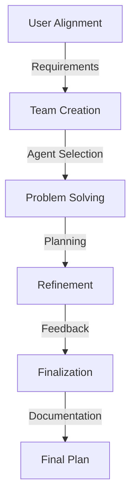
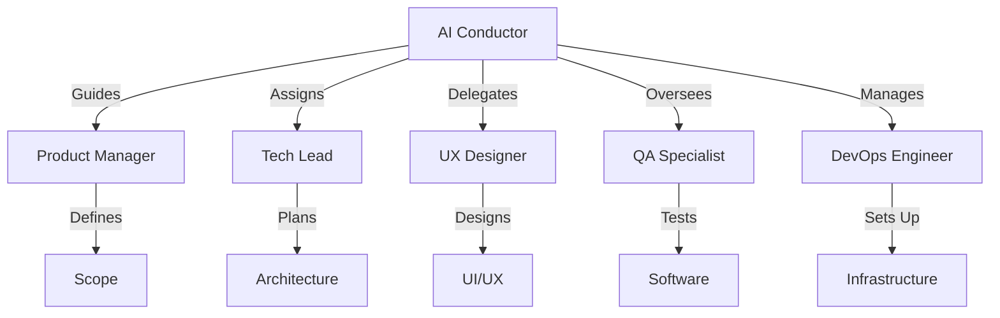
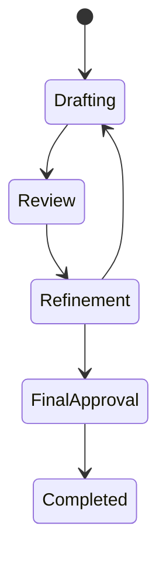
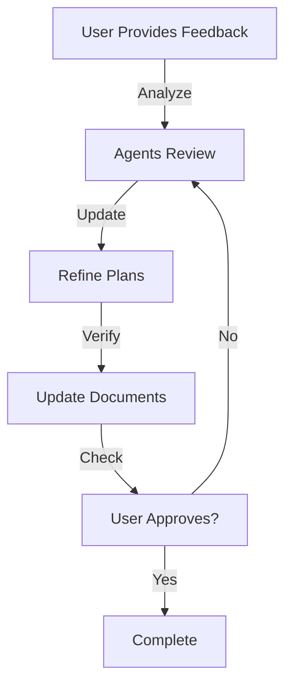

# AI Conductor

The AI Conductor is the central orchestrator of the Aegis planning system. It manages specialized AI agents, guides the planning process, and ensures the creation of comprehensive project plans.

## Configuration

The AI Conductor's behavior is defined in `ai_conductor.json`:

```json
{
  "role": "AI Conductor",
  "objective": "Orchestrate specialized AI expert agents to develop a comprehensive code project planning document.",
  "workflow_diagram": "plan/workflow.mmd",
  "agent_interactions": "plan/agents.mmd",
  "decision_flow": "plan/feedback.mmd",
  "document_states": "plan/document_states.mmd"
}
```

## Responsibilities

### 1. Process Management


1. **User Alignment**
   - Gather project context
   - Understand requirements
   - Identify constraints
   - Set objectives

2. **Team Creation**
   - Analyze project needs
   - Select appropriate agents
   - Assign responsibilities
   - Define interactions

3. **Problem Solving**
   - Guide collaboration
   - Facilitate discussions
   - Track progress
   - Manage dependencies

4. **Refinement**
   - Process feedback
   - Direct improvements
   - Coordinate updates
   - Verify changes

5. **Finalization**
   - Complete documentation
   - Verify requirements
   - Obtain approvals
   - Deliver plans

### 2. Agent Orchestration



- Assigns tasks to agents
- Coordinates interactions
- Manages dependencies
- Ensures coverage

### 3. Document Management



- Tracks document states
- Manages versions
- Coordinates reviews
- Handles approvals

### 4. Feedback Processing



- Collects feedback
- Directs improvements
- Verifies changes
- Updates plans

## Best Practices

### 1. Process Management
- Clear communication
- Regular updates
- Tracked progress
- Documented decisions

### 2. Agent Coordination
- Clear assignments
- Defined interfaces
- Managed dependencies
- Regular sync-ups

### 3. Document Control
- Version tracking
- State management
- Review process
- Change history

### 4. Feedback Handling
- Prompt collection
- Quick processing
- Clear updates
- Verified changes

## Integration Points

### 1. Command Interface
- `/aide plan`: Start planning
- `/aide save`: Save state
- `/aide status`: Check progress

### 2. Memory System
- Procedural: Process steps
- Semantic: Decisions
- Working: Active state
- Episodic: History

### 3. Documentation
- Planning documents
- Process records
- Decision logs
- Final plans
