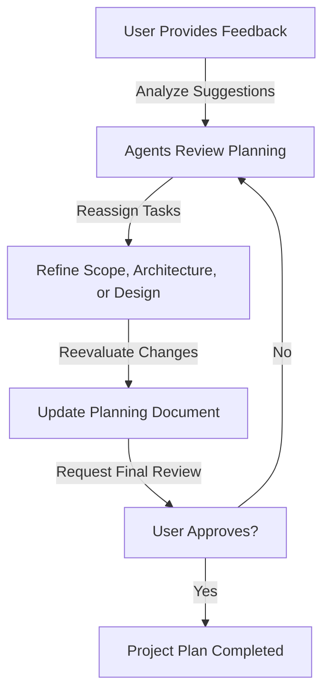

# Feedback System

The Aegis planning system incorporates a robust feedback system that enables continuous improvement and refinement of project plans through structured user input and agent responses.

## Feedback Flow



## Process Components

### 1. Feedback Collection
- **Purpose**: Gather user input and suggestions
- **Activities**:
  - Collect feedback
  - Organize input
  - Prioritize changes
  - Track requests
- **Outputs**:
  - Feedback log
  - Priority list
  - Change requests
  - Action items

### 2. Agent Review
- **Purpose**: Analyze and process feedback
- **Activities**:
  - Review feedback
  - Analyze impact
  - Plan changes
  - Assign tasks
- **Outputs**:
  - Analysis report
  - Change plan
  - Task assignments
  - Timeline updates

### 3. Task Rework
- **Purpose**: Implement requested changes
- **Activities**:
  - Update plans
  - Refine designs
  - Adjust scope
  - Modify architecture
- **Outputs**:
  - Updated documents
  - Change records
  - Progress notes
  - Quality checks

### 4. Planning Updates
- **Purpose**: Incorporate changes into plans
- **Activities**:
  - Update documents
  - Verify changes
  - Check quality
  - Track progress
- **Outputs**:
  - Revised plans
  - Update log
  - Quality report
  - Change history

### 5. User Approval
- **Purpose**: Validate changes and improvements
- **Activities**:
  - Review updates
  - Verify changes
  - Provide feedback
  - Grant approval
- **Outputs**:
  - Approval status
  - Review notes
  - Next steps
  - Final decisions

## Feedback Types

### 1. Scope Feedback
- Requirements changes
- Feature requests
- Priority adjustments
- Timeline updates

### 2. Technical Feedback
- Architecture concerns
- Technical constraints
- Implementation details
- Performance requirements

### 3. Design Feedback
- UI/UX suggestions
- Flow improvements
- Accessibility needs
- Visual updates

### 4. Process Feedback
- Workflow changes
- Communication needs
- Documentation requests
- Tool suggestions

## Best Practices

### 1. Feedback Collection
- Clear channels
- Structured format
- Quick response
- Complete capture

### 2. Processing
- Thorough analysis
- Quick turnaround
- Clear communication
- Complete tracking

### 3. Implementation
- Accurate updates
- Quality checks
- Progress tracking
- Change validation

### 4. Validation
- Complete review
- Clear criteria
- Quick approval
- Change history

## Integration Points

### 1. Command Interface
```mermaid
graph LR
    Feedback[User Feedback] --> Save[/aide save]
    Save --> Status[/aide status]
    Status --> Review[Review Changes]
    Review --> Feedback
```

### 2. Memory System
- Procedural: Process steps
- Semantic: Decisions made
- Working: Active changes
- Episodic: Feedback history

### 3. Documentation
- Feedback records
- Change history
- Decision logs
- Progress tracking

## Tips for Success

1. **Clear Communication**
   - Structured feedback
   - Quick response
   - Clear updates
   - Complete tracking

2. **Quality Focus**
   - Thorough review
   - Complete updates
   - Change validation
   - Quality checks

3. **Process Adherence**
   - Follow steps
   - Track progress
   - Document changes
   - Maintain history

4. **Continuous Improvement**
   - Learn from feedback
   - Improve process
   - Update practices
   - Share knowledge
