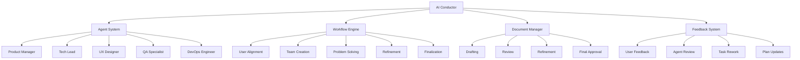

# Planning System Overview

The Aegis planning system uses an AI Conductor to orchestrate specialized AI agents in creating comprehensive project plans. This document provides a high-level overview of the system's architecture and components.

> **Related Documentation**
> - [AI Conductor Details](./conductor.md) - Deep dive into the orchestration system
> - [Specialized Agents](./agents.md) - Learn about each planning agent's role
> - [Planning Workflow](./workflow.md) - Understand the planning process
> - [Feedback System](./feedback.md) - How planning improves
> - [Memory System](../memory_system.md) - How planning integrates with project memory
> - [Commands Reference](../commands/aegis_plan.md) - Planning command details

## System Architecture

## Key Components

### 1. AI Conductor
- Orchestrates the planning process
- Manages specialized agents
- Guides workflow progression
- Handles document states

### 2. Specialized Agents
- Product Manager: Scope definition
- Tech Lead: Architecture planning
- UX Designer: Interface design
- QA Specialist: Quality assurance
- DevOps Engineer: Infrastructure planning

### 3. Workflow Engine
1. User Alignment
   - Gather requirements
   - Understand constraints
   - Set objectives

2. Team Creation
   - Select agents
   - Assign roles
   - Define responsibilities

3. Problem Solving
   - Analyze requirements
   - Design architecture
   - Plan implementation

4. Refinement
   - Process feedback
   - Adjust plans
   - Improve solutions

5. Finalization
   - Complete documentation
   - Verify requirements
   - Obtain approval

### 4. Document Manager
- Tracks document states
- Manages versions
- Coordinates reviews
- Handles approvals

### 5. Feedback System
- Collects user input
- Coordinates reviews
- Manages iterations
- Updates plans

## Core Concepts

### 1. Multi-Agent Collaboration
- Specialized expertise
- Coordinated effort
- Comprehensive coverage
- Balanced perspectives

### 2. Structured Planning
- Clear process
- Defined states
- Tracked progress
- Managed iterations

### 3. User-Centric Design
- Regular feedback
- Iterative refinement
- Clear communication
- Aligned objectives

### 4. Document Lifecycle
- State management
- Version control
- Review process
- Final deliverables

## Integration

### 1. Memory System
- Procedural: Workflows and processes
- Semantic: Decisions and architecture
- Working: Active planning state
- Episodic: Planning history

### 2. Command Interface
- `/aide plan`: Initiate planning
- `/aide save`: Save state
- `/aide status`: Check progress

### 3. Documentation
- Planning documents
- Architecture decisions
- Implementation guides
- Process documentation
