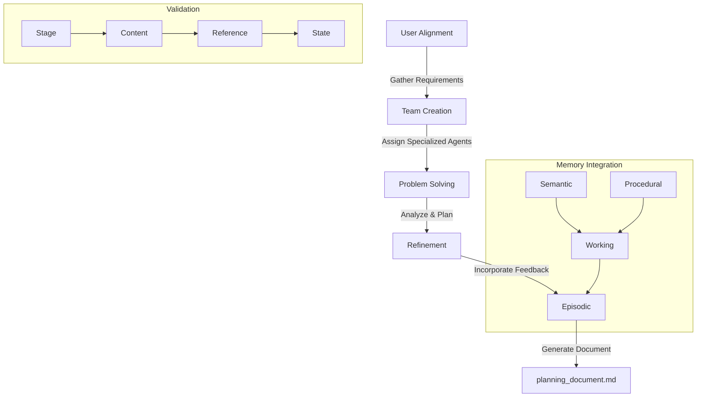

# Planning Workflow

The Aegis framework implements a structured workflow system that guides projects from initial requirements to final planning documents. This document explains how the workflow integrates with the framework's operation patterns and memory types.

## Overview

The workflow system consists of several integrated components:

1. **Core Components**
   - Process management tracks workflow stages
   - State transitions handle document flow
   - Validation ensures quality at each step
   - Memory integration maintains context

2. **Memory Integration**
   - Semantic Memory stores workflow patterns and rules
   - Procedural Memory tracks current workflow steps
   - Working Memory maintains active workflow state
   - Episodic Memory records workflow history

3. **Validation System**
   - Stage validation ensures proper transitions
   - Content validation verifies completeness
   - Reference validation maintains connections
   - State validation ensures consistency

## Workflow Architecture



## Stage Definitions

### 1. User Alignment
```yaml
stage:
  id: alignment
  type: initial
  memory_types: [semantic, working]
  validation:
    required:
      - requirements: {complete: true}
      - constraints: {defined: true}
      - objectives: {clear: true}
    
  activities:
    - gather_requirements: {type: input}
    - analyze_constraints: {type: analysis}
    - define_objectives: {type: planning}
    
  outputs:
    - project_brief: {format: markdown}
    - requirements_list: {format: yaml}
    - constraints_doc: {format: yaml}
```

### 2. Team Creation
```yaml
stage:
  id: team_creation
  type: setup
  memory_types: [procedural, working]
  validation:
    required:
      - roles: {defined: true}
      - agents: {assigned: true}
      - interactions: {mapped: true}
    
  activities:
    - analyze_needs: {type: analysis}
    - select_agents: {type: assignment}
    - define_roles: {type: planning}
    
  outputs:
    - team_structure: {format: yaml}
    - role_assignments: {format: yaml}
    - interaction_model: {format: mermaid}
```

### 3. Problem Solving
```yaml
stage:
  id: problem_solving
  type: development
  memory_types: [semantic, procedural]
  validation:
    required:
      - analysis: {complete: true}
      - design: {validated: true}
      - risks: {assessed: true}
    
  activities:
    - analyze_requirements: {type: analysis}
    - design_solution: {type: planning}
    - assess_risks: {type: evaluation}
    
  outputs:
    - technical_design: {format: markdown}
    - implementation_plan: {format: yaml}
    - risk_assessment: {format: yaml}
```

### 4. Refinement
```yaml
stage:
  id: refinement
  type: iteration
  memory_types: [working, episodic]
  validation:
    required:
      - feedback: {processed: true}
      - changes: {validated: true}
      - improvements: {verified: true}
    
  activities:
    - gather_feedback: {type: input}
    - process_changes: {type: analysis}
    - validate_updates: {type: validation}
    
  outputs:
    - updated_plans: {format: markdown}
    - change_log: {format: yaml}
    - validation_results: {format: yaml}
```

### 5. Finalization
```yaml
stage:
  id: finalization
  type: completion
  memory_types: [semantic, episodic]
  validation:
    required:
      - documents: {complete: true}
      - approvals: {obtained: true}
      - delivery: {verified: true}
    
  activities:
    - compile_docs: {type: generation}
    - obtain_approvals: {type: validation}
    - prepare_delivery: {type: packaging}
    
  outputs:
    - final_documents: {format: markdown}
    - approval_records: {format: yaml}
    - delivery_package: {format: archive}
```

## State Management

```yaml
workflow_states:
  transitions:
    alignment:
      to: [team_creation]
      validate: [requirements, objectives]
    
    team_creation:
      to: [problem_solving]
      validate: [roles, assignments]
    
    problem_solving:
      to: [refinement]
      validate: [design, risks]
    
    refinement:
      to: [finalization, problem_solving]
      validate: [changes, improvements]
    
    finalization:
      to: [completed]
      validate: [documents, approvals]
```

## Memory Integration

### 1. Semantic Memory
```yaml
semantic_integration:
  store:
    - workflow_patterns: {type: rules}
    - design_decisions: {type: choices}
    - quality_standards: {type: criteria}
  
  access:
    read: [patterns, decisions]
    write: [new_decisions]
```

### 2. Procedural Memory
```yaml
procedural_integration:
  store:
    - workflow_steps: {type: process}
    - validation_rules: {type: checks}
    - stage_transitions: {type: flow}
  
  access:
    read: [steps, rules]
    write: [progress]
```

### 3. Working Memory
```yaml
working_integration:
  store:
    - active_stage: {type: current}
    - stage_progress: {type: status}
    - pending_tasks: {type: todo}
  
  access:
    read: [status, tasks]
    write: [updates]
```

### 4. Episodic Memory
```yaml
episodic_integration:
  store:
    - stage_history: {type: log}
    - change_records: {type: changes}
    - validation_results: {type: checks}
  
  access:
    read: [history, results]
    write: [new_records]
```

## Operation Pattern Integration

### 1. Framework Check Pattern
```yaml
workflow_check:
  validate:
    - structure: {complete: true}
    - stages: {defined: true}
    - transitions: {valid: true}
    - memory: {integrated: true}
```

### 2. Memory Processing Pattern
```yaml
workflow_memory:
  load:
    - type: {validate: true}
    - content: {process: true}
    - refs: {resolve: true}
  
  update:
    - state: {track: true}
    - changes: {record: true}
    - consistency: {maintain: true}
```

### 3. State Management Pattern
```yaml
workflow_state:
  track:
    - current: {stage: active}
    - progress: {steps: completed}
    - next: {stage: pending}
  
  validate:
    - transitions: {allowed: true}
    - conditions: {met: true}
    - state: {consistent: true}
```

## Related Documentation

- [Memory Types](../operations/memory_types.md)
- [Operation Patterns](../operations/patterns.md)
- [Validation Rules](../operations/validation.md)
- [Error Handling](../operations/error_handling.md)
- [State Management](../operations/state_management.md)
