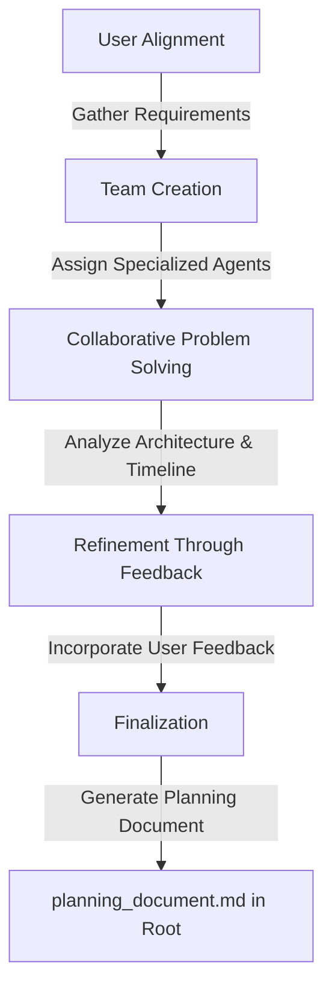
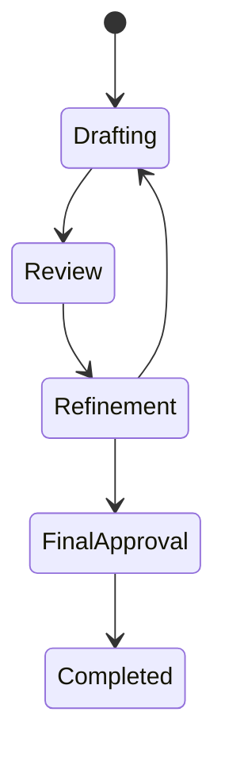

# Planning Workflow

The Aegis planning system follows a structured workflow that guides projects from initial requirements to final planning documents. This process ensures comprehensive coverage and quality outcomes.

## Workflow Overview



## Process Steps

### 1. User Alignment
- **Purpose**: Establish project context and requirements
- **Activities**:
  - Gather requirements
  - Understand constraints
  - Define objectives
  - Set expectations
- **Outputs**:
  - Project brief
  - Initial requirements
  - Constraint list
  - Success criteria

### 2. Team Creation
- **Purpose**: Assemble specialized agents for the project
- **Activities**:
  - Analyze needs
  - Select agents
  - Assign roles
  - Define interactions
- **Outputs**:
  - Team composition
  - Role assignments
  - Interaction model
  - Communication plan

### 3. Collaborative Problem Solving
- **Purpose**: Develop comprehensive project plan
- **Activities**:
  - Analyze requirements
  - Design solutions
  - Plan implementation
  - Assess risks
- **Outputs**:
  - Technical design
  - Implementation plan
  - Risk assessment
  - Resource plan

### 4. Refinement Through Feedback
- **Purpose**: Improve and validate planning
- **Activities**:
  - Gather feedback
  - Analyze input
  - Make improvements
  - Validate changes
- **Outputs**:
  - Updated plans
  - Refinement log
  - Validation results
  - Change history

### 5. Finalization
- **Purpose**: Complete and deliver planning documents
- **Activities**:
  - Compile documentation
  - Verify completeness
  - Get approvals
  - Deliver plans
- **Outputs**:
  - Final documents
  - Approval records
  - Delivery notes
  - Next steps

## Document States



### State Descriptions

1. **Drafting**
   - Initial creation
   - Content development
   - Structure formation
   - Basic review

2. **Review**
   - Content validation
   - Technical review
   - Quality check
   - Feedback collection

3. **Refinement**
   - Update content
   - Address feedback
   - Improve quality
   - Verify changes

4. **Final Approval**
   - Final review
   - Stakeholder approval
   - Quality assurance
   - Release preparation

5. **Completed**
   - Document finalized
   - Changes tracked
   - History maintained
   - Ready for use

## Best Practices

### 1. Process Management
- Follow sequence
- Track progress
- Document changes
- Maintain quality

### 2. Documentation
- Clear structure
- Complete content
- Regular updates
- Version control

### 3. Communication
- Regular updates
- Clear channels
- Quick feedback
- Issue tracking

### 4. Quality Control
- Regular reviews
- Clear standards
- Validation steps
- Issue resolution

## Integration Points

### 1. Command Interface
```mermaid
graph LR
    Start[/aide plan] --> Process
    Process --> Save[/aide save]
    Save --> Status[/aide status]
    Status --> Process
```

- `/aide plan`: Start workflow
- `/aide save`: Save progress
- `/aide status`: Check state

### 2. Memory System
- Procedural: Workflow steps
- Semantic: Decisions made
- Working: Active state
- Episodic: Progress history

### 3. Documentation
- Planning documents
- Process records
- Decision logs
- Change history

## Tips for Success

1. **Process Adherence**
   - Follow steps
   - Track progress
   - Document changes
   - Maintain quality

2. **Quality Focus**
   - Regular reviews
   - Clear standards
   - Quick feedback
   - Issue resolution

3. **Communication**
   - Clear updates
   - Quick responses
   - Issue tracking
   - Progress reports

4. **Documentation**
   - Complete records
   - Clear structure
   - Version control
   - Change tracking
