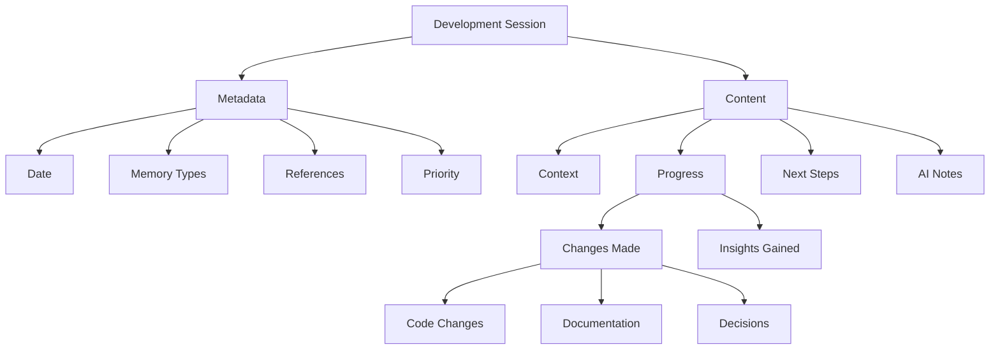

# Development Sessions

The Aegis framework uses development sessions to maintain episodic memory of project activities. Each session captures the context, progress, insights, and next steps, helping both developers and AI assistants maintain continuity across development activities.

## Overview



## Session Structure

### Metadata Section
```yaml
---
memory_types: [episodic, working]
references: []
priority: medium
---
```

#### Fields Explained
- **memory_types**: How this session should be processed (typically episodic and working)
- **references**: Links to related sessions, tasks, or decisions
- **priority**: Importance level for context retention

### Content Sections

1. **Context**
   - Previous session link
   - Related tasks
   - Current focus
   - Active context

2. **Progress**
   - Changes Made:
     - Code changes
     - Documentation updates
     - Decisions made
   - Insights Gained:
     - Technical insights
     - Pattern discoveries
     - Potential issues

3. **Next Steps**
   - Immediate tasks
   - Open questions
   - Follow-up items
   - Planned work

4. **Notes for AI**
   - Key context
   - Important patterns
   - Special considerations
   - Implementation guidance

## Memory Integration

### Episodic Memory
- Development history
- Problem-solving approaches
- Decision contexts
- Implementation progression

### Working Memory
- Active context
- Current focus
- Immediate tasks
- Recent changes

## Session Management

### 1. Session Creation
- Created by `/aide start`
- Links to previous session
- Sets initial context
- Establishes focus

### 2. Session Updates
- Updated during development
- Records progress
- Captures decisions
- Maintains context

### 3. Session Completion
- Finalized by `/aide save`
- Summarizes changes
- Sets next steps
- Archives context

## Best Practices

### 1. Session Documentation
- Clear context description
- Detailed progress notes
- Specific next steps
- Relevant AI notes

### 2. Context Maintenance
- Link related sessions
- Reference decisions
- Track task progress
- Note dependencies

### 3. Progress Tracking
- Document all changes
- Record insights
- Note challenges
- Plan next steps

## Example Session

```markdown
# Session Summary 2025-01-20

---
memory_types: [episodic, working]
references: [DEC-001, SESSION-20250119]
priority: medium
---

## Context
- Previous session: SESSION-20250119
- Related tasks: [TASK-001, TASK-002]
- Current focus: Implementing memory system documentation

## Progress
### Changes Made
- Code changes:
  - Documentation system
  - Added session templates
  - Implemented memory types
  - Added context tracking
- Documentation updates:
  - Created `docs/sessions.md`
  - Updated `README.md`
- Decisions made:
  - Standardized session format
  - Implemented memory tagging
  - Added AI notes section

### Insights Gained
- Session structure improves AI context
- Memory typing enhances retrieval
- Context links aid continuity

## Next Steps
- Immediate tasks: 
  - [ ] Complete memory docs
  - [ ] Add more examples
  - [ ] Review templates
- Open questions:
  - Optimal session linking
  - Context preservation
  - Memory optimization

## Notes for AI
- Maintain session links
- Track decision impacts
- Focus on continuity
```

## Integration with Commands

1. **`/aide start`**
   - Creates new session
   - Links previous context
   - Sets initial state
   - Loads relevant memory

2. **`/aide save`**
   - Updates session
   - Records progress
   - Sets next steps
   - Archives context

3. **`/aide status`**
   - Shows session state
   - Lists changes
   - Displays focus
   - Reports progress

4. **`/aide context`**
   - References session
   - Shows active work
   - Maintains continuity
   - Tracks progress

## Tips for Effective Use

1. **Regular Updates**
   - Document changes
   - Record decisions
   - Note insights
   - Plan ahead

2. **Clear Context**
   - Link related items
   - Explain changes
   - Note dependencies
   - Track progress

3. **AI Assistance**
   - Provide clear notes
   - Maintain context
   - Track patterns
   - Guide implementation