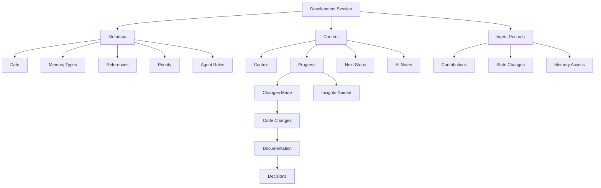

# Development Sessions

The Aegis framework uses development sessions to maintain episodic memory of project activities. Each session captures the context, progress, insights, and next steps, helping both developers and AI assistants maintain continuity across development activities.

## Overview



## Session Structure

### Metadata Section
```yaml
---
memory_types: [episodic, working]
references: []
priority: medium
agent_roles: [AGENT-PM, AGENT-TL]
agent_states:
  AGENT-PM: active
  AGENT-TL: active
memory_access: [semantic, working]
---
```

#### Fields Explained
- **memory_types**: How this session should be processed (typically episodic and working)
- **references**: Links to related sessions, tasks, or decisions
- **priority**: Importance level for context retention
- **agent_roles**: Active agents in this session
- **agent_states**: Current state of each agent
- **memory_access**: Memory types accessible in this session

### Content Sections

1. **Context**
   - Previous session link
   - Related tasks
   - Current focus
   - Active context
   - Active agents
   - Agent states
   - Memory context

2. **Progress**
   - Changes Made:
     - Code changes
     - Documentation updates
     - Decisions made
     - Agent contributions
     - Role-specific updates
   - Insights Gained:
     - Technical insights
     - Pattern discoveries
     - Potential issues
     - Agent learnings
     - Role effectiveness

3. **Next Steps**
   - Immediate tasks
   - Open questions
   - Follow-up items
   - Planned work
   - Agent assignments
   - Role transitions
   - Memory requirements

4. **Notes for AI**
   - Key context
   - Important patterns
   - Special considerations
   - Implementation guidance
   - Agent guidance
   - Role boundaries
   - Memory access

### Agent Records

1. **Contributions**
   - Role-specific work
   - Key decisions
   - Implementation details
   - Documentation updates

2. **State Changes**
   - Role transitions
   - Task assignments
   - Context updates
   - Memory access

3. **Memory Access**
   - Read operations
   - Write operations
   - Context updates
   - Reference tracking

## Memory Integration

### Episodic Memory
- Development history
- Problem-solving approaches
- Decision contexts
- Implementation progression

### Working Memory
- Active context
- Current focus
- Immediate tasks
- Recent changes

### Agent Memory
- Role-based access
- State persistence
- Context sharing
- Interaction history

## Session Management

### 1. Session Creation
- Created by `/aide start`
- Links to previous session
- Sets initial context
- Establishes focus
- Agent initialization
- Role assignment
- Access configuration

### 2. Session Updates
- Updated during development
- Records progress
- Captures decisions
- Maintains context
- Agent state tracking
- Role progression
- Access management

### 3. Session Completion
- Finalized by `/aide save`
- Summarizes changes
- Sets next steps
- Archives context
- Agent state cleanup
- Role documentation
- Access cleanup

## Best Practices

### 1. Session Documentation
- Clear context description
- Detailed progress notes
- Specific next steps
- Relevant AI notes

### 2. Context Maintenance
- Link related sessions
- Reference decisions
- Track task progress
- Note dependencies

### 3. Progress Tracking
- Document all changes
- Record insights
- Note challenges
- Plan next steps

### 4. Agent Coordination
- Track contributions
- Manage states
- Control access
- Document interactions

## Example Session

```markdown
# Session Summary 2025-01-20

---
memory_types: [episodic, working]
references: [DEC-001, SESSION-20250119]
priority: medium
agent_roles: [AGENT-PM, AGENT-TL]
agent_states:
  AGENT-PM: active
  AGENT-TL: active
memory_access: [semantic, working]
---

## Context
- Previous session: SESSION-20250119
- Related tasks: [TASK-001, TASK-002]
- Current focus: Implementing memory system documentation
- Active agents: AGENT-PM (Requirements), AGENT-TL (Implementation)

## Progress
### Agent Contributions
#### Product Manager [AGENT-PM]
- Defined documentation requirements
- Reviewed structure and format
- Provided user perspective
- Planned next iterations

#### Tech Lead [AGENT-TL]
- Implemented documentation system
- Created templates
- Set up memory integration
- Added context tracking

### Changes Made
- Code changes:
  - Documentation system
  - Added session templates
  - Implemented memory types
  - Added context tracking
- Documentation updates:
  - Created `docs/sessions.md`
  - Updated `README.md`
- Decisions made:
  - Standardized session format
  - Implemented memory tagging
  - Added AI notes section

### Insights Gained
- Session structure improves AI context
- Memory typing enhances retrieval
- Context links aid continuity
- Role-specific insights:
  - PM: Documentation structure improves usability
  - TL: Memory typing enhances implementation

## Next Steps
- Immediate tasks: 
  - [ ] Complete memory docs (AGENT-TL)
  - [ ] Review documentation (AGENT-PM)
  - [ ] Finalize templates (AGENT-TL)
- Agent assignments:
  - PM: Documentation review and feedback
  - TL: Implementation and templates

## Notes for AI
- Maintain session links
- Track decision impacts
- Focus on continuity
- Coordinate agent handoffs
- Maintain role boundaries
- Track memory access
```

## Integration with Commands

1. **`/aide start`**
   - Creates new session
   - Links previous context
   - Sets initial state
   - Loads relevant memory

2. **`/aide save`**
   - Updates session
   - Records progress
   - Sets next steps
   - Archives context

3. **`/aide status`**
   - Shows session state
   - Lists changes
   - Displays focus
   - Reports progress

4. **`/aide context`**
   - References session
   - Shows active work
   - Maintains continuity
   - Tracks progress

5. **`/aide plan`**
   - Coordinates agents
   - Assigns roles
   - Sets access
   - Manages workflow

## Tips for Effective Use

1. **Regular Updates**
   - Document changes
   - Record decisions
   - Note insights
   - Plan ahead

2. **Clear Context**
   - Link related items
   - Explain changes
   - Note dependencies
   - Track progress

3. **AI Assistance**
   - Provide clear notes
   - Maintain context
   - Track patterns
   - Guide implementation