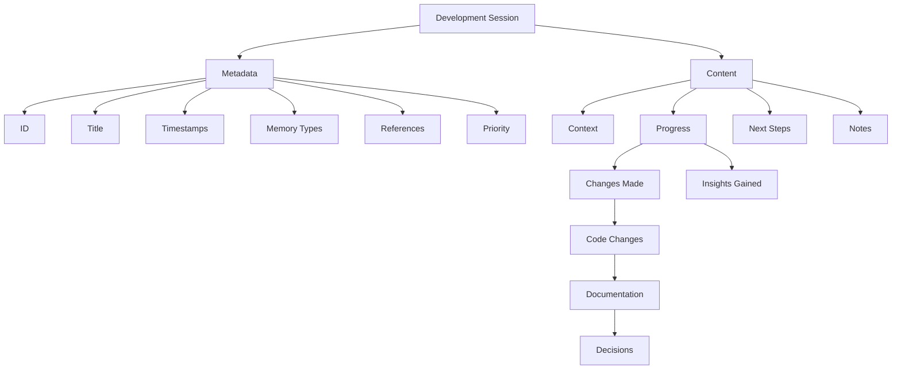

# Development Sessions

The Aegis framework uses development sessions to maintain episodic memory of project activities. Each session captures the context, progress, insights, and next steps, helping maintain continuity across development activities.

## Overview



## Session Structure

### Metadata Section
```yaml
---
id: SESSION-YYYYMMDD
title: [Session Title]
created: ${timestamp}
updated: ${timestamp}
memory_types: [episodic, working]
references: []
priority: [high | medium | low]
---
```

#### Fields Explained
- **id**: Unique session identifier (format: SESSION-YYYYMMDD)
- **title**: Clear, descriptive session title
- **created**: Initial creation timestamp
- **updated**: Last modification timestamp
- **memory_types**: How this session should be processed (episodic and working)
- **references**: Links to related sessions, tasks, or decisions
- **priority**: Importance level for context retention

### Content Sections

1. **Context**
   - Previous session link
   - Related tasks
   - Current focus
   - Active context

2. **Progress**
   - Changes Made:
     - Code changes
     - Documentation updates
     - Decisions made
   - Insights Gained:
     - Technical insights
     - Pattern discoveries
     - Potential issues

3. **Next Steps**
   - Immediate tasks
   - Open questions
   - Follow-up items
   - Planned work

4. **Notes**
   - Key context
   - Important patterns
   - Special considerations
   - Implementation guidance

## Memory Integration

### Episodic Memory
- Development history
- Problem-solving approaches
- Decision contexts
- Implementation progression

### Working Memory
- Active context
- Current focus
- Immediate tasks
- Recent changes

## Command Integration

### 1. `/aegis start`
- Creates new session
- Links previous context
- Sets initial state
- Loads memory types

### 2. `/aegis save`
- Creates session log
- Records progress
- Updates task status
- Shows summary

### 3. `/aegis status`
- Shows current state
- Lists recent changes
- Shows active focus

### 4. `/aegis context`
- Quick context refresh
- Shows relevant info
- Updates working memory

## Best Practices

### 1. Session Documentation
- Clear context description
- Detailed progress notes
- Specific next steps
- Relevant notes

### 2. Context Maintenance
- Link related sessions
- Reference decisions
- Track task progress
- Note dependencies

### 3. Progress Tracking
- Document all changes
- Record insights
- Note challenges
- Plan next steps

## Common Issues

### 1. Context Management
- Keep context focused
- Update regularly
- Link related items
- Track progress

### 2. Documentation
- Clear descriptions
- Complete info
- Good structure
- Regular updates

### 3. Organization
- Proper references
- Clean structure
- Good links
- Easy navigation

For more information, see:
- [Memory System](memory_system.md)
- [Task Management](tasks.md)
- [Decision Records](decisions.md)