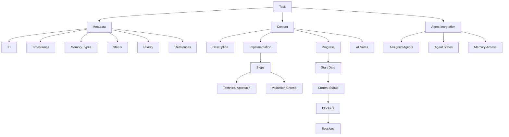

# Task Management

The Aegis framework uses a structured task management system to track development activities, progress, and implementation details. Tasks represent the procedural memory of the project, guiding both developers and AI assistants through implementation steps.

## Overview



## Task Structure

### Metadata Section
```yaml
---
id: TASK-XXX
created: [timestamp]
updated: [timestamp]
memory_types: [procedural, working]
status: [planned | active | completed | blocked]
priority: [high | medium | low]
references: []
assigned_agents: [AGENT-PM, AGENT-TL]
agent_states:
  AGENT-PM: active
  AGENT-TL: standby
memory_access: [procedural, working]
---
```

#### Fields Explained
- **id**: Unique task identifier (format: TASK-XXX)
- **created**: Initial creation timestamp
- **updated**: Last modification timestamp
- **memory_types**: How this task should be processed (typically procedural and working)
- **status**: Current task state
- **priority**: Task importance level
- **references**: Links to related tasks, decisions, or sessions
- **assigned_agents**: List of agents responsible for this task
- **agent_states**: Current state of each assigned agent
- **memory_access**: Memory types agents can access for this task

### Content Sections

1. **Description**
   - Detailed task overview
   - Goals and objectives
   - Expected outcomes
   - Requirements
   - Agent responsibilities
   - Role assignments

2. **Implementation**
   - Step-by-step breakdown
   - Technical approach
   - Validation criteria
   - Progress tracking
   - Agent coordination
   - Role-specific steps

3. **Progress**
   - Start date
   - Current status
   - Blockers
   - Related sessions
   - Agent contributions
   - State transitions

4. **Notes for AI**
   - Key considerations
   - Related patterns
   - Implementation guidance
   - Special instructions
   - Agent guidance
   - Memory permissions

## Task States

1. **Planned**
   - Ready for implementation
   - Requirements defined
   - Dependencies resolved
   - Resources available
   - Agents assigned
   - Roles defined
   - Access configured

2. **Active**
   - Currently in progress
   - Being implemented
   - Under development
   - Being tested
   - Agents engaged
   - States tracked
   - Progress monitored

3. **Completed**
   - Implementation done
   - Tests passed
   - Documentation updated
   - Reviewed and accepted
   - Agent states cleared
   - Contributions documented
   - Memory updated

4. **Blocked**
   - Has dependencies
   - Awaiting resources
   - Technical issues
   - External blockers
   - Agent availability
   - Role conflicts
   - Access issues

## Memory Integration

### Procedural Memory
- Implementation steps
- Technical approaches
- Process workflows
- Development patterns

### Working Memory
- Active development
- Current progress
- Immediate focus
- Recent changes

### Agent Memory Access
- Role-based permissions
- State persistence
- Context sharing
- Progress tracking

## Task Management

### 1. Task Creation
- Clear description
- Defined steps
- Success criteria
- AI guidance
- Agent assignment
- Role definition
- Access configuration

### 2. Task Updates
- Progress tracking
- Status changes
- Blocker documentation
- Session links
- Agent state tracking
- Role adjustments
- Access modifications

### 3. Task Completion
- Implementation verification
- Documentation updates
- Reference maintenance
- Status transition
- Agent state cleanup
- Role documentation
- Access cleanup

## Best Practices

### 1. Task Definition
- Clear objectives
- Specific steps
- Measurable outcomes
- Complete context

### 2. Progress Tracking
- Regular updates
- Clear status
- Blocker documentation
- Session references

### 3. AI Collaboration
- Implementation guidance
- Pattern recognition
- Context preservation
- Knowledge transfer

### 4. Agent Coordination
- Clear role definition
- State management
- Access control
- Progress tracking

## Example Task

```markdown
# Implement Task Management System

---
id: TASK-001
created: 2025-01-20T19:48:53-05:00
updated: 2025-01-20T19:48:53-05:00
memory_types: [procedural, working]
status: active
priority: high
references: [DEC-001, SESSION-20250120]
assigned_agents: [AGENT-TL, AGENT-QA]
agent_states:
  AGENT-TL: active
  AGENT-QA: standby
memory_access: [procedural, working]
---

## Description
Implement a structured task management system that helps track development activities and maintain procedural memory for both developers and AI assistants.

### Agent Responsibilities
- **Tech Lead**: System design and implementation
- **QA**: Test plan and validation

## Implementation
- [x] Step 1: Design task structure (AGENT-TL)
  - Technical approach: Use markdown templates with YAML frontmatter
  - Validation: Template covers all required fields
- [ ] Step 2: Implement task states (AGENT-TL)
  - Technical approach: Define clear state transitions
  - Validation: All states properly tracked
- [ ] Step 3: Create test plan (AGENT-QA)
  - Technical approach: Define validation criteria
  - Validation: Coverage meets requirements

## Progress
- Started: 2025-01-20
- Current status: Implementing task states
- Blockers: None
- Sessions: [SESSION-20250120]
- Agent Updates:
  - TL: Completed structure design
  - QA: Preparing test plan

## Notes for AI
- Use memory types to guide processing
- Maintain task relationships
- Track implementation patterns
- Guide state transitions
- Coordinate agent handoffs
- Manage memory access

## Integration with Commands

1. **`/aegis start`**
   - Initializes agents
   - Sets permissions
   - Loads states

2. **`/aegis save`**
   - Updates agent states
   - Records contributions
   - Maintains access

3. **`/aegis status`**
   - Shows agent states
   - Lists assignments
   - Reports access

4. **`/aegis task`**
   - Manages agents
   - Tracks states
   - Controls access

5. **`/aegis plan`**
   - Coordinates agents
   - Assigns roles
   - Sets permissions
   - Manages workflow

## Tips for Effective Use

1. **Task Creation**
   - Clear descriptions
   - Specific steps
   - Measurable outcomes
   - Complete context

2. **Progress Management**
   - Regular updates
   - Clear status
   - Document blockers
   - Link sessions

3. **AI Collaboration**
   - Provide guidance
   - Document patterns
   - Maintain context
   - Track relationships
```

## Integration with Commands

1. **`/aide start`**
   - Loads active tasks
   - Sets current focus
   - Tracks progress
   - Updates context

2. **`/aide save`**
   - Updates task status
   - Records progress
   - Links sessions
   - Documents changes

3. **`/aide status`**
   - Shows task progress
   - Lists blockers
   - Reports changes
   - Displays focus

4. **`/aide task`**
   - Shows task details
   - Lists steps
   - Reports progress
   - Shows blockers

## Tips for Effective Use

1. **Task Creation**
   - Clear descriptions
   - Specific steps
   - Measurable outcomes
   - Complete context

2. **Progress Management**
   - Regular updates
   - Clear status
   - Document blockers
   - Link sessions

3. **AI Collaboration**
   - Provide guidance
   - Document patterns
   - Maintain context
   - Track relationships