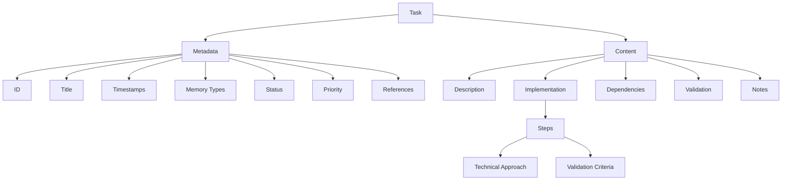

# Task Management

The Aegis framework uses a structured task management system to track development activities, progress, and implementation details. Tasks represent the procedural memory of the project, guiding implementation steps.

## Overview



## Task Structure

### Metadata Section
```yaml
---
id: TASK-XXX
title: [Task Title]
created: ${timestamp}
updated: ${timestamp}
memory_types: [procedural, working]
status: [planned | active | completed | blocked]
priority: [high | medium | low]
references: []
---
```

#### Fields Explained
- **id**: Unique task identifier (format: TASK-XXX)
- **title**: Clear, descriptive task title
- **created**: Initial creation timestamp
- **updated**: Last modification timestamp
- **memory_types**: How this task should be processed (procedural and working)
- **status**: Current task state
- **priority**: Task importance level
- **references**: Links to related tasks, decisions, or sessions

### Content Sections

1. **Description**
   - Detailed task overview
   - Goals and objectives
   - Expected outcomes
   - Requirements

2. **Implementation**
   - Step-by-step breakdown
   - Technical approach
   - Validation criteria
   - Progress tracking

3. **Dependencies**
   - Blocking dependencies
   - Required resources
   - Access requirements

4. **Validation**
   - Test cases
   - Implementation verification
   - Documentation requirements

5. **Notes**
   - Additional context
   - Implementation decisions
   - Lessons learned

## Task States

1. **Planned**
   - Ready for implementation
   - Requirements defined
   - Dependencies resolved
   - Resources available

2. **Active**
   - Currently in progress
   - Being implemented
   - Under development
   - Being tested

3. **Completed**
   - Implementation done
   - Tests passed
   - Documentation updated
   - Reviewed and accepted

4. **Blocked**
   - Has dependencies
   - Awaiting resources
   - Technical issues
   - External blockers

## Memory Integration

### Procedural Memory
- Implementation steps
- Technical approaches
- Process workflows
- Development patterns

### Working Memory
- Active development
- Current progress
- Immediate focus
- Recent changes

## Task Management

### 1. Task Creation
- Clear description
- Defined steps
- Success criteria
- Dependencies identified

### 2. Task Updates
- Progress tracking
- Status changes
- Blocker documentation
- Session links

### 3. Task Completion
- Implementation verification
- Documentation updates
- Reference maintenance
- Status transition

## Best Practices

### 1. Task Definition
- Clear objectives
- Specific steps
- Measurable outcomes
- Complete context

### 2. Progress Tracking
- Regular updates
- Clear status changes
- Documented blockers
- Referenced sessions

### 3. Documentation
- Implementation details
- Technical decisions
- Dependencies
- Validation results

### 4. Organization
- Proper status
- Updated references
- Clear progress
- Next steps

## Directory Structure
```
tasks/
├── TEMPLATE.md     # Task template
├── active/        # Current tasks
├── planned/       # Future tasks
├── hold/          # Blocked tasks
└── completed/     # Finished tasks
```

## Command Integration

### 1. `/aegis task`
- Shows active task details
- Lists implementation progress
- Shows blockers and dependencies
- Focuses on procedural memory

### 2. `/aegis save`
- Updates task progress
- Records session progress
- Shows summary of changes

### 3. `/aegis status`
- Shows active task progress
- Lists recent changes
- Shows current focus

### 4. `/aegis start`
- Loads active tasks
- Sets current focus
- Shows task progress

### 5. `/aegis context`
- Quick refresh of task status
- Shows current task focus
- Lists active tasks

## Common Issues

### 1. Task Management
- Keep tasks focused
- Update regularly
- Track progress
- Document blockers

### 2. Documentation
- Clear descriptions
- Complete steps
- Good structure
- Regular updates

### 3. Organization
- Proper status
- Clean structure
- Good references
- Easy navigation

For more information, see:
- [Memory System](memory_system.md)
- [Session Management](sessions.md)
- [Decision Records](decisions.md)