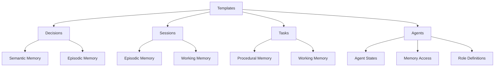

# Template System

Aegis uses a structured template system to maintain consistency and enable effective AI processing across different types of project information. Each template is designed to capture specific types of memory and context.

## Overview



## Common Structure

All templates share a common metadata structure using YAML frontmatter:

```yaml
---
memory_types: [type1, type2]    # Types of memory this document represents
references: []                  # Links to related documents
priority: [high|medium|low]     # Importance level
agent_roles: []                # Involved agent roles
agent_states: {}               # Current agent states
memory_access: []              # Memory access patterns
---
```

### Memory Types
- **semantic**: Long-term project knowledge and decisions
- **episodic**: Historical events and progress
- **procedural**: Tasks and implementation steps
- **working**: Current focus and active context

### Priority Levels
- **high**: Critical information needed frequently
- **medium**: Important but not critical information
- **low**: Background or reference information

## Decision Template

Location: `.context/decisions/TEMPLATE.md`

```markdown
# [Title of Decision]

---
id: DEC-XXX
created: ${timestamp}
updated: ${timestamp}
memory_types: [semantic, episodic]
status: [proposed | accepted | deprecated | superseded]
priority: [high | medium | low]
references: []
---

## Context
[What is the issue that we're seeing that is motivating this decision or change?]

## Decision
[What is the change that we're proposing and/or doing?]

## Rationale
- Key factors considered
- Alternatives evaluated
- Trade-offs made

## Impact
- Benefits gained
- Challenges introduced
- Areas affected

## Validation
- Success criteria
- Metrics to track
- Review timeline

## Notes for AI
- Pattern implications
- Implementation guidance
- Future considerations
- Agent responsibilities
- Memory access patterns
```

### Usage
- Record architectural decisions
- Document technical choices
- Track design patterns
- Maintain system constraints

## Session Template

Location: `.context/sessions/TEMPLATE.md`

```markdown
# Session Summary {{DATE}}

---
memory_types: [episodic, working]
references: []
priority: medium
agent_roles: [AGENT-PM, AGENT-TL]
agent_states:
  AGENT-PM: active
  AGENT-TL: active
memory_access: [semantic, working]
---

## Context
- Previous session: [link]
- Related tasks: []
- Current focus: [Brief description]
- Active agents: [AGENT-PM, AGENT-TL]

## Progress
### Agent Contributions
#### Product Manager [AGENT-PM]
- Decisions made:
  - [Decision]
  - Rationale
  - Impact
- Tasks managed:
  - [Task references]
  - Status updates

#### Tech Lead [AGENT-TL]
- Technical decisions:
  - Architecture choices
  - Implementation details
- Code reviews:
  - Components reviewed
  - Feedback provided

### Changes Made
- Code changes:
  - [Component/Feature]
  - Specific changes
  - Implementation details
  - Test coverage
- Documentation updates:
  - Created/updated files
  - Brief descriptions

### Insights Gained
- Technical insights
- Pattern discoveries
- Potential issues

## Next Steps
- Immediate tasks
- Open questions
- Follow-up items

## Notes for AI
- Key context
- Important patterns
- Special considerations
- Agent state transitions
- Memory access updates
```

### Usage
- Track development sessions
- Record progress
- Document insights
- Plan next steps

## Task Template

Location: `.context/tasks/TEMPLATE.md`

```markdown
# [Task Name]

---
id: TASK-XXX
created: ${timestamp}
updated: ${timestamp}
memory_types: [procedural, working]
status: [planned | active | completed | blocked]
priority: [high | medium | low]
references: []
assigned_agents: [AGENT-TL]
agent_states:
  AGENT-TL: active
memory_access: [procedural, working]
---

## Description
[Detailed description of the task]

## Implementation
- [ ] Step 1: [description]
  - Technical approach
  - Validation criteria
- [ ] Step 2: [description]
  - Technical approach
  - Validation criteria

## Progress
- Started: [date]
- Current status: [details]
- Blockers: [if any]
- Sessions: [session-ids]

## Notes for AI
- Key considerations
- Related patterns
- Implementation guidance
- Agent responsibilities
- Memory access rules
```

### Usage
- Track implementation tasks
- Document progress
- Manage blockers
- Guide development

## Agent Template

Location: `.context/plan/agents/TEMPLATE.md`

```markdown
# [Agent Role]

---
id: AGENT-ROLE
created: ${timestamp}
updated: ${timestamp}
memory_types: [semantic, working]
status: [active | standby | inactive]
priority: [high | medium | low]
references: []
memory_access: [semantic, working]
task_types: [type1, type2]
---

## Role Definition
[Detailed description of the agent's role and responsibilities]

## Memory Access
### Read Access
- Semantic memory: [full | partial | none]
- Episodic memory: [full | partial | none]
- Procedural memory: [full | partial | none]
- Working memory: [full | partial | none]

### Write Access
- Semantic memory: [full | partial | none]
- Episodic memory: [full | partial | none]
- Procedural memory: [full | partial | none]
- Working memory: [full | partial | none]

## Task Types
- Primary tasks:
  - [Task type 1]
  - [Task type 2]
- Support tasks:
  - [Task type 3]
  - [Task type 4]

## Interaction Patterns
### Direct Interactions
- [AGENT-ROLE-1]: [interaction type]
- [AGENT-ROLE-2]: [interaction type]

### Workflow Integration
- Entry points
- Exit conditions
- State transitions
- Handoff protocols

## State Management
### Active State
- Memory context required
- Task prerequisites
- Resource requirements

### Standby State
- Minimal context
- Wake conditions
- Resource cleanup

### Inactive State
- State preservation
- Reactivation requirements
- Context restoration

## Notes for AI
- Role boundaries
- Decision authority
- Escalation paths
- Special considerations
```

## Agent State Template

Location: `.context/plan/states/TEMPLATE.md`

```markdown
# [Agent State Record]

---
id: STATE-${timestamp}
agent_id: AGENT-ROLE
memory_types: [working]
status: [transition | active | complete]
references: []
memory_context: []
---

## State Transition
- From: [previous state]
- To: [current state]
- Trigger: [event/condition]

## Memory Context
### Active References
- Semantic: [DEC-XXX, ...]
- Episodic: [SESSION-XXX, ...]
- Procedural: [TASK-XXX, ...]
- Working: [current focus]

### Access Patterns
- Read operations
- Write operations
- Reference updates

## Task Context
- Active tasks
- Completed tasks
- Blocked tasks
- Next tasks

## Notes for AI
- State implications
- Context requirements
- Cleanup needs
- Transition rules
```

## Best Practices

### 1. Template Usage
- Use appropriate template for content type
- Fill all relevant sections
- Keep content focused
- Update regularly

### 2. Memory Types
- Assign correct types
- Consider multiple types
- Update as needed
- Maintain consistency

### 3. References
- Link related documents
- Use correct IDs
- Keep links current
- Validate references

### 4. Timestamps
- Use consistent format
- Update when changed
- Track modifications
- Maintain history

### 5. AI Notes
- Be specific
- Include context
- Note patterns
- Guide implementation

### 6. Agent Templates
- Follow role patterns
- Define clear boundaries
- Specify memory access
- Document interactions

## Template Customization

### 1. Adding Fields
- Maintain YAML structure
- Document new fields
- Update AI guidance
- Validate changes

### 2. Modifying Sections
- Keep core structure
- Document changes
- Update references
- Maintain consistency

### 3. Creating New Templates
- Follow common structure
- Include metadata
- Document purpose
- Add AI guidance

### 4. Agent Templates
- Follow role patterns
- Define clear boundaries
- Specify memory access
- Document interactions

## Integration Points

### 1. Commands
- `/aegis start`: Initializes templates
- `/aegis save`: Updates states
- `/aegis status`: Checks templates
- `/aegis task`: Uses task templates
- `/aegis plan`: Uses agent templates

### 2. Memory System
- Templates map to memory types
- Structure aids processing
- Metadata guides context
- References maintain relationships

### 3. Agent System
- Role definitions
- State tracking
- Memory access
- Task coordination
- Interaction patterns

### 4. Documentation
- Templates support docs
- Structure aids clarity
- Format ensures consistency
- Enables automation

## Tips for Success

1. **Consistency**
   - Follow templates
   - Use standard formats
   - Maintain structure
   - Update regularly

2. **Completeness**
   - Fill all sections
   - Include metadata
   - Add references
   - Document changes

3. **Context**
   - Clear descriptions
   - Complete information
   - Relevant links
   - AI guidance

4. **Maintenance**
   - Regular updates
   - Valid references
   - Current status
   - Clean structure